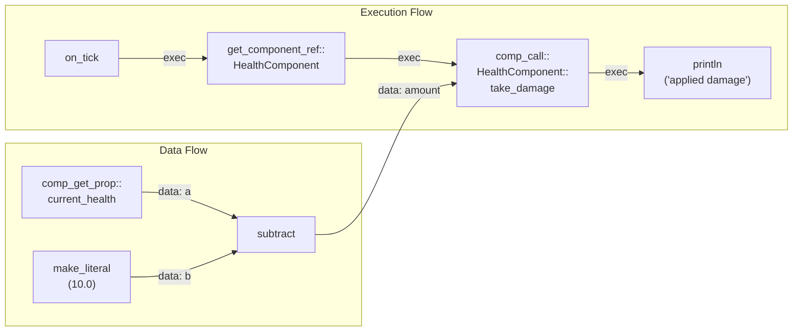

## The Vision

Every game engine confronts the same tension: the visual scripting system wants runtime flexibility, but shipping a game demands native performance. Unreal Engine had Blueprint nativization (deprecated in 5.0, removed in 5.1) — too brittle, too hard to debug, too much friction between the visual graph and the generated C++. Unity never had visual-script nativization; DOTS operates at a completely different level. Godot keeps GDScript interpreted and accepts the tax.

Pulsar approaches the problem differently. Not by choosing between flexibility and performance, but by building a system that can be either depending on context — the exact same graph, the exact same nodes, the exact same component methods, running through two completely different execution paths. In the editor: bytecode, hot-reload, live debugging. In the shipping build: native Rust, zero runtime overhead, no VM in sight.

This is the blueprint system.

It sits on top of the reflection infrastructure we covered in the [previous post](/2026-06-26-pulsar-reflection-system). The `RuntimeTypeInfo` that powers the property panel is the same type information that validates blueprint pin connections. The `EngineClass` that auto-generates property editors is the same trait that component methods register against. The `Reflectable` derive that gives your structs serialization is the same trait that lets blueprint nodes pass complex types across wires. Everything connects.

This post covers the full stack: from the `#[blueprint]` macro that turns Rust functions into graph nodes, through the standard library of built-in nodes, through the component method system that exposes component APIs to visual scripting, down to the dual-path execution runtime that runs bytecode in the editor and transpiled Rust in shipping builds. The companion post — [Pulsar's Blueprint Compiler: Graphs, Types, and Transpilation](/2026-07-16-pulsar-blueprint-compiler) — goes deep into the graph compilation pipeline, type checking, bytecode generation, Rust codegen, and project assembly.

---

## The Blueprint Macro: From Rust Function to Graph Node

The fundamental unit of the blueprint system is the node. Every node in the graph editor, every function call in a generated Rust file, every instruction in a bytecode program, starts as a plain Rust function annotated with `#[blueprint]`.

### The Four Node Types

The macro takes a single attribute argument — the node's type — which determines how the node appears and behaves in the graph:

```rust
use pulsar_macros::blueprint;
use pulsar_std::NodeTypes;

#[blueprint(type: NodeTypes::pure, category: "Math", color: "#4A90E2")]
pub fn add(a: i64, b: i64) -> i64 {
    a + b
}
```

This small function produces a large amount of generated code. Let's unpack what the `#[blueprint]` macro actually emits.

**`NodeTypes::pure`** — A pure function with no side effects. It has no execution pins in the graph editor — only data inputs and a data output. The compiler evaluates it purely based on data dependencies, and its result can be inlined or cached. Pure nodes form a DAG that the compiler topologically sorts to determine evaluation order. When you wire an `add` node's output into a `println` node's message input, the compiler knows the `add` must execute before `println` even though there is no execution wire connecting them — the data wire implies the dependency.

The distinction between pure and impure is the single most important classification the compiler makes. Pure nodes are reorderable, cacheable, and inlineable. Impure nodes must execute exactly once, in the exact order specified by the execution wires. This is the same distinction that functional programming languages make between pure expressions and side-effecting statements, and we get the same benefits: the compiler can optimize pure sub-graphs aggressively without risking behavioral changes.

**`NodeTypes::fn_`** — A function with side effects. In the graph editor, it has one execution input pin (top of the node) and one execution output pin (bottom), plus data inputs and an optional data output. The compiler sequences these in the exact order specified by the execution wires. `println`, `log_error`, `emit_event`, and `assert_eq_int` are all `fn_` nodes. If you wire `println`'s exec output into `log_error`'s exec input, the compiler guarantees the print happens before the error log, every time.

**`NodeTypes::control_flow`** — A branching node. It has one execution input and multiple named execution outputs. The magic is in the `exec_output!()` marker macro:

```rust
#[blueprint(type: NodeTypes::control_flow, category: "Flow", color: "#BD10E0")]
pub fn branch(condition: bool) {
    if condition {
        exec_output!("True");
    } else {
        exec_output!("False");
    }
}
```

The `exec_output!("True")` call looks like a function call in the source code, but it is not. The macro does not define an `exec_output` function anywhere. Instead, the `exec_output!()` marker is detected by the `#[blueprint]` macro's `find_exec_output_labels()` pass, which parses the function body looking for `exec_output!("...")` invocations. The string argument — `"True"`, `"False"`, `"Body"`, `"Branch1"` — becomes the name of an execution output pin on the node.

When the graph compiler processes a control flow node, it takes the original `function_source` string (captured by the macro), parses it with `syn`, finds every `exec_output!("Label")` call using a custom AST visitor (`ExecOutputReplacer`), and replaces each one with the actual generated code of whatever is connected to that execution output pin. The branch function's `if condition { exec_output!("True"); } else { exec_output!("False"); }` becomes `if condition { /* code connected to True pin */ } else { /* code connected to False pin */ }`.

This approach means control flow nodes are defined with regular Rust `if`, `match`, `for`, and `while` constructs — not a custom DSL. The standard library's `for_loop` node is just:

```rust
#[blueprint(type: NodeTypes::control_flow, category: "Flow", color: "#BD10E0")]
pub fn for_loop(count: i64) {
    for _i in 0..count {
        exec_output!("Body");
    }
}
```

And `switch_on_int` is a regular `match`:

```rust
#[blueprint(type: NodeTypes::control_flow, category: "Flow", color: "#BD10E0")]
pub fn switch_on_int(value: i64) {
    match value {
        0 => exec_output!("Case0"),
        1 => exec_output!("Case1"),
        2 => exec_output!("Case2"),
        3 => exec_output!("Case3"),
        _ => exec_output!("Default"),
    }
}
```

No new syntax to learn. The template is Rust, the substitution targets are `exec_output!()` markers, and the compiler handles the rest.

**`NodeTypes::event`** — An entry point into the graph. Events like `begin_play`, `on_tick`, and `on_input_key` define the outer function signature for a blueprint class's lifecycle. Like control flow nodes, they use `exec_output!("Body")` to expose their body execution pin. The event node's parameter list becomes the generated function's parameter list — `on_tick` generates `pub fn on_tick(delta_time: f32)`, `on_input_key` generates `pub fn on_input_key(key: String, pressed: bool)`.

There are currently six built-in event types: `main` (the root entry point), `begin_play` (called once when the instance enters the world), `on_tick` (called every frame with `delta_time: f32`), `end_play` (called when the instance leaves the world), `on_input_key` (called on keyboard events), and `on_input_mouse` (called on mouse events). Custom events can be defined by emitting `emit_event(name, payload)` from a `fn_` node, which dispatches to any graph that has a matching custom event handler registered.

### What the Macro Generates

For every `#[blueprint]` function, the macro in `pulsar_macros` emits several pieces of infrastructure:

**1. A `NodeMetadata` entry** that is compiled into the binary and registered at link time. For each function parameter, the macro captures the Rust type token at compile time and emits `std::mem::size_of::<T>()` and `std::mem::align_of::<T>()` calls. For generic functions, the approach depends on the kind of type parameter:

- **Wrapper generic `Vec<T>`:** Substitute `T → ()`, so `size_of::<Vec<()>>()` = 24 (fixed pointer width on 64-bit). A `Vec<T>` always occupies exactly three words on the stack (pointer, length, capacity) regardless of `T`. The dispatch shim reads those three words via `ptr::read` and passes them to the real `Vec::push` etc. — the byte-level content of the buffer is irrelevant because the Vec's metadata is layout-independent. Same for `Arc<T>` (one word) and `Box<T>` (one word).
- **Bare generic `T`:** The macro cannot know the size at expansion time — different call sites may bind `T` to different concrete types. Instead, the generic dispatch shim pre-compiles monomorphizations for every common size up to 32 bytes (`[u8; 0]`, `[u8; 1]`, `[u8; 2]`, `[u8; 4]`, `[u8; 8]`, `[u8; 12]`, `[u8; 16]`, `[u8; 24]`, `[u8; 32]`). At the DLL boundary, the shim reads `type_slots[0].size` (written into the arena by the bytecode codegen's `InitTypeSlot` instruction) and dispatches via a match on that size. Because `[u8; N]` has the same size and alignment as any `N`-byte type, and generic functions with bare `T` may only use auto-trait bounds (Sized, Send, Sync, Clone, Copy, PartialEq, Eq), the machine code is identical regardless of what `T` actually is at the graph level. The type checker guarantees at graph-compile time that the connected types are compatible, so the `size` in `type_slots[0]` always matches the actual arena layout.
- **Concrete type `i64`:** `size_of::<i64>()` = 8. Simple — the dispatch shim reads an `i64` directly.

The 0-size signal in the `NodeMetadata` (from `size_of::<()>()`) tells the bytecode codegen to look up the actual size from the graph connections and emit an `InitTypeSlot` instruction with the concrete value. It is not "we'll figure out the generic at runtime" — it's "the DLL must be compiled with all possible sizes, and the correct one is selected via a match on `type_slots[0].size` at the FFI boundary."

> **⚠️ Limitation:** The pre-compiled `[u8; N]` table only covers sizes 0, 1, 2, 4, 8, 12, 16, 24, and 32 bytes. Any type outside this set (e.g., `[f32; 6]` at 24 bytes is fine, but a 40-byte struct panics at runtime). This was expedient for the initial implementation but is not the final design.
>
> **Proper solution:** Add `copy` and `drop` function pointers to `TypeSlot`, exactly like Unreal's `FProperty` vtable:
> ```rust
> #[repr(C)]
> pub struct TypeSlot {
>     pub size:  usize,
>     pub align: usize,
>     pub copy:  Option<extern "C" fn(src: *const u8, dst: *mut u8)>,
>     pub drop:  Option<extern "C" fn(ptr: *mut u8)>,
> }
> ```
> The `#[blueprint]` macro generates `__bp_type_copy_<T>` and `__bp_type_drop_<T>` wrappers alongside the dispatch shim — just `ptr::copy_nonoverlapping` / `drop_in_place` behind `extern "C"`. The `Reflectable` trait's existing `clone_any()` already proves every type can be duplicated. With these function pointers, the generic dispatch shim becomes a single generated function that works for **any** `T`, any size, with no pre-compiled monomorphization table and no runtime panic. Two extra words per `TypeSlot`, zero limits.

Each parameter also gets a `type_info_fn` closure: `Some(|| RUNTIME_TYPE_REGISTRY::get::<T>())`. This bridges the codegen system to the reflection system's canonical type information. The `RUNTIME_TYPE_REGISTRY` is a global `LazyLock<HashMap<TypeId, &RuntimeTypeInfo>>` populated at startup by the reflection system's `inventory` registration. The `type_info_fn` is `None` for generic parameters (resolved at graph compile time) and `Some(closure)` for concrete parameters.

The function's doc comments (///) are extracted, concatenated, and embedded as the `documentation` field. If documentation exists, the macro also embeds the cleaned source code (the function body without macro attributes) as a code block in the documentation string — the blueprint editor's tooltip for any node shows both the docs and the source code implementation. External dependencies declared by `#[bp_import]` attributes are collected into the `imports` list, which the Rust codegen uses to emit `use` statements in the generated code.

The `exec_output!()` labels are detected by `find_exec_output_labels()`, which walks the function body's syntax tree looking for macro invocations matching `exec_output!("...")`. The found labels become the node's exec output pin names and their count determines the node's exec_outputs array. The function source itself is captured as a string for the AST transformation pass.

**2. A `` `__bp_dispatch_<name>` `` dispatch shim** — an `unsafe extern "C"` function compiled into the cdylib. This is the bridge between the bytecode VM and native code. The shim's ABI matches the VM's `DispatchFn` type:

```rust
pub type DispatchFn = unsafe extern "C" fn(
    args:       *const *const u8,    // pointers into byte arena
    ret:        *mut u8,             // output region (null for void)
    type_slots: *const TypeSlot,     // resolved generic params
);
```

Inside the shim, generated by the proc macro:

```rust
#[no_mangle]
pub unsafe extern "C" fn __bp_dispatch_add(
    args: *const *const u8,
    ret: *mut u8,
    _type_slots: *const TypeSlot,
) {
    let a = *(args.add(0) as *const i64);
    let b = *(args.add(1) as *const i64);
    let result = add(a, b);
    *(ret as *mut i64) = result;
}
```

The VM builds an array of arena pointers, calls `f(args.as_ptr(), ret, ts_ptr)`, and the shim reads the arguments from the arena using `ptr::read`, calls the original Rust function, and writes the result. For generic functions, the shim reads `type_slots[0].size` and dispatches to the correct monomorphization through a match on the size.

**3. A `linkme::distributed_slice` registration** that adds the `NodeMetadata` to the global `BLUEPRINT_REGISTRY`:

```rust
#[cfg(feature = "native")]
#[linkme::distributed_slice(BLUEPRINT_REGISTRY)]
static __BLUEPRINT_NODE_ADD: NodeMetadata = NodeMetadata { ... };
```

This is a zero-cost, link-time mechanism. No constructor calls, no manual registration, no `main()`-before dependencies. The `linkme` crate works by placing each entry into a named linker section. When the linker collects all object files, it gathers every entry in that section into a contiguous array. Plugin DLLs that link against `pulsar_std` get their entries collected by the loader automatically. The registry is fully populated before any code executes.

The `BLUEPRINT_REGISTRY` is exposed through `pulsar_std::get_all_nodes()`, which returns a `&[NodeMetadata]` view over the distributed slice. For the cdylib build (no native feature), the distributed slice is not compiled, and `get_all_nodes()` returns an empty slice — in this mode, nodes are resolved by name via `dlsym` on the `__bp_dispatch_*` symbols.

The `TypeSlot` struct that carries generic type information across the FFI boundary is intentionally minimal:

```rust
#[repr(C)]
pub struct TypeSlot {
    pub size: usize,   // std::mem::size_of::<T>()
    pub align: usize,  // std::mem::align_of::<T>()
}
```

Two words, no pointers, no type IDs, no vtable entries. It exists only for the size-dispatch pattern in generic dispatch shims. Concrete functions ignore it entirely. The VM writes `TypeSlot` values into the arena via `InitTypeSlot` instructions, one per resolved generic parameter, and passes a pointer to the contiguous array as the third argument to every dispatch call. If there are no type slots, the pointer is null.

### The Standard Library

The standard library lives in `pulsar_std` and contains over 200 registered nodes organized into 36 category modules. Every one of them is a plain Rust function with `#[blueprint]`. The modules cover:

- **Core** — literal construction, identity, passthrough
- **Math** — `add`, `subtract`, `multiply`, `divide`, `lerp`, `clamp`, `abs`, `floor`, `ceil`, `round`, `sqrt`, `pow`, `sin`, `cos`, `tan`, `min`, `max`, `random_int`, `random_float`
- **Logic** — `and`, `or`, `not`, `equals`, `greater_than`, `less_than`, `range_check`, `select`
- **Flow** — `branch`, `multi_branch`, `switch_on_int`, `for_loop`, `sequence`, `gate`, `flip_flop`, `delay`, `do_once`
- **String** — `string_concat`, `string_split`, `string_replace`, `string_length`, `string_to_int`, `string_to_upper`, `string_to_lower`
- **Vector** — `make_vector2`, `make_vector3`, `vector_dot`, `vector_cross`, `vector_normalize`, `vector_length`
- **Color** — `color_new`, `color_deconstruct`, `color_lerp`
- **Debug** — `println`, `print_string`, `log_error`, `assert_true`, `assert_eq_int`
- **Array, Collections, Random, JSON, HTTP, File I/O, DateTime, Crypto, Network, Env, Shell, Process, Thread, Timer, Channel, Mutex**

The standard library is compiled both as a regular Rust dependency (for native builds that link against it) and as a standalone cdylib (for the bytecode VM to load dynamically). The `pulsar_std_bundle` crate embeds the compiled cdylib's bytes at build time using `include_bytes!()`, computes its SHA-256 hash, and provides `extract_to_tempfile()` to write it to disk at runtime. The `BpExecutor` verifies the hash before loading via `libloading` — a defense against TOCTOU attacks between extraction and symbol resolution.

The std library is also the extension mechanism: any crate in the workspace can define blueprint nodes by re-exporting `pulsar_macros::blueprint`, writing a `#[blueprint]` function, and declaring the module in `pulsar_std/src/lib.rs` with a `pub mod foldername; pub use foldername::*;` stanza. The `linkme` distributed slice picks up the new entries automatically. There is no central registry to edit, no registration boilerplate, no init-order dependency.

---

## Component Methods: Bridging Components and Blueprints

> **📐 Work in progress:** This section describes what we are actively building over the next month or two. The reflection system already has the data structures (`MethodMetadata`, `ComponentMethodRegistration`) and the macro infrastructure (`#[component_methods]`, `#[method]`), but wiring the full chain from component method definition to blueprint graph node to runtime execution is the primary focus of the current development cycle.

The core loop is: a programmer writes a component with methods, the reflection system discovers them, the blueprint editor generates nodes for them, the compiler lowers them to either bytecode or native Rust, and the runtime dispatches them against live component instances. Zero glue code in any direction.

### How It Works (In Progress)

The entry point is the `#[component_methods]` attribute on a component's `impl` block. It scans for `#[method]`-annotated functions and registers their metadata with the reflection system:

```rust
use engine_class_derive::{component_methods, method, MethodType};

#[component_methods]
impl PhysicsComponent {
    #[method(type = MethodType::Pure, category = "Physics")]
    pub fn get_speed(&self) -> f32 {
        (self.velocity[0].powi(2)
            + self.velocity[1].powi(2)
            + self.velocity[2].powi(2))
            .sqrt()
    }

    #[method(type = MethodType::Fn, category = "Physics")]
    pub fn apply_impulse(&mut self, force: [f32; 3]) {
        self.velocity[0] += force[0] / self.mass;
        self.velocity[1] += force[1] / self.mass;
        self.velocity[2] += force[2] / self.mass;
    }
}
```

The `#[component_methods]` attribute, defined in `engine_class_derive`, processes the entire `impl` block. For each `#[method]` it generates a `MethodMetadata` struct with the method's name, parameter types, return type, method type (Pure, Fn, or ControlFlow), and a type-erased `caller` closure. The closure is the dispatch mechanism — it downcasts the `&mut dyn EngineClass` to the concrete component type, unpacks the `Vec<Box<dyn Any>>` arguments, calls the method, and wraps the return value:

```rust
Box::new(|obj: &mut dyn EngineClass, args: MethodArgs| -> MethodReturnValue {
    let self_ = obj.downcast_mut::<PhysicsComponent>()
        .expect("PhysicsComponent::apply_impulse called on wrong type");
    let force: [f32; 3] = *args[0].downcast::<[f32; 3]>().unwrap();
    self_.apply_impulse(force);
    MethodReturnValue::Void
})
```

The downcast is O(1) — a single `TypeId` comparison — so the overhead of calling a reflected method is just a checked cast and a few pointer dereferences. No string-based dispatch, no JSON round-trip at the dispatch layer (though the current compiler codegen does add JSON serialization on top — that's the next thing to fix).

The `MethodType` enum mirrors the blueprint node types:

```rust
pub enum MethodType {
    Pure,  // Read-only, no &mut self required → no exec pins in the graph
    Fn,    // Mutates self → exec input and output
    ControlFlow,  // Branches on return value → multiple named exec outputs
}
```

Every `#[property]` field on a component also gets auto-generated getter and setter methods — `get_mass` (Pure, returns `f32`) and `set_mass` (Fn, takes `f32`). Property access through blueprints is identical to method access: same metadata format, same type-erased dispatch, same codegen path. No additional annotation needed.

### The Editor Pipeline (Under Development)

The `#[component_methods]` macro submits a `ComponentMethodRegistration` via `inventory`, collected at link time into the reflection system's `REGISTRY`. At editor startup, `NodeDefinitions::load()` queries the registry and creates node definitions for every discovered method on every component:

1. **Property getters** — Node ID `comp_get_prop::PhysicsComponent::mass`. Execution in, execution out, one data output typed from the property's `RuntimeTypeInfo`. Pin color comes from `resolve_color()` on the type.

2. **Property setters** — Node ID `comp_set_prop::PhysicsComponent::mass`. Same pattern but with a data input instead of output.

3. **Method calls** — Node ID `comp_call::PhysicsComponent::apply_impulse`. Execution in/out plus data pins for each parameter and an optional return value pin.

These nodes appear in the editor's node palette under the component's class name, grouped by the category declared in the `#[method]` attribute. The type system integration is already in place — pin types carry the canonical `RuntimeTypeInfo`, so the type checker validates connections against the same reflection data that drives the property panel. A `get_speed` output pin carries `RuntimeTypeInfo` for `f32`, which resolves to the same `ReflectedType::Primitive(PrimitiveKind::F32)` that the type checker uses for every other `f32` pin in the graph.

### What Remains

The data structures and macro infrastructure are implemented. The remaining work over the next month or two is the wiring between systems:

**Graph nodes in the palette.** The editor's `NodeDefinitions::generate_component_nodes()` needs to query the `REGISTRY` and produce `NodeDefinition` entries for each component method. The registry is populated, the method metadata is there, the `RuntimeTypeInfo` is available — the bridge function that connects them to the node palette is the current focus.

**Compiler support for `comp_get_prop`/`comp_set_prop`/`comp_call`.** The PBGC codegen has placeholder handling for these node types. The bytecode codegen emits `Instruction::Call` with the correct `node_type` string, but the `__bp_dispatch_*` symbols for component access need to be defined in the game runtime (`pulsar_game`) and registered with the executor's symbol whitelist. The Rust codegen emits the JSON-store helper calls, but the direct-access path (bypassing JSON) is the optimization target after the basic path works.

**Component store integration.** The runtime `ComponentStore` needs a method registry that maps `(class_name, method_name)` → `MethodMetadata`, and a dispatch path that calls the `caller` closure with the correct component instance. The `MethodMetadata` entries are registered; the bridge from bytecode/native call to live component is the remaining piece.

Once these three pieces connect, the full chain works: write a component with `#[component_methods]`, see its methods in the blueprint editor, drag them into a graph, compile, and execute against live game objects. The [roadmap section](#how-close-we-are) at the end of this post covers the subsequent optimization work — direct native access without JSON indirection, actor-as-component integration, and hot-reload for the native path.

### How They Compile

During graph compilation, the code generator handles these specially. For the Rust codegen path:

- `comp_get_prop::PhysicsComponent::mass` generates `pulsar_game::__bp_with_comp(|store| store.get_property_json::<f32>("PhysicsComponent", "mass"))` — a closure that accesses the runtime component store, deserializes the JSON value for the property, and returns it as a typed value.

- `comp_set_prop::PhysicsComponent::mass` generates a call to `store.set_property_json("PhysicsComponent", "mass", &value)` — serializing the value through `serde_json::Value` and writing it back to the scene data store.

- `comp_call::PhysicsComponent::apply_impulse` generates `store.call_method_json("PhysicsComponent", "apply_impulse", args)` — which looks up the `MethodMetadata` from the registry, calls the type-erased `caller` closure, and returns the result.

For the bytecode codegen path, the same operations are compiled into `Instruction::Call` entries with `fn_ptr` values that point to the `__bp_dispatch_` symbols of the underlying helper functions. The runtime overhead is one extra indirection through the component store — a hash lookup by class name and method name — which is then amortized across the execution chain.

### What This Means Architecturally

The component methods system completes a symmetry. The reflection system exposes component state as `PropertyMetadata` — type information, getters, setters, editor widgets. It also exposes component behavior as `MethodMetadata` — type information, parameter schemas, type-erased callers. Both feed through the same `RuntimeTypeInfo` system, both are registered via the same `inventory` mechanism, both appear in the blueprint editor as automatically generated nodes, and both compile to either bytecode or native Rust depending on the build target.

The component author never touches the blueprint system directly. They write a struct, annotate it with `#[engine_class]`, write methods with `#[component_methods]`, and everything connects. The editor discovers the component. The node palette shows its methods. The compiler generates the correct code. The runtime executes it. Zero glue code in any direction.

---

## Walkthrough: A Blueprint Component on a Prefab

To see how all these pieces connect, let's follow a damage system from component definition through editing, compilation, and runtime execution.

Architecture note: In Pulsar, blueprint classes **are** components — they don't stand alone. They are assembled onto **prefabs**, configured, and referenced by that prefab's event graph to write the prefab's runtime logic. Prefabs are the unit analogous to Blueprint Actors in Unreal. Eventually we'll support defining prefabs and their runtimes in Rust with no in-editor tools, but right now it's locked to the editor.

### Step 1: Define the Component

A game designer wants a damage system. The programmer writes a Rust component:

```rust
#[engine_class(category = "Gameplay", default, clone, serialize, deserialize)]
pub struct HealthComponent {
    #[property]
    pub max_health: f32,

    #[property]
    pub current_health: f32,

    #[property]
    pub is_invulnerable: bool,
}

#[component_methods]
impl HealthComponent {
    #[method(type = MethodType::Pure, category = "Health")]
    pub fn get_health_percent(&self) -> f32 {
        self.current_health / self.max_health
    }

    #[method(type = MethodType::Fn, category = "Health")]
    pub fn take_damage(&mut self, amount: f32) {
        if !self.is_invulnerable {
            self.current_health = (self.current_health - amount).max(0.0);
        }
    }
}
```

The `#[engine_class]` derive generates `EngineClass` registration with three properties, each with getter/setter closures and `RuntimeTypeInfo`. The `#[component_methods]` attribute generates two `MethodMetadata` entries — one pure method (`get_health_percent`) and one mutating method (`take_damage(amount: f32)`). Both are registered in the global `REGISTRY` via `inventory::submit!`.

The programmer also writes the `take_damage` call as a registered `#[blueprint]` node (or it could be a library node from `pulsar_std`):

```rust
#[blueprint(type: NodeTypes::pure, category: "Math", color: "#4A90E2")]
pub fn subtract(a: f32, b: f32) -> f32 {
    a - b
}
```

### Step 2: Build the Graph

The designer opens the blueprint editor and builds a `DamageHandler` blueprint graph:



This graph: on every tick, gets a reference to the entity's `HealthComponent`, reads `current_health`, subtracts 10, passes the result as the `amount` parameter to `take_damage`, and prints "applied damage".

### Step 3: Compile

The graph is saved as a `BlueprintDocument` JSON file. The user clicks "Compile":

**Compiler Phase 0 — Sub-graph expansion:** No macros in this graph. No-op.

**Compiler Phase 1 — Metadata loading:** The compiler resolves:
- `on_tick` → event node with param `delta_time: f32`, exec output `"Body"`
- `get_component_ref` → special node type that resolves to a component reference at runtime
- `comp_call::HealthComponent::take_damage` → resolved from `REGISTRY`, metadata shows param `amount: f32`, return type void
- `comp_get_prop::HealthComponent::current_health` → resolved from `REGISTRY`, returns `f32`
- `subtract` → resolved from `pulsar_std::get_all_nodes()`, pure, params `a: f32, b: f32`, returns `f32`
- `make_literal(10.0)` → resolved from metadata, pure, returns `f32`
- `println` → resolved from `pulsar_std`, fn_ node with param `message: String`

**Compiler Phase 2 — Data flow analysis:** The data resolver identifies the pure node dependence:
1. `make_literal(10.0)` has no inputs → evaluated first
2. `comp_get_prop::current_health` has no data inputs → evaluated second (its execution input is sequenced separately)
3. `subtract` depends on both → evaluated third

**Compiler Phase 3 — Execution routing:**
- `(on_tick, "Body")` → `["get_component_ref_1"]`
- `(get_component_ref_1, "exec")` → `["comp_call_take_damage_2"]`
- `(comp_call_take_damage_2, "exec")` → `["println_3"]`

**Compiler Phase 4 — Code generation:**

*Bytecode path (serialized as JSON via serde — this is the actual `bytecode.json` format):*
```json
{
  "name": "on_tick",
  "arena_size": 256,
  "max_args_count": 6,
  "instructions": [
    {"InitBytes": { "offset": 0, "bytes": [0, 0, 128, 64] }},
    {"InitTypeSlot": { "offset": 8, "size": 4, "align": 4 }},
    {"Call": { "fn_ptr": 0, "node_type": "comp_get_prop::HealthComponent::current_health",
               "input_offsets": [], "output_offset": 12, "has_output": true,
               "type_slot_offsets": [] }},
    {"Call": { "fn_ptr": 0, "node_type": "subtract",
               "input_offsets": [12, 0], "output_offset": 16, "has_output": true,
               "type_slot_offsets": [8] }},
    {"Call": { "fn_ptr": 0, "node_type": "comp_call::HealthComponent::take_damage",
               "input_offsets": [16], "output_offset": 0, "has_output": false,
               "type_slot_offsets": [] }},
    {"Call": { "fn_ptr": 0, "node_type": "println",
               "input_offsets": [msg_offset], "output_offset": 0, "has_output": false,
               "type_slot_offsets": [] }},
    {"Return": {}}
  ]
}
```
After deserialization, the executor patches each `fn_ptr` from 0 to the resolved symbol address via `dlsym`.

*Rust codegen path:*
```rust
pub fn on_tick(delta_time: f32) {
    let current_health = pulsar_game::__bp_with_comp(|store|
        store.get_property_json::<f32>("HealthComponent", "current_health")
    );
    let damage_amount = subtract(current_health, 10.0f32);
    pulsar_game::__bp_with_comp(|store|
        store.call_method_json("HealthComponent", "take_damage", &[damage_amount])
    );
    println("applied damage");
}
```

### Step 4: Execute (Bytecode Path)

The blueprint component is assembled onto a prefab in the editor. When the prefab is instantiated in the scene, the editor registers the component:

1. `BlueprintDispatcher::register_instance(prefab_instance_42, "DamageHandler/bytecode.json", overrides)` reads the file, creates a `BpProgram`, and calls `BlueprintExecutor::prepare()` which patches `fn_ptr: 0` → actual memory addresses via `dlsym`.

2. A `ByteArena` is allocated with `arena_size` bytes from the program metadata. Variable defaults are written at their offsets.

3. On the first frame, `dispatch_pending_begin_play()` runs the component's `begin_play` event (which is empty — no `begin_play` event in this graph).

4. Every subsequent frame, `dispatch_event(prefab_instance_42, "on_tick")` calls `vm::run_with_external_arena(program, arena_ptr, arena_size)`. The VM loops through the instructions, dispatching each `Call` through the patched function pointer. The `ByteArena` persists across frames.

At the moment, component refs — the `get_component_ref` node in the graph — are **not yet wired**. The graph above assumes a hardcoded `HealthComponent` reference, but in reality there is no way to pass an entity handle between nodes or look up a component on a specific prefab instance. This is the critical missing piece for gameplay logic: without cross-object references, a blueprint component can only operate on its own internal state.

### Step 5: Ship (Native Path)

For the shipping build, the Rust codegen's output for the blueprint component is compiled as part of the prefab's crate:

```rust
mod damage_handler_logic {
    pub fn on_tick(delta_time: f32) {
        let current_health = /* component store access */;
        let damage_amount = subtract(current_health, 10.0f32);
        /* apply damage via store */;
        println("applied damage");
    }
}
```

The generated code is linked into the game binary alongside the hand-written components. The `subtract` call is a direct function call through the inlined `pulsar_std` (linked as a dependency, not loaded as a cdylib). The component store calls go through `get_property_json`/`call_method_json` — the JSON serialization round-trip is the bottleneck.

When the native path is fully optimized and component refs are wired, the generated code will look like — and perform like — hand-written Rust operating on the prefab's component list:

```rust
pub fn on_tick(prefab: &mut PrefabInstance) {
    let health = prefab.get_mut::<HealthComponent>();
    health.current_health = (health.current_health - 10.0).max(0.0);
    println("applied damage");
}
```

Zero indirection. Zero serialization. The `HealthComponent` is accessed directly through the prefab's component storage. The blueprint graph is gone — only the equivalent Rust code remains, compiled at the same optimization level as the rest of the game.

---

## The Execution Runtime: Two Paths, One Graph

The blueprint runtime lives in `pulsar_game::blueprint_runtime` and implements the dual-path execution model. Every blueprint component compiled from a graph produces two outputs — bytecode for the editor and Rust source for shipping — but the runtime infrastructure supports both from the same code paths. These components don't execute standalone; they are assembled onto **prefabs**, and the prefab's event graph dispatches lifecycle events (`begin_play`, `tick`, `end_play`) to each component in sequence.

### Bytecode Path (Development)

When the user hits "Play" in the editor, the `BlueprintDispatcher` orchestrates instance lifecycle:

```
BlueprintDispatcher
  ├── BlueprintExecutor
  │     ├── NativeExecutor (cdylib handle + patched programs)
  │     └── LoadedBlueprint cache
  └── BlueprintInstance map
        └── per-instance ByteArena state
```

**Registration:** `BlueprintDispatcher::register_instance()` reads a `CompiledBytecode` JSON file from disk, deserializes it into a `BpProgram`, passes it to the `BlueprintExecutor`, and creates a `BlueprintInstance`. The executor patches function pointers — iterating every `Instruction::Call`, building symbol names like `__bp_dispatch_add`, and resolving them via `libloading::Library::get()` against the embedded `pulsar_std` native library. After patching, every `fn_ptr` field holds the direct memory address of the native function.

**State:** Each instance gets its own `ByteArena` — a flat `std::alloc::alloc` buffer, 8-byte aligned, zero-initialized, sized exactly to the arena size computed by the bytecode compiler. Class variable values are written into the arena at their byte offsets during instance construction. Variable overrides from prefab JSON are applied the same way. The arena persists across event executions — a variable set during `begin_play` is available during `tick`.

**Deferred begin_play:** Instance registration happens during level setup, before the window, GPU, or scene is ready. The dispatcher queues registered objects in `pending_begin_play`. The `TickLoop` drains this queue on its first tick, after `spawn_ecs_thread` has initialized the world. This ensures that `begin_play` observes a fully-initialized scene with all subsystems ready.

**Event dispatch:** `BlueprintDispatcher::dispatch_event(object_id, "tick")` looks up the instance, retrieves its `ByteArena`, and calls the VM's `run_with_external_arena()`:

```rust
pub unsafe fn run_with_external_arena(
    program: &BpProgram,
    arena: *mut u8,
    arena_size: usize,
) -> Result<(), VmError> {
    let labels = build_labels(&program.instructions);
    let mut pc = 0usize;

    loop {
        match &program.instructions[pc] {
            InitBytes { offset, bytes } =>
                ptr::copy_nonoverlapping(bytes.as_ptr(), base.add(offset), bytes.len()),
            InitTypeSlot { offset, size, align } =>
                ptr::write(base.add(offset) as *mut TypeSlot, TypeSlot { size, align }),
            Call { fn_ptr, input_offsets, output_offset, has_output, type_slot_offsets } => {
                arg_ptrs.clear();
                for &off in input_offsets { arg_ptrs.push(base.add(off)); }
                let ret = if *has_output { base.add(output_offset) } else { null_mut() };
                let f: DispatchFn = transmute(*fn_ptr as usize);
                f(arg_ptrs.as_ptr(), ret, ts_ptr);
            },
            JumpIf { condition_offset, true_label, false_label } => {
                let cond = *base.add(condition_offset) != 0;
                pc = labels[if cond { true_label } else { false_label }] + 1;
            },
            Return => break,
            // ...
        }
    }
}
```

The dispatch loop is intentionally minimal. There is no dispatch table — `Instruction::Call` stores the raw function pointer directly, patched once at load time. The `arg_ptrs` and `type_slots_buf` scratch buffers are pre-allocated at startup with capacity `max_args_count`. The branches are predictable — `InitBytes` and `InitTypeSlot` appear only during constant initialization, `LoadVar`/`StoreVar` for variable access, then a flat chain of `Call` instructions with occasional `JumpIf`/`Label` for control flow.

### Native Path (Shipping)

For shipping builds, the exact same graph is compiled to Rust source code. The generated code is wrapped in a struct that implements the `Actor` trait:

```rust
#[derive(EngineClass, Clone)]
pub struct MyBlueprint {
    pub components: Arc<ComponentStore>,
}

impl Actor for MyBlueprint {
    fn begin_play(&self) { logic::begin_play(); }
    fn tick(&self, dt: f32) { logic::on_tick(dt); }
}

mod logic {
    use std::cell::{Cell, RefCell};

    thread_local! {
        static PBGC_VAR_HEALTH: Cell<Option<f32>> = Cell::new(None);
        static PBGC_VAR_PLAYER_NAME: RefCell<Option<String>> = RefCell::new(None);
    }

    pub fn on_tick(delta_time: f32) {
        // Generated from the graph nodes, inlined and optimized
        let v = add(5i64, 3i64);
        PBGC_VAR_HEALTH.with(|slot| __pbgc_set_copy(slot, v as f32));
        println("tick");
    }
}
```

Pure nodes are inlined as direct function calls. Control flow nodes are lowered to `if`/`else` with the downstream execution chain substituted for each `exec_output!()` marker. Variables become `thread_local!` statics with `Cell<Option<T>>` for `Copy` types and `RefCell<Option<T>>` for `Clone` types. Component access goes through the `ComponentStore` with `get_property_json`/`call_method_json` helpers.

The native path has zero VM overhead. Every function call is a direct Rust call. Every variable access is a `thread_local!` lookup. The compiler knows the full graph at compile time and can perform all the optimizations that `rustc` provides — inlining, constant propagation, dead code elimination, vectorization.

### Performance Characteristics

The bytecode VM's overhead comes from four sources:

1. **Instruction dispatch** — One match arm per instruction, with a loop back to the top. For a chain of N `Call` instructions, that's N match statements plus N indirect function calls through `transmute`d pointers. The match is on a small enum and the branch predictor handles it well in the common case (flat call chain).

2. **Memory indirection** — Arguments are read from the arena via `ptr::read` inside the dispatch shim. This is equivalent to an unaligned load — the arena is always at least 8-byte aligned, and individual values within it are aligned by the `LayoutAllocator` during compilation.

3. **Scratch buffer construction** — For each `Call`, the VM builds `arg_ptrs` by pushing pointers and `type_slots_buf` by copying `TypeSlot` values. These buffers are pre-allocated to avoid heap allocation, but the loop overhead exists.

4. **Variable access** — `LoadVar` and `StoreVar` are `memcpy` operations of `size` bytes. For small primitives these are single-word copies; for large types like `String` or `Vec` they copy the fat pointer (16 or 24 bytes).

The VM is not designed to compete with native execution on a per-operation basis. It is designed to be *fast enough for development iteration*. The vast majority of frame time in a game goes to rendering, physics, and audio — the blueprint execution is a tiny fraction of the per-frame budget. What matters is that changes to a blueprint graph can be recompiled and hot-reloaded in under a second, and that a user can step through execution, inspect variables, and set breakpoints without leaving the editor.

For shipping, the native Rust codegen produces code that has zero of these overheads. The Rust compiler sees the full graph, inlines across node boundaries, and optimizes the entire event function as a single unit. The component store calls remain (the `HashMap` lookup by class name and the JSON serialization round-trip), but these are being replaced by direct field access as the native transpilation pipeline matures.

### The SHA-256 Verification Chain

Security is a concern for any system that loads native code at runtime. The blueprint system has three layers of verification:

1. **`pulsar_std_bundle`** — At build time, compiles `pulsar_std` as a cdylib and embeds the bytes. At runtime, `expected_sha256()` computes the hash of the embedded bytes lazily, caching it in a `OnceCell`.

2. **`BpExecutor::load()`** — Reads the extracted temp file from disk, computes SHA-256 through a buffered reader, and compares against the expected hash. Returns `ExecutorError::HashMismatch` on failure. This prevents a TOCTOU attack where the temp file is swapped between extraction and loading.

3. **`PermanentLibrary::new()`** — On Linux, keeps the file descriptor open and loads via `/proc/self/fd/N`, guaranteeing the kernel loads the same bytes that were hashed. Streams the file through `Sha256` in 8KB chunks, stores the result, and provides `verify_integrity()` for later checks against manifest files.

The verification chain ensures that the loaded native code matches the embedded binary, which matches the compiler's output, which matches the graph the user built.

---

## How Close We Are

The bytecode VM compiles and executes flat graphs — pure math chains, linear execution sequences, variable storage, and `println` debug nodes all work. The standard library covers math, logic, flow control, strings, and debugging — over 200 nodes accessible from the palette without importing anything. If you build a graph that reads a timer, does math, and prints the result, it compiles and runs.

But "flat code runs" is not "gameplay logic works." The system cannot yet handle anything involving cross-object references — there is no way to pass an entity handle between nodes, no collision event nodes, no `get_actor_by_tag` or `spawn_actor` primitives. Component methods aren't wired into the palette yet. You can't write `HealthComponent.take_damage(10)` in a graph because the bridge between `#[component_methods]` metadata and the editor's node palette hasn't been connected — and even if it were, the runtime component store integration isn't finished. Blueprint graphs are isolated programs that run in a sandbox with no access to the scene, the ECS, or any other entity.

This is the gap we're closing over the next two months. The reflection data structures are in place (`MethodMetadata`, `ComponentMethodRegistration`, `RuntimeTypeInfo`). The macro infrastructure works (`#[component_methods]`, `#[method]`). The codegen has placeholder handling for `comp_get_prop`/`comp_set_prop`/`comp_call` node types. What remains is wiring: generating palette nodes from the registry, resolving component refs in the compiler, dispatching method calls against live `ComponentStore` instances at runtime, and — critically — building the cross-object communication primitives (entity references, event dispatchers, scene queries) that turn a flat program into a gameplay system. Each of these is an incremental improvement on a working foundation.

### Direct Native Component Access

This is the single biggest performance improvement available. Currently, every component method call and property access goes through `ComponentStore` with `serde_json::Value` as the serialization format. A `comp_get_prop` node reading `PhysicsComponent.velocity` serializes the `[f32; 3]` to JSON, passes the `Value` through the store, and deserializes it back to `[f32; 3]` on the other side. For a simple read of three 32-bit floats, this round-trip involves an allocation for the JSON string, a parse of that string, a borrow check on the internal store, and a copy of the result.

The fix is straightforward in concept. The `#[component_methods]` macro already knows the concrete types of every parameter and return value — it generates the `caller` closures with typed downcasts, not generic `serde_json::Value` manipulation. The reflection system already stores `getter` and `setter` closures on `PropertyMetadata` that operate directly on the struct fields. The codegen already has access to `RuntimeTypeInfo::type_name` and can determine which concrete Rust type corresponds to each node's pin.

What's missing is a codegen pass that, given a `comp_get_prop::PhysicsComponent::velocity` node, emits:
```rust
let velocity = store.direct_get::<[f32; 3]>("PhysicsComponent", "velocity");
```

Instead of:
```rust
let velocity_json = store.get_property_json("PhysicsComponent", "velocity");
let velocity: [f32; 3] = serde_json::from_value(velocity_json).unwrap();
```

This requires a small change to the `comp_get_prop`/`comp_set_prop`/`comp_call` handling in the Rust codegen — instead of emitting the JSON helper functions, emit calls that access concrete types through the store's typed method registry. The reflection system already has the `MethodMetadata::caller` closures; we just need to make them callable directly from generated code without the JSON detour.

### Cross-Object References

This is the single biggest gap. Blueprint components can access their own internal state (variables, constants, math results), but there is **no way to pass an entity handle between nodes**. You cannot get a reference to another prefab instance, look up a component by tag, respond to a collision event, or spawn a new actor. The `get_component_ref` node exists in the graph editor as a placeholder, but it produces a dead wire — the compiler strips it during `build_graphy_description()` because there is no runtime component registry to resolve against.

The solution is an entity reference type and a set of scene-query primitives. Every prefab instance in the scene has a stable handle (`EntityId` — a `u64` index into the ECS's entity array). Blueprint graphs need nodes that produce and consume `EntityId` values: `get_self` (returns the current prefab instance's ID), `get_child_by_name`, `get_actor_by_tag`, `on_collision_enter`. Once `EntityId` is a first-class `PinDataType` with `RuntimeTypeInfo` and serialization, the type checker validates connections just like it does for `f32` or `String`. The compiler emits code that queries the scene database at runtime.

The `EntityId` type itself is trivial — a `u64` newtype with `Reflectable` and a registered property editor (a read-only label showing the entity's display name). The hard part is the runtime: the VM needs access to the scene's entity registry, and the native codegen needs to emit scene queries that the Rust compiler can inline against. Both are well-understood problems with known solutions (the ECS crate already has `Entity`/`EntityId`); it's a matter of wiring them through the blueprint pipeline.

### Prefab Definition in Rust

Currently, blueprint components are authored exclusively in the editor. There is no way to define a prefab — a named assembly of components with an event graph — in Rust source code. A designer must open the editor, create a prefab asset, add component blueprints to it, wire their event graphs, and save. This is fine for iteration but creates a hard dependency on the editor toolchain.

The long-term goal is to support prefab definition in Rust, analogous to how Unreal lets you define `AActor` subclasses in C++ that coexist with Blueprint-authored actors:

```rust
#[prefab]
pub struct DamageableEnemy {
    health: HealthComponent,
    renderer: StaticMeshComponent,
    collider: BoxColliderComponent,

    #[event_graph]
    fn on_tick(&mut self, dt: f32) {
        // Optionally override or extend the editor-authored event graph
    }
}
```

The `#[prefab]` macro would generate the same `EngineClass` registration and `Actor` impl that the editor currently generates from the graph. The `#[event_graph]` attribute would mark a function as the "default" implementation that the editor's graph overrides — or, if no editor graph exists, the Rust code IS the implementation. This lets programmers define prefabs in code while keeping the editor path available for designers.

This is further out. The immediate priority is wiring component refs and establishing `EntityId` as a first-class blueprint type.

### Compiler Optimizations

Three optimizations are planned for the compiler pipeline:

**Dead node elimination.** Graphs accumulate unused nodes during editing. A designer might wire up a `lerp` node, decide not to use it, but leave it in the graph. The compiler should detect nodes with no path to an event output — no connection, no matter how indirect, to an event's execution chain or any data pin consumed by an execution chain node — and emit nothing for them. For the bytecode path, this reduces arena size and instruction count. For the Rust path, it eliminates dead code that would otherwise be compiled and optimized away by `rustc` anyway (saving compilation time but not runtime).

**Constant folding.** Pure nodes whose inputs are all compile-time constants should be evaluated during compilation. A `add(make_literal_int(3), make_literal_int(5))` sub-graph — a pure `add` with two constant inputs — should become `8` in the output, saving two function calls and the runtime overhead of literal construction. The data flow analyzer already identifies pure node dependencies; detecting fully-constant sub-graphs is a straightforward extension.

**Macro inlining in the Rust path.** Currently, macro instances compile to separate function calls that are stored in a call graph separate from the main event flow. For macros used inside a single event, they should be inlined directly into the calling function — no function call overhead, no cross-function register pressure. The bytecode path already handles this (sub-graph expansion happens before codegen), but the Rust codegen uses a separate path for macros that generates wrapper functions instead. Aligning the Rust path with the bytecode path on this point would eliminate the discrepancy.

### Hot-Reload of Native Actors

The bytecode VM reloads a graph in under 100ms — the compiler runs, writes a JSON file, the executor reads it, patches function pointers, and the next frame executes the new instructions. The native path requires a full `cargo build` of the blueprint project, which takes 2-8 seconds even with incremental compilation.

For shipping, this doesn't matter — the game is compiled once and distributed. For development, it matters a great deal. The 100ms vs 5 seconds difference is the difference between iterative editing (change, test, change, test) and batch editing (change, wait, test, change, wait, test).

The solution is a hot-swap mechanism for native actors: compile the blueprint to a standalone cdylib instead of inline Rust, load it with `libloading`, and swap the function tables at runtime. The blueprint class's `Actor` implementation would hold an `Arc<dyn ActorImpl>` that points to either the bytecode VM or the compiled native code. A swap replaces the `dyn ActorImpl` with a new implementation loaded from the freshly-compiled cdylib. The `ByteArena` survives the swap — its layout is determined by the compiler and is identical between implementations.

This gives native execution speed during development, not just in shipping builds. The bytecode VM exists as a fallback for platforms or workflows where native compilation is unavailable (e.g., WASM builds, mobile preview).

### The Timeline

Each of these improvements is independently implementable on the current foundation. There are no architectural dependencies between them — they are extensions, not rewrites. The current system compiles flat graphs and runs them in the VM. The next phase is about adding the scene integration that turns isolated programs into gameplay logic.

The blueprint system will reach its final form when:
- A component author writes a struct with `#[engine_class]` and `#[component_methods]`
- The editor automatically discovers the component and its methods
- A designer assembles components onto a prefab
- The prefab's event graph references those components and wires their runtime logic
- Cross-object refs work — collision events, tag lookups, entity handles
- The graph runs in the editor via bytecode with sub-second hot-reload
- The shipping build executes the exact same graph as native Rust with zero runtime overhead
- Prefabs and their runtimes can optionally be defined in Rust with no in-editor tools

We are at step three with step four in progress. The reflection layer (steps 1-2) is complete. Flat graph compilation and bytecode execution (step 6) works. Component methods (step 3) are wired at the data structure and macro level but not yet connected to the editor palette. The prefab event graph (step 4-5) is the immediate focus — cross-object references are the critical missing piece that turns flat programs into gameplay.

### What We Learned

Building a blueprint system from scratch in Rust taught us a few things that aren't obvious from the literature.

**The `#[blueprint]` macro's size/align strategy for generics** — substituting `T` → `()` for unbound type parameters — is the simplest possible solution and it works. The alternative was a separate metadata registration system for generic monomorphizations, which would have required the user to declare every possible instantiation. The size signal (0 means "resolve from graph") is elegant because it requires no runtime type information: if the codegen sees a parameter with size 0, it follows the data connection to the source node, reads the source's return size, and emits an `InitTypeSlot` with the concrete values. The type checker validates that the concrete type is compatible at the graph level, so the dispatch function always receives valid `TypeSlot` data.

**`linkme::distributed_slice` is the right mechanism for plugin registration.** The `inventory` crate works similarly but requires a constructor to run before `main()`, which creates ordering dependencies if your registration constructors have side effects. `linkme` resolves at link time with no runtime initialization — the `distributed_slice` is populated by the linker collecting all matching `#[linkme::distributed_slice]` entries from all linked object files. This means plugin DLLs registered through the same mechanism get their entries collected by the loader automatically. The registry is ready before any code executes, with zero initialization order concerns.

**The dual-path architecture paid for itself early.** We originally planned the bytecode VM as a temporary scaffolding for the Rust codegen. But the bytecode path became the primary development tool within weeks — the ability to recompile a graph in 80ms and see the result in the running game without restarting the editor is transformative for iteration speed. The Rust codegen exists for shipping, but the bytecode VM is where the daily work happens. If we had built only one path, we would have built the wrong one.
