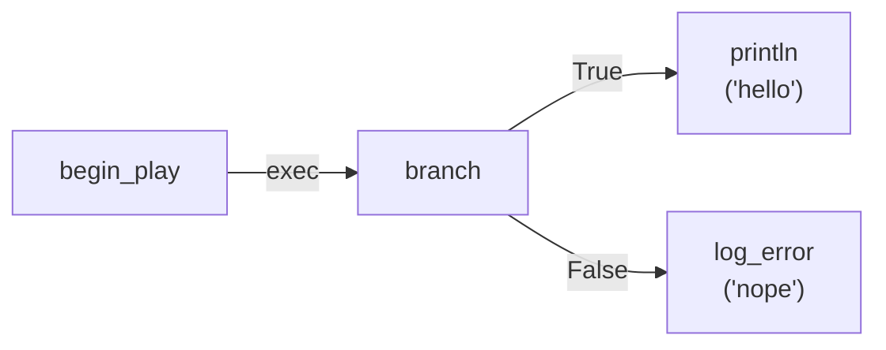

## The Assembly Line

A blueprint graph in the editor is a visual thing — nodes with colored pins, bezier wires, collapsible comments, zoom-to-fit. You can drag nodes around, connect outputs to inputs, group regions into macros. It feels like a drawing tool. But every time you hit the compile button, that drawing is fed into an assembly line that transforms it into executable code with two possible outputs.

This post follows that assembly line from end to end. It covers the Graphy library's representation of graphs, the type checker with its coercion system, the data flow analyzer, the execution router, the sub-graph expander, and the two code generators — bytecode and Rust. It is the companion to the [previous post](/blog/2026-07-14-pulsar-blueprint-executor), which covered the `#[blueprint]` macro, the component method system, and the dual-path execution runtime. Where that post followed the runtime path, this one follows the compile-time path.

The assembly line has five phases, implemented in the Pulsar Blueprint Graph Compiler (PBGC) and its underlying library, Graphy:

```
Phase 0: Sub-graph expansion — inline macros and collapsed regions
Phase 1: Metadata loading — resolve every node's type from the registry
Phase 2: Data flow analysis — compute pure node evaluation order
Phase 3: Execution routing — build the exec-pin connection table
Phase 4: Code generation — emit bytecode or Rust source
```

Each phase consumes the output of the previous one. Everything is a `CompileResult<T>` that carries diagnostics even on success — warnings don't fail the compile, they accumulate alongside the result.

---

## Representing a Graph

Before the compiler can analyze anything, it needs a structured representation of the graph. Graphy's core types model the graph as a collection of nodes, connections, and comments, with typed data flowing through pins.

### GraphDescription

The top-level container is `GraphDescription`:

```rust
pub struct GraphDescription {
    pub metadata: GraphMetadata,
    pub nodes: HashMap<String, NodeInstance>,
    pub connections: Vec<Connection>,
    pub comments: Vec<GraphComment>,
}
```

Nodes are stored in a `HashMap<String, NodeInstance>` keyed by node ID — O(1) lookups during compilation when following connections. Connections are stored as a flat `Vec` because every connection is visited during analysis anyway. Comments carry position, size, and text but are ignored by the compiler — they're purely visual.

### NodeInstance

Every node in the graph is a `NodeInstance`:

```rust
pub struct NodeInstance {
    pub id: String,
    pub node_type: String,         // "math.add", "branch", "comp_get_prop::PhysicsComponent::mass", etc.
    pub position: Position,
    pub inputs: Vec<PinInstance>,
    pub outputs: Vec<PinInstance>,
    pub properties: HashMap<String, JsonValue>,
    pub typed_properties: HashMap<String, PropertyValue>,
}
```

The `node_type` string is the key that links to `NodeMetadata`, where the compiler finds the parameter types, return type, exec pin layout, and function source. The `properties` and `typed_properties` maps carry node configuration — the constant value of a `MakeLiteral` node, the open/close state of a `Gate` node, the enum variant name for a text selection.

The editor also generates a rich `BlueprintDocument` (format v2) that wraps `GraphDescription` with a multi-graph structure:

```rust
pub struct BlueprintDocument {
    pub format_version: u32,
    pub metadata: BlueprintMetadata,
    pub entry_graph: String,
    pub graphs: HashMap<String, Graph>,  // main graph + macro graphs
    pub variables: Vec<ClassVariable>,
    pub editor_state: Option<DocumentEditorState>,
}
```

Each macro in the blueprint gets its own entry in `graphs`, keyed by a unique identifier. The compiler's first phase (Phase 0) expands these sub-graphs into the main graph before analysis.

### PinInstance and DataType

Each pin carries its data type as the `DataType` enum:

```rust
pub enum DataType {
    Exec,
    Data(TypeInfo),
}

pub struct TypeInfo {
    pub type_string: String,       // e.g. "f32", "Vec2", "Vec<Option<String>>"
    pub display_name: Option<String>,
    pub size_bytes: Option<usize>,
    pub align_bytes: Option<usize>,
}
```

Execution pins (`DataType::Exec`) are the white arrow-like pins that connect execution chains. Data pins (`DataType::Data`) carry a `TypeInfo` with the full type name as a string. The size and alignment fields are populated from the node metadata if known, or left as `None` for types that need resolution.

The `type_string` is the serialization-stable handle — "f32", "String", "Vec<Entity>", "[f32; 4]". It's not a `TypeId` because type IDs are not serializable across compilation boundaries. The type checker resolves these strings to `ReflectedType` values for structural comparison, then back to `RuntimeTypeInfo` through the reflection system for the final codegen layout decisions.

### ReflectedType: The Type Algebra

The `ReflectedType` enum is the compiler's internal type representation, parsed from `type_string` values:

```rust
pub enum ReflectedType {
    Primitive(PrimitiveKind),
    Struct { path: String, generics: Vec<ReflectedType> },
    Enum { path: String, variants: Vec<String> },
    Tuple(Vec<ReflectedType>),
    Array { element: Box<ReflectedType>, len: Option<usize> },
    Wrapper { kind: WrapperKind, inner: Box<ReflectedType> },
    TraitObject { trait_path: String },
    Wildcard,
}
```

This is a type algebra, not a type dictionary. It doesn't know about specific types — it knows about structural categories. A `Struct` is any type with fields regardless of name. A `Wrapper` is `Vec<T>`, `Option<T>`, `Arc<T>`, `Box<T>`, `&T`, `&mut T`. A `Wildcard` is the `?` type that matches anything.

The "is compatible" check between two types resolves to structural equality of `ReflectedType` trees, with two special cases: `Wildcard` matches everything, and the `CoercionRegistry` handles legal implicit conversions.

---

## Phase 1: Type Checking and Coercions

The type checker validates every connection in the graph. It is implemented in `graphy/src/type_checker.rs` and runs after sub-graph expansion.

### Connection Validation

For each connection, the type checker:

1. Looks up the source and target nodes in the graph.
2. Finds the source output pin and target input pin by ID.
3. If the pin type is `DataType::Exec`, checks only that both nodes exist — execution compatibility is unconditional.
4. If the pin type is `DataType::Data`, resolves the output pin's `ReflectedType` from the source node's metadata, the input pin's `ReflectedType` from the target node's metadata, and calls `is_compatible_with()`.

The resolution path for output pin types is:

1. Check if the pin itself has a `DataType::Data` with a `ReflectedType` already set (from the node's `metadata.return_type` or `metadata.effective_params()`).
2. Fall back to the node metadata's `return_type` for the first output pin, or `params[i]` for the i-th input pin.
3. If neither is set (e.g., for generic nodes whose types are determined by graph context), the type is `Wildcard` — it matches anything.

### The Coercion Registry

When two types are not equal, the type checker consults the `CoercionRegistry`:

```rust
pub struct CoercionRegistry {
    coercions: Vec<Coercion>,
    pub warn_lossy: bool,
}

pub enum Coercion {
    Lossless { from: String, to: String },
    Lossy { from: String, to: String },
}
```

The built-in coercions cover Rust's numeric widening rules:

- `i8 → i16 → i32 → i64 → i128` (all lossless)
- `u8 → u16 → u32 → u64 → u128` (all lossless)
- `f32 → f64` (lossless)
- `&str → String` (lossless — the only non-numeric coercion)
- `i8 → f32, i16 → f32, u8 → f32, u16 → f32` (lossless for integer→float, but only up to u16)

The registry is extensible — plugin systems can submit additional coercions, and the `warn_lossy` flag controls whether lossy coercions produce a warning diagnostic or an error.

Third-party plugins can register their own coercions via `inventory`:

```rust
use graphy::type_checker::{Coercion, CoercionRegistry};

inventory::submit! {
    Coercion::Lossless {
        from: "MyUnits".to_string(),
        to: "f32".to_string(),
    }
}
```

The registry collects all submitted coercions on first access, merging them with the built-in numeric coercions. The `warn_lossy` flag controls whether lossy coercions produce a warning or an error — a lossy coercion between game-specific units might be acceptable for prototyping but flagged in production builds.

The type checker checks coercions in order: exact match first, then lossless coercions, then lossy coercions, then failure. This means plugin coercions cannot override the built-in numeric widening rules — the built-in lossless coercions always take priority.

### Diagnostics: Warnings Aren't Failures

The diagnostic system is structured around the insight that a compile can produce useful output even when there are warnings:

```rust
pub struct CompileResult<T> {
    pub value: Option<T>,
    pub diagnostics: Vec<Diagnostic>,
}

pub struct Diagnostic {
    pub severity: Severity,
    pub message: String,
    pub location: Option<SourceLocation>,
    pub pass: PassName,
    pub code: Option<String>,
    pub note: Option<String>,
}
```

A `CompileResult::has_errors()` method returns `true` if any diagnostic has `Severity::Error`. The `value` may still be `Some` even with errors — the compiler produces what it can. This is important for the editor workflow: a graph with a type mismatch can still be partially compiled for preview, and errors are surfaced inline on the offending connection rather than as a dialog box.

The `SourceLocation` carries the graph ID, node ID, and optional pin ID — enough for the editor to highlight the exact connection that failed. When the `TypeChecker` emits a `TypeMismatch { expected: "String", actual: "f32" }` error, the `SourceLocation` identifies the specific `(node_id, pin_id)` where the incompatible edge is connected. The editor's diagnostic overlay highlights that pin in red and shows the error message as a tooltip on hover.

The `PassName` enum identifies which compiler phase emitted each diagnostic:

```rust
pub enum PassName {
    SubgraphExpansion,
    TypeChecking,
    DataFlow,
    ExecutionRouting,
    Codegen,
    Validation,
}
```

This lets the editor group diagnostics by phase and lets developers quickly determine whether an error is in the graph structure (type checking) or in the graph analysis (data flow). Each diagnostic also carries an optional `code` field — a human-readable identifier like `"E0001"` for "type mismatch" or `"W0002"` for "deprecated node in use" — that links to a documentation page explaining the error and how to fix it.

The build system in `pbgc/src/compiler.rs` accumulates diagnostics across all phases and returns them as a single `CompileResult` at the end:

```rust
pub fn compile_graph_with_library_manager(
    graph: &GraphDescription,
    variables: &HashMap<String, String>,
    library: &dyn GraphLibrary,
) -> CompileResult<String> {
    let mut diags = DiagnosticAccumulator::new();

    // Phase 0
    let expanded = diags.capture(|| expand_subgraphs(graph, library));

    // Phase 1
    let metadata = diags.capture(|| BlueprintMetadataProvider::new());

    // Phase 2
    let data_resolver = diags.capture(|| DataResolver::build(&expanded, &metadata));

    // Phase 3
    let exec_routing = diags.capture(|| ExecutionRouting::build_from_graph(&expanded));

    // Phase 4
    let code = diags.capture(|| {
        let generator = BlueprintCodeGenerator::new(
            &expanded, &metadata, &data_resolver, &exec_routing, variables.clone(),
        );
        generator.generate_program()
    });

    CompileResult {
        value: code.ok(),
        diagnostics: diags.into_diagnostics(),
    }
}
```

The `DiagnosticAccumulator::capture()` method runs a closure, catches any returned errors as `Diagnostic::Error` entries, and continues executing the remaining phases. This ensures that a type-checking error in Phase 1 doesn't prevent the data flow analysis in Phase 2 from running — the later phases operate on whatever they can, and their diagnostics are merged with the earlier ones. The editor displays all diagnostics at once, so the user can fix multiple issues in a single edit-compile cycle rather than the frustrating fix-one-error-compile-again-repeat pattern.

### The Type Information Chain

The compiler manages three separate type representations, each serving a different purpose in the pipeline:

| Representation | Location | Purpose |
|---|---|---|
| `type_string: String` | Serialized in graph JSON files | Persistent, portable type names |
| `ReflectedType` | Compiler IR (parsed from `type_string`) | Structural type algebra for validation |
| `RuntimeTypeInfo` | Reflection system (resolved from `RUNTIME_TYPE_REGISTRY`) | Layout data for codegen |

The chain works in one direction at compile time. The graph JSON stores `type_string` values like `"f32"`, `"Vec<String>"`, `"[f32; 4]"`. The `TypeParser` (a hand-written recursive descent parser in `graphy/src/core/types.rs`) converts these strings to `ReflectedType` trees. The type checker operates on `ReflectedType` trees because they're structural — `Vec<String>` and `Vec<f32>` are both `Wrapper { kind: Vec, inner: ... }` with different inner types, which means the checker can validate "this pin expects a `Vec` of anything" by matching the `Wrapper` variant without inspecting the inner type.

For codegen, the compiler needs actual sizes and alignments, not structural categories. It resolves each `ReflectedType` back to a concrete `RuntimeTypeInfo` through the `RUNTIME_TYPE_REGISTRY`. The `BlueprintMetadataProvider` exposes `param_layout()` and `return_layout()` methods for this purpose:

```rust
impl BlueprintMetadataProvider {
    pub fn param_layout(&self, node_type: &str, param_name: &str) -> Option<(usize, usize)>;
    pub fn return_layout(&self, node_type: &str) -> Option<(usize, usize)>;
}
```

These methods return the `(size, align)` pair baked into the `NodeMetadata` by the `#[blueprint]` macro's `size_of::<T>()` calls — no runtime type resolution, no reflection lookup. The size and alignment are compile-time constants embedded in the binary by the proc macro.

For component property and method types, the pin's `RuntimeTypeInfo` is resolved through the reflection system's `REGISTRY` at graph-edit time (when the user drags the node into the graph), and the `type_string` is stored in the graph JSON at save time. The compiler reads the `type_string` from the saved graph, never needing the reflection system at compile time for type validation — the `ReflectedType` comparison happens entirely on structural categories, not on `TypeId` equality.

This separation ensures the compiler can run in environments where the reflection system is not available — headless CI builds, WASM targets, or editor-less compilation pipelines.

### Node Metadata: The Source of Truth

The type checker gets its type information from the `NodeMetadataProvider` trait:

```rust
pub trait NodeMetadataProvider {
    fn get_node_metadata(&self, node_type: &str) -> Option<&NodeMetadata>;
    fn get_all_nodes(&self) -> Vec<&NodeMetadata>;
    fn get_nodes_by_category(&self, category: &str) -> Vec<&NodeMetadata>;
}
```

The `BlueprintMetadataProvider` implements this for blueprint nodes. It wraps `pulsar_std::get_all_nodes()` and caches the result in a `OnceLock<HashMap<String, NodeMetadata>>`. The `NodeMetadata` struct carries everything a compiler pass needs:

```rust
pub struct NodeMetadata {
    pub name: String,
    pub node_type: NodeTypes,               // pure, fn_, control_flow, event
    pub category: String,
    pub params: Vec<ParamInfo>,
    pub return_type: Option<TypeInfo>,
    pub exec_outputs: Vec<String>,           // named execution output pins
    pub param_metas: Vec<ParamMeta>,         // rich reflected-type params
    pub property_schema: Vec<PropertySchema>,
    pub is_variadic: bool,
    pub generic_params: Vec<String>,
    pub function_source: String,             // Rust code template, used for control flow inlining
    pub imports: Vec<String>,
    pub doc: Option<String>,
    pub deprecated: Option<String>,
}
```

The `function_source` field is critical for control flow nodes. It stores the original Rust function body as a string, which the AST transformer later parses to find `exec_output!()` markers and substitute the downstream execution chain.

### How the Editor Drives Compilation

The compiler pipeline is not a standalone executable — it's a library called from within the editor process. The `BlueprintEditorPanel` in `plugins/vendor/blueprint_editor/src/features/compilation/compiler.rs` orchestrates the full compile:

```rust
impl BlueprintEditorPanel {
    pub fn compile_to_class_directory(&mut self, cx: &mut Context<Self>) {
        // 1. Convert the editor's BlueprintGraph to GraphDescription
        let graph = self.build_graphy_description();

        // 2. HACK: Strip editor-only internal nodes from the graph.
        //    Unconnected component-ref nodes and similar editor scaffolding
        //    are removed so the compiler doesn't complain about dangling wires.
        let cleaned = strip_internal_blueprint_nodes(graph);

        // 3. Run the compiler
        let result = pbgc::compile_graph_with_variables(
            &cleaned,
            &self.class_variables(),
        );

        // 4. Collect diagnostics and display them in the editor UI
        self.show_diagnostics(&result.diagnostics, cx);

        // 5. If successful, wrap in an actor and write files
        if let Some(code) = &result.value {
            let actor_source = generate_blueprint_actor_source_with_components(
                &self.id, code, &self.components, &self.class_variables(),
            );
            self.write_class_directory(&actor_source);
            cx.notify();
        }
    }

    pub fn compile_to_bytecode_files(&mut self, cx: &mut Context<Self>) {
        let graph = self.build_graphy_description();
        let cleaned = strip_internal_blueprint_nodes(graph);
        let result = pbgc::compile_graph_to_bytecode_with_variables(
            &cleaned,
            &self.class_variables(),
        );
        self.show_diagnostics(&result.diagnostics, cx);
        if let Some(programs) = &result.value {
            self.write_bytecode_files(programs);
            cx.notify();
        }
    }
}
```

The `build_graphy_description()` method converts the editor's internal `BlueprintGraph` (which carries animation state, selection highlights, drag operations, and other editor-only data) into a clean `GraphDescription` for the compiler. The conversion:

1. Copies every node, stripping editor-only fields (position velocity for animations, visual size override, context menu state).
2. Strips internal nodes that the editor uses for UI — `get_component_ref` placeholder nodes, for example, are removed because the component reference is resolved differently in the final graph (the compiler needs the actual component class name, not a node that resolves it).
3. Strips `component_ref` pins on component method call nodes — the compiler hard-codes the component class from the node type string.
4. Expands macros by calling `SubGraphExpander::expand_all_flat()` with the editor's local macro library.

The diagnostics are surfaced through the editor's existing diagnostic overlay system. `Diagnostic` entries with `SourceLocation` values are displayed as colored annotations on the graph nodes and pins. Entries without locations (structural errors like "no event node found") appear as notifications in the editor's status bar. The editor also caches the diagnostic list and updates it incrementally: only changed graphs are recompiled, avoiding a full recompile on every node position change.

The editor triggers compilation automatically when the user saves the graph, or manually via a "Compile" button in the toolbar. The bytecode compile path runs on every "Play" press (sub-100ms for typical graphs), while the Rust compile path is triggered explicitly by the user when they want to generate actor files for shipping.

---

## Phase 2: Data Flow Analysis

With metadata loaded and types validated, the `DataResolver` builds a dependency graph of pure nodes. Pure nodes have no side effects and no execution pins — they compute values purely from their data inputs.

### Mapping Data Sources

The resolver iterates every data connection and maps each `(target_node_id, target_pin_id)` to a `DataSource`:

```rust
pub enum DataSource {
    Connection { source_node_id: String, source_pin: String },
    Constant(String),       // property value serialized as JSON string
    Default,                // use Default::default()
}
```

An unconnected data pin becomes either a `Constant` (if the node has a property value for that pin) or `Default`. The constant path is how literal nodes work — they have no data inputs and their output is the constant value stored in `properties`.

### Building the Pure Node Order

The resolver identifies pure nodes (metadata says `node_type == NodeTypes::pure` with a non-void return type) and runs Kahn's algorithm for topological sorting of the pure-node DAG:

1. Build the dependency graph: a pure node A depends on pure node B if B's output is connected to A's input.
2. Start with nodes that have no dependencies (their inputs come from constants, defaults, or impure nodes).
3. Emit each node after all its dependencies have been emitted.
4. If any pure node remains unemitted, there's a cycle — emit a `CyclicDependency` diagnostic.

The output ordering determines the evaluation order for pure node expressions. A node used as input to multiple downstream nodes is emitted once and its result is referenced by name in the downstream expressions.

The resolver also generates unique variable names for each node's result. The convention prefixes the node's ID to avoid collisions: `node_{sanitized_id}_result`. The sanitization step replaces hyphens and special characters so the result is a valid Rust identifier.

### Parallel Build

The resolver has a parallel build variant that uses `rayon` for the data connection mapping phase. The topological sort remains sequential — it's an inherently linear operation — but the initial scan of 1000+ connections benefits from parallel iteration, especially for large graphs with hundreds of nodes.

---

## Phase 3: Execution Routing

While the data resolver handles pure-node ordering, the `ExecutionRouting` handles execution flow. It builds a routing table from execution connections:

```rust
pub struct ExecutionRouting {
    routes: FxHashMap<(String, String), Vec<String>>,
}
```

The table maps `(source_node_id, output_pin_id)` to `[target_node_ids]`. For a `branch` node connected to a `println` on its `"True"` output and a `log_error` on its `"False"` output, the routing table has entries like:

```
("branch_42", "True")  → ["println_7"]
("branch_42", "False") → ["log_error_3"]
```

The routing table is built in a single pass over the graph's connections, filtering for `ConnectionType::Execution`. After construction, it supports O(1) lookups via `get_connected_nodes(node_id, output_pin_id)`. Both code generators use this to follow execution chains from event nodes through function nodes, control-flow branches, and back.

```rust
impl ExecutionRouting {
    pub fn build_from_graph(graph: &GraphDescription) -> Self;
    pub fn get_connected_nodes(&self, node_id: &str, output_pin: &str) -> &[String];
    pub fn has_execution_outputs(&self, node_id: &str) -> bool;
    pub fn get_output_pins(&self, node_id: &str) -> Vec<String>;
}
```

---

## Phase 0: Sub-Graph Expansion

Before the main phases run, an optional Phase 0 expands macros into the main graph. The `SubGraphExpander` implements this through a `GraphLibrary` trait:

```rust
pub trait GraphLibrary {
    fn get_graph(&self, id: &str) -> Option<GraphDescription>;
}
```

The expander's algorithm is recursive:

1. Collect all `SubgraphCall` nodes in the main graph.
2. For each call node `C`:
   - Look up the target graph `G` by ID from the library.
   - **Cycle detection**: Maintain a `visited` stack of graph IDs. If `G` is already on the stack, abort with `GraphExpansion` error — macro recursion is forbidden.
   - **Recursive expansion**: Expand `G` first (handles nested macros within `G`).
   - **Inline**: Clone all non-entry/exit nodes from `G` into the parent graph, prefixing each node's ID with `<call_id>__`. The `NodeInstance::with_id_prefix()` method handles re-wiring: every connection within the cloned sub-graph is updated to reference the prefixed IDs.
   - **Rewire connections**: Incoming connections to `C`'s input pins are rewired to the `SubgraphEntry` node inside the expansion. Outgoing connections from `C`'s output pins are rewired from the `SubgraphExit` node.
   - Remove `C` from the parent graph.

The result is a flat graph with all macros expanded. The type checker and analyzers then see a single graph with no macro boundaries.

---

## Phase 4: Code Generation — Two Outlets

The final phase produces the executable output. The compiler has two entry points:

```rust
// Rust codegen path
pub fn compile_graph_with_variables(
    graph: &GraphDescription,
    variables: HashMap<String, String>,
) -> Result<String, GraphyError>;

// Bytecode codegen path
pub fn compile_graph_to_bytecode_with_variables(
    graph: &GraphDescription,
    variables: HashMap<String, String>,
) -> Result<Vec<BpProgram>, GraphyError>;
```

Both receive the same expanded, analyzed graph with the same metadata provider, data resolver, and execution routing. They both walk the execution chains starting from event nodes. The difference is the output format — and therefore the code generation strategy for every construct in the graph.

---

## Bytecode Code Generation

The bytecode codegen in `pbgc/src/codegen/bytecode_codegen.rs` produces a vector of `BpProgram` values — one per event (begin_play, tick, end_play, etc.). Each program is a flat sequence of instructions operating on a byte arena.

### The LayoutAllocator

Before emitting instructions, the codegen needs to know where every value lives in the arena. The `LayoutAllocator` is a simple bump allocator:

```rust
struct LayoutAllocator {
    next_offset: usize,
}

impl LayoutAllocator {
    fn alloc(&mut self, size: usize, align: usize) -> usize {
        let offset = (self.next_offset + align - 1) & !(align - 1);
        self.next_offset = offset + size;
        offset
    }
}
```

It is not a general-purpose allocator. It's used once during compilation and thrown away. The arena layout is fixed at compile time, which means the VM never allocates or deallocates during execution. Every variable slot, every temporary value, every return value buffer has a fixed byte offset known before execution begins.

### Emitting a Pure Node

Pure nodes compile to `Instruction::Call` with their function pointer (patched later by the executor):

```rust
fn emit_fn_node(
    &mut self,
    node: &NodeInstance,
    metadata: &NodeMetadata,
    allocator: &mut LayoutAllocator,
) -> Result<(), GraphyError> {
    // Allocate output slot if the node has a return value
    let output_offset = if let Some(rt) = &metadata.return_type {
        let layout = self.metadata_provider.return_layout(node.node_type.as_str());
        match layout {
            Some((size, align)) => Some(allocator.alloc(size, align)),
            None => return Err(...),
        }
    } else {
        None
    };

    // Collect input offsets — resolve from data connections or properties
    let input_offsets: Vec<usize> = ...;

    self.instructions.push(Instruction::Call {
        fn_ptr: 0,  // patched later by BpExecutor::prepare
        node_type: node.node_type.clone(),
        input_offsets,
        output_offset: output_offset.unwrap_or(0),
        has_output: output_offset.is_some(),
        type_slot_offsets: self.collect_type_slot_offsets_for(node, allocator),
    });
}
```

The `fn_ptr` is left as 0 because the function addresses are not known until the native cdylib is loaded at runtime. The executor patches these before execution.

### Emitting Control Flow

Control flow emission follows the execution routing table:

```rust
fn emit_control_flow(&mut self) {
    if node_type == "branch" {
        // Read condition offset, emit JumpIf
        let condition_offset = self.resolve_input_offset(node, "condition");
        let true_label = self.next_label;
        let false_label = self.next_label + 1;
        let after_label = self.next_label + 2;

        self.instructions.push(Instruction::JumpIf {
            condition_offset,
            true_label,
            false_label,
        });

        // Emit true branch
        self.instructions.push(Instruction::Label(true_label));
        for downstream in self.exec_routing.get_connected_nodes(node_id, "True") {
            self.emit_exec_chain(downstream, indent + 1)?;
        }
        self.instructions.push(Instruction::Jump(after_label));

        // Emit false branch
        self.instructions.push(Instruction::Label(false_label));
        for downstream in self.exec_routing.get_connected_nodes(node_id, "False") {
            self.emit_exec_chain(downstream, indent + 1)?;
        }

        self.instructions.push(Instruction::Label(after_label));
    }
}
```

The `JumpIf` instruction reads a single bool byte from the arena. If non-zero (true), execution continues at the `true_label`. Otherwise, it jumps to `false_label`. The `Jump` at the end of the true branch skips over the false branch, ensuring only one side executes.

### Emitting Component Nodes

Component nodes — `comp_get_prop`, `comp_set_prop`, `comp_call` — emit the same `Instruction::Call` as any other node, but their dispatch functions are defined in the `pulsar_game` crate rather than `pulsar_std`. The executor resolves `__bp_dispatch_comp_get_prop__PhysicsComponent__mass` from the game library's exports. The dispatch function internally calls the component store with the class name, property name, and serialized JSON value.

### Constants and Initialization

The first instructions in any program are `InitBytes` entries for constant values used by the graph. A `make_literal_f32(3.14)` node emits:

```rust
Instruction::InitBytes {
    offset: allocator.alloc(4, 4),  // 4 bytes, 4-byte aligned
    bytes: 3.14f32.to_le_bytes().to_vec(),
}
```

For generic type parameters (`Vec<T>`, `Arc<T>`, bare `T`), the codegen emits `InitTypeSlot` instructions after resolving the concrete type from the data connections that feed into the generic pin. The `collect_type_slots_for_node` method traces each generic parameter's data source:

- If the parameter is a wrapper (e.g., `Vec<T>`), the wrapper size is known from compile time (24 bytes). Only the inner `T` needs resolution.
- If the parameter is bare `T`, the codegen follows the data connection to the source node, reads the source's return type layout from metadata, and emits an `InitTypeSlot` with the concrete size and alignment.

> **⚠️ Limitation:** The current dispatch shim for bare `T` uses a pre-compiled `[u8; N]` size table covering only 0, 1, 2, 4, 8, 12, 16, 24, and 32 bytes. Types outside this range (e.g., a 48-byte struct) panic at runtime. The proper solution adds `copy` and `drop` function pointers to `TypeSlot` — generated by the `#[blueprint]` macro alongside the dispatch shim — so the generic dispatch works for any size with no pre-compiled table and no size limit.

### The Complete Program

A `BpProgram` is serialized to JSON and written to `events/.build/bytecode.json`:

```json
{
  "name": "tick",
  "arena_size": 256,
  "max_args_count": 8,
  "instructions": [
    { "InitBytes": { "offset": 0, "bytes": [0, 0, 0, 0] } },
    { "Call": { "fn_ptr": 0, "node_type": "get_delta_time", ... } },
    { "Call": { "fn_ptr": 0, "node_type": "add", ... } },
    { "StoreVar": { "input_offset": 16, "target_offset": 64, "size": 4 } },
    { "Return": {} }
  ]
}
```

After deserialization, the executor patches every `fn_ptr` from 0 to the actual function address via `dlsym`. The program is then ready for the VM's `run_with_external_arena`.

---

## Rust Code Generation

The Rust codegen in `pbgc/src/codegen/rust_codegen.rs` produces idiomatic Rust source from the same graph. Where the bytecode codegen produces a flat instruction sequence, the Rust codegen produces structured Rust with `if/else`, `let` bindings, function calls, and `thread_local!` storage.

### Event Functions

Each event node becomes a `pub fn`:

```rust
pub fn on_tick(delta_time: f32) {
    // pure node preamble — compute all pure expressions in topological order
    let node_result_7 = add(5i64, 3i64);
    let node_result_8 = lerp(0.0f64, 1.0f64, delta_time as f64);

    // execution chain starting from the event's "Body" output
    PBGC_VAR_HEALTH.with(|slot| __pbgc_set_copy(slot, node_result_7 as f32));
    println("tick");
}
```

The function signature is derived from the event node's metadata parameters — `on_tick` gets `delta_time: f32`, `on_input_key` gets `key: String, pressed: bool`.

### Pure Node Preamble

Pure nodes with non-void return values are emitted as `let` bindings in topological order before the execution chain. The codegen uses the data resolver's computed ordering to ensure each node's inputs are available before its outputs are used.

If a pure node is used as input to exactly one execution node, the codegen inlines its expression directly rather than creating a named variable:

```rust
// Instead of:
let node_add = add(3, 5);
println(node_add);

// Inline:
println(add(3, 5));
```

The heuristic is: a pure node with one consumer is inlined; a pure node with multiple consumers or used as a class variable assignment is materialized.

### Control Flow Inlining

Control flow nodes are the most interesting part of the Rust codegen. The key insight is that every control flow node has a `function_source` — the original Rust function body captured by the `#[blueprint]` macro. The codegen uses the AST transformer in `graphy/src/utils/ast_transform.rs` to inline the downstream execution chain into the source template.

The `inline_control_flow_function()` function:

1. Parses the `function_source` string into a `syn::Expr` expression.
2. Uses `ExecOutputReplacer` — a `syn` visitor that finds `exec_output!("Label")` calls and replaces each with the actual generated code of the downstream execution chain for that label.
3. Uses `ParameterSubstitutor` — replaces parameter name references with the resolved input expressions (either the pure node's variable name or the inlined expression).
4. Returns the transformed function body as a string.

For a `branch` node on the graph connected to `print("yes")` on True and `print("no")` on False:

```rust
// Original function_source:
fn branch(condition: bool) {
    if condition {
        exec_output!("True");
    } else {
        exec_output!("False");
    }
}

// After exec_output inlining + parameter substitution:
if condition {
    print("yes");
} else {
    print("no");
}
```

This produces natural Rust control flow. The codegen is not generating bytecode-level jumps — it is generating the same `if/else` that a human would write.

For `for_loop`:

```rust
// function_source:
fn for_loop(count: i64) {
    for _i in 0..count {
        exec_output!("Body");
    }
}

// After inlining:
for _i in 0..count {
    // code connected to the "Body" exec output
    process_item(i);
}
```

The AST transformer handles arbitrarily nested `exec_output!()` calls — a `branch` inside a `for_loop` inside a `sequence` inlines correctly through recursive transformation.

### Variable Storage

Class variables declared on the blueprint class are compiled to `thread_local!` statics:

```rust
thread_local! {
    static PBGC_VAR_HEALTH: Cell<Option<f32>> = Cell::new(None);
    static PBGC_VAR_PLAYER_NAME: RefCell<Option<String>> = RefCell::new(None);
}
```

The codegen chooses `Cell<Option<T>>` for `Copy` types (primitives, `[f32; 4]`, etc.) and `RefCell<Option<T>>` for `Clone` types (`String`, `Vec<T>`, structs). Helper functions provide ergonomic access:

```rust
fn __pbgc_set_copy<T: Copy>(slot: &Cell<Option<T>>, value: T) {
    slot.set(Some(value));
}

fn __pbgc_get_copy<T: Copy>(slot: &Cell<Option<T>>, var_name: &str) -> T {
    slot.get().unwrap_or_else(|| panic!("PBGC variable '{}' read before assignment", var_name))
}

fn __pbgc_get_clone<T: Clone>(slot: &RefCell<Option<T>>, var_name: &str) -> T {
    slot.borrow().as_ref().cloned()
        .unwrap_or_else(|| panic!("PBGC variable '{}' read before assignment", var_name))
}
```

The `thread_local!` approach has two advantages over a global HashMap. First, it's zero-overhead when the variable is not used — the storage is only initialized if the containing function is called. Second, `Cell` and `RefCell` provide borrow-checking at runtime for mutable state, which matches the mutable semantics of blueprint variables.

### Component Node Codegen

Component method nodes generate different code depending on the node type:

- **comp_get_prop** — Emits a call to `store.get_property_json::<T>(class_name, prop_name)`, which deserializes the property's current JSON value to the appropriate type.

- **comp_set_prop** — Emits `store.set_property_json(class_name, prop_name, &value)`, which serializes the value back to JSON and writes it to the scene store.

- **comp_call** — Emits `store.call_method_json(class_name, method_name, args)`, which looks up the `MethodMetadata` by class and method name, unpacks the JSON arguments, calls the method's type-erased `caller` closure, and returns the result as JSON.

These calls are wrapped in a `pulsar_game::__bp_with_comp(|store| { ... })` closure that provides access to the runtime component store. The closure pattern ensures the store is properly initialized before any component access and cleaned up afterward.

The JSON serialization round-trip is the current bottleneck for component method calls in the native path. A component `apply_impulse(force: [f32; 3])` call serializes the force vector to JSON in the calling code, passes it through `serde_json::Value`, deserializes it in the component store, calls the method, serializes the result, and deserializes it back. For the shipping path, this will become a direct function call through the component's generated bindings — no serialization, no store lookup, just `component.apply_impulse(force)`. The reflection system already has all the information needed (`MethodMetadata` with parameter types and the `caller` closure); the codegen just needs to emit the direct call instead of the JSON indirection.

### Project Assembly

The generated event functions are assembled into a blueprint component crate by `generate_project()` in `pbgc/src/project.rs`. The output has this structure:

```
<blueprint_component>/
  mod.rs           → #[derive(EngineClass, Clone)] struct, Actor impl
  events/
    mod.rs         → pub mod logic; pub use logic::*;
    logic.rs       → generated event functions (the output of rust_codegen)
  vars/
    mod.rs         → variable storage thread_local! and helper functions
```

The component struct is generated as:

```rust
#[derive(EngineClass, Clone)]
pub struct DamageHandler {
    pub components: Arc<ComponentStore>,
}

impl Actor for DamageHandler {
    fn begin_play(&self) { logic::begin_play(); }
    fn tick(&self, dt: f32) { logic::on_tick(dt); }
    fn end_play(&self) { logic::end_play(); }
}
```

Blueprint components don't stand alone — they are assembled onto **prefabs**, which are the unit analogous to Unreal's Blueprint Actors. A prefab holds a list of component instances and an event graph that wires them together. The `EngineClass` derive registers the component in the `EngineClassRegistry`, making it available to be added to prefabs in the editor. The `Actor` trait implementation connects the component's lifecycle to the prefab's event dispatch.

The generated project is written to a `generated/` directory in the engine's workspace and compiled as part of the regular `cargo build` for shipping builds. Eventually, prefabs themselves will be definable in Rust (`#[prefab] struct MyPrefab { health: HealthComponent, ... }`), but for now they are authored exclusively in the editor.

---

## The Assembly Line in Miniature

Following a single graph through all five phases demonstrates the system end to end.

**User builds this graph:**



**Phase 0 — Sub-graph expansion:** No macros present. No-op.

**Phase 1 — Metadata loading:** The compiler resolves:
- `begin_play` → event node with `exec_output!("Body")`
- `branch` → control_flow node with param `condition: bool`, exec outputs `"True"` and `"False"`
- `println` → fn_ node with param `message: String`, one exec output
- `log_error` → fn_ node with param `message: String`, one exec output

**Phase 2 — Data flow analysis:** No pure nodes with data outputs. No-op.

**Phase 3 — Execution routing:** Builds routing table:
- `(begin_play, "Body")` → `["branch_1"]`
- `(branch_1, "True")` → `["println_2"]`
- `(branch_1, "False")` → `["log_error_3"]`

**Phase 4a — Bytecode codegen (serialized as JSON via serde — this is the actual `bytecode.json` format):**

```json
{
  "name": "begin_play",
  "arena_size": 128,
  "max_args_count": 4,
  "instructions": [
    {"Call": { "fn_ptr": 0, "node_type": "branch",
               "input_offsets": [condition_offset], "output_offset": 0,
               "has_output": false, "type_slot_offsets": [] }},
    {"JumpIf": { "condition_offset": 0, "true_label": 1, "false_label": 2 }},
    {"Label": 1},
    {"Call": { "fn_ptr": 0, "node_type": "println",
               "input_offsets": [message_offset], "output_offset": 0,
               "has_output": false, "type_slot_offsets": [] }},
    {"Jump": 3},
    {"Label": 2},
    {"Call": { "fn_ptr": 0, "node_type": "log_error",
               "input_offsets": [message_offset], "output_offset": 0,
               "has_output": false, "type_slot_offsets": [] }},
    {"Label": 3},
    {"Return": {}}
  ]
}
```

**Phase 4b — Rust codegen:**

```rust
pub fn begin_play() {
    if condition {
        println("hello");
    } else {
        log_error("nope");
    }
}
```

The same graph, the same analysis, two completely different execution strategies.

---

## The Graph Rendering Pipeline

While the compiler processes the graph for execution, the editor's `NodeGraphRenderer` processes it for display — and it uses many of the same structures. The renderer in `plugins/vendor/blueprint_editor/src/rendering/graph.rs` is a GPU-driven pipeline that takes the same `BlueprintGraph` type and renders it through four parallel GPU pipelines: grid, node bodies, wires, and (CPU-tessellated) text glyphs.

The renderer's CPU work is minimal by design: viewport culling (skip off-screen nodes), building instance arrays (position, size, color for each node/pin/wire), bezier wire control point calculation, and text layout. The GPU handles all actual drawing — the graph editor has no GPUI canvas overlay for graph content, including text. Every character in a node title or pin label is rendered as a GPU glyph.

The connection between the renderer and the compiler is the `GraphDescription` type. The editor's `BlueprintGraph` (used for display and editing) and the compiler's `GraphDescription` (used for analysis and codegen) are two views of the same data. The `build_graphy_description()` function strips editor-only state (selection state, animation timers, drag operations) and produces a clean graph for the compiler pipeline.

---

## What We Learned Building the Compiler

**The `exec_output!()` lowering via `syn` AST transformation was the right call.** We considered three approaches for control flow nodes: (1) a custom DSL for describing branch patterns, (2) a node metadata schema that explicitly listed exec output names, and (3) the Rust source template approach. The DSL would have required learning a new syntax. The schema approach would have been fragile — any change to the exec output structure required updating the schema. The Rust source template approach works because `syn` already parses Rust, and the template is just Rust code with `exec_output!()` as a sentinel. No new syntax. No schema versioning. The compiler already has `syn` as a dependency for the proc macro system, so there's no additional compile-time cost.

**The dual codegen architecture is a forcing function for correctness.** Every bug in the graph analyzer shows up as a mismatch between the bytecode output and the Rust output. The test suite compiles the same graph through both paths and validates that they produce equivalent behavior. A bug that only manifests in one path is caught by the other. The `test_timing_bytecode_vs_rust_codegen` test in `pulsar_std_bundle/tests/integration.rs` compiles a 50-node graph through both paths and reports the speedup factor — currently 3-8x for compile time (bytecode is faster to compile), with equivalent execution results.

**The `LayoutAllocator` approach forced us to think about memory layout during compilation, and that was valuable.** In a stack-based VM, memory layout is emergent — values are pushed and popped, and the stack pointer tracks the current depth. In a register-style VM with a fixed arena, the compiler must know where every value lives before it emits the first instruction. This upfront planning catches layout conflicts at compile time that would be runtime crashes in a stack machine. The simple bump allocator with explicit alignment handling also made it easy to reason about the FFI boundary — every `DispatchFn` receives pointers that are guaranteed to be properly aligned for the target type.

**The JSON serialization indirection for component methods is the single biggest remaining performance issue.** For the bytecode path, the JSON round-trip is acceptable because the VM is already an order of magnitude slower than native. For the native path, it's wasteful — the component store serializes to JSON only to immediately deserialize on the other side. The fix is straightforward: the `#[component_methods]` macro already knows the concrete parameter types, and the `MethodMetadata::caller` closure already does the type-erased dispatch. The codegen just needs to emit a direct call through the component's generated trait, bypassing JSON entirely. This change will bring native component method calls from "comparable to Lua interop" to "as fast as a hand-written Rust call."

---

## The Next Phase

The compiler pipeline is complete and functional. Every graph that compiles through bytecode also compiles through Rust. The type checker catches mismatches before codegen runs. The sub-graph expander handles recursive macros. The AST transformer correctly inlines `exec_output!()` through arbitrary nesting depths.

The next phase focuses on optimization:

**Dead node elimination.** Graphs accumulate unused nodes during editing — a user might wire up a `lerp` node, decide not to use it, but leave it in the graph. The compiler should detect nodes with no path to an event output and emit nothing for them. This is straightforward dead code elimination on the execution routing table.

**Macro inlining in the Rust path.** Currently, macro instances compile to separate function calls. For macros used inside a single event, they should be inlined directly into the calling function. The bytecode path already handles this (sub-graph expansion happens before codegen), but the Rust codegen uses a separate code path for macros that generates wrapper functions.

**Constant folding.** Pure nodes whose inputs are all compile-time constants should be evaluated during compilation. A `add(make_literal_int(3), make_literal_int(5))` sub-graph should become `8` in the output, saving two function calls and the runtime overhead of literal construction.

**Component method direct access.** As described above, the JSON serialization indirection for component property and method access should be replaced with direct Rust function calls, using the `MethodMetadata` data already available from the reflection system.

Each of these is an incremental improvement on the existing pipeline. The structure is right — the phases are clean, the data structures are well-defined, and the dual output validates correctness. The remaining work is in making the output faster, not in making the pipeline work.

The full blueprint system — from `#[blueprint]` macro to bytecode VM, from `#[component_methods]` to native Rust actor, from `exec_output!("Body")` to `if/else` — is an assembly line that transforms a visual program into an executable one. The first post followed the runtime path after compilation. This post followed the compile-time path before execution. Together, they cover every stage of a blueprint graph's journey from the editor canvas to the game loop.
