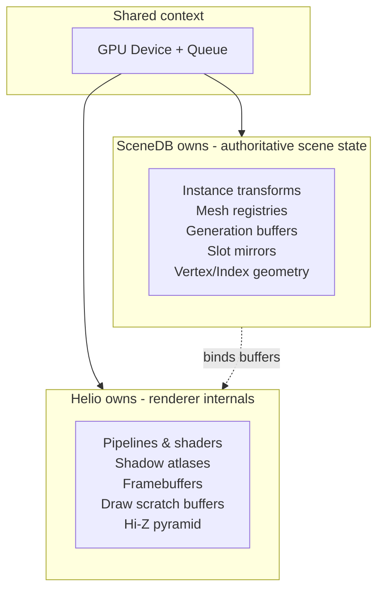
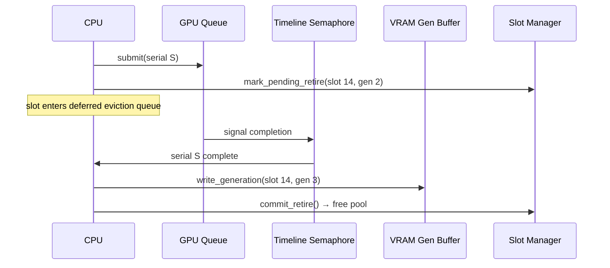
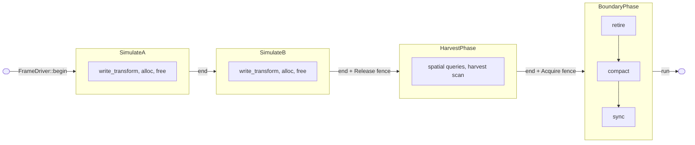
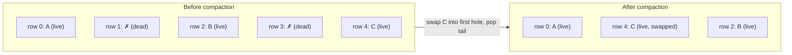
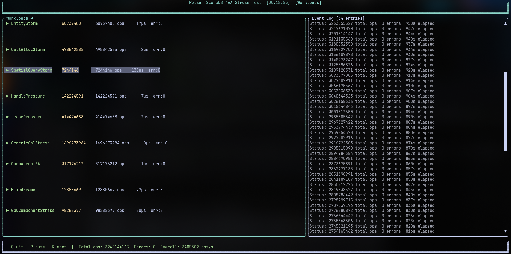
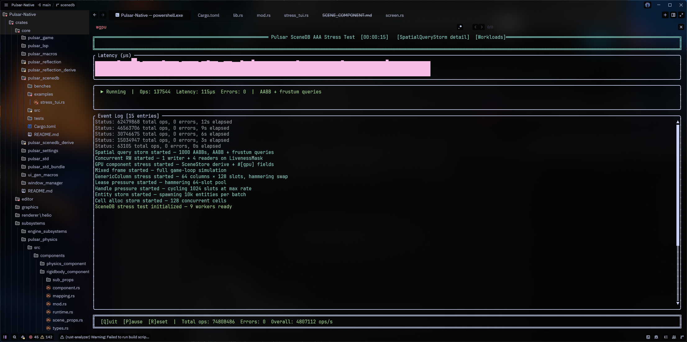
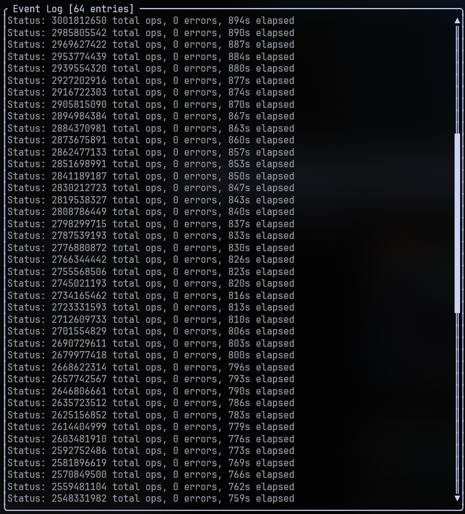

## Part 0: Context

### 0.1 The Problem That Gave Birth to SceneDB

Every system in a legacy engine owns its own copy of the world. The renderer
keeps a scene graph. The physics engine builds a broadphase from scratch each
frame. The editor maintains a selection set and a hierarchy panel. AI systems
query spatial trees they rebuilt after the last mutation. Each copy is slightly
different because each system cares about a different subset of properties, and
each system updates its copy on a different schedule.

The renderer needs mesh handles, material indices, and transform matrices. The
physics engine needs collision shapes, velocities, and broadphase AABBs. The
editor needs selection volumes, hierarchy relationships, and undo state. None of
these are the same data, but they all describe the same objects. Keeping them
consistent is the hidden cost that grows with every new subsystem.

A typical frame in a legacy engine runs something like this. The game thread
mutates transforms. It notifies the renderer that the scene graph is dirty. The
renderer walks its scene graph, rebuilds a list of visible objects on the CPU,
and uploads transforms to the GPU. Meanwhile the physics engine fetches the
updated positions from its own representation, rebuilds its broadphase, and runs
collision detection. The editor, which needs to display the same scene, reads
from a third copy or polls the game thread directly. Each path is a hand-written
sync channel that must be maintained, debugged, and kept performant as the
entity count climbs.

At small scale, a few hundred objects, the approach works. The copies are small.
The sync overhead is noise. The engineering cost of maintaining parallel data
structures is invisible. The renderer uploads everything because uploading
everything is cheap when there is almost nothing to upload. The physics
broadphase rebuilds from scratch because rebuilding from scratch for 300 bodies
takes microseconds. The editor reads the game thread's state directly because
the lock contention is negligible.

At medium scale, a few thousand objects, the noise becomes a line item in the
frame budget. Transform uploads start showing up in the profiler. The physics
broadphase rebuild takes measurable time. The editor panel starts to lag behind
the game view by a frame or two. The team adds dirty flags and change lists to
the transform sync path. The physics engine switches to incremental broadphase
updates. Each subsystem adds a tracking layer: a set of changed entity IDs, a
per-frame diff buffer, a deferred update queue. Each tracking layer is a new
surface for desync bugs. A dirty flag that is not cleared. A change list that
overflows. An update that arrives after the consumer has already read the stale
data.

At large scale, tens of thousands of objects in a modern open-world scene, the
approach breaks. The renderer cannot afford to push 50,000 transforms to the GPU
every frame. The physics engine cannot rebuild or incrementally update a
broadphase that large without paying a cost proportional to the scene size
rather than the number of changed objects. The editor cannot poll the game
thread for updates without stalling both. The sync channels that worked at 1,000
objects consume more frame time than the actual work they support.

The waste is not just bandwidth. CPU time spent marshalling data into upload
buffers scales with total object count, not mutation count. A full-upload
renderer pushing 100,000 transforms at 64 bytes each transfers 6.4 MB per
frame whether 100 or 100,000 objects moved. The renderer has no way to know what
changed because it does not own the data. It owns a copy it must refresh in its
entirety or risk staleness.

> [!NOTE]
> The push-model is not inherently wrong. At small entity counts the overhead
> is negligible. The problem is that it does not scale - the cost is O(entities)
> per frame regardless of how few entities changed. SceneDB replaces this with
> a cost proportional to the number of mutations, not the total scene size.

Each subsystem solves this problem in isolation. Physics builds an incremental
broadphase in its own memory, invisible to the renderer. The editor reads the
game thread's arrays directly, coupling itself to a single consumer's layout.
Audio, AI, and networking each add their own sync channels. The cost is
superlinear - each new consumer multiplies the pairwise reconciliation paths.

This is the problem SceneDB was built to solve. Not incremental optimization of
the sync channels. Removal of the sync channels entirely. One store. One
representation of each object, CPU and GPU. One allocator, one retirement path,
one spatial index. Every subsystem that needs to know where things are goes
through the same store.

### 0.2 What SceneDB Replaces

The old `pulsar_ecs` crate was a conventional archetype ECS. Entities lived in
CPU memory. Components were stored in dense `Vec<T>` columns indexed by
`ComponentId`, itself a dense `u32` assigned on first access. Queries matched
archetypes by bitmask and returned pointers into the columns. Archetype
migration moved entities between storage arrays when components were added or
removed.

```rust
// pulsar_ecs, the old world
let mut world = World::new();
let e = world.spawn((Pos(0.0, 0.0), Vel(1.0, 0.0)));
for (pos, vel) in world.query::<(&Pos, &Vel)>() {
  // direct pointer access
}
```

It was fast for what it was. Spawn throughput hit 560 million entities per
second on the empty archetype. Query iteration ran at 84 million entities per
second. Archetype migration ran faster than the original baseline after the
merge-insert and `get_raw` optimizations landed. The `thread_local!` component
ID cache avoided `TypeId` hashing. The bitmask pre-filter let queries skip
non-matching archetypes without touching any column storage. The `swap_remove`
slot reuse eliminated tombstones and compaction passes.

But it had a hard ceiling. The storage was CPU-only. Every component was a Rust
struct in host memory. The renderer had no direct access to the data. It
received a copy transformed into its own representation through a dedicated
sync path. The game thread mutated transforms in the ECS. The renderer then
queried the ECS for every entity with transform and mesh components, copied the
data into its own GPU staging buffers, and uploaded the full buffer to the GPU.
Every frame, every entity, full upload. No mechanism existed to track what
changed between frames.

The ECS owned the data on the CPU. The renderer owned a copy on the GPU. The
bridge between them was a full dump every 16 milliseconds. The renderer's copy
had no relationship to the ECS's storage layout, so there was no shared
indexing. A handle in the ECS was a `u32` plus a generation counter. A handle
in the renderer was a different allocation, a different namespace, a different
lifetime.

None of this is a failure of `pulsar_ecs`. The crate delivered fast archetype
iteration with minimal overhead. The limitation was architectural, not a gap in
implementation quality. An ECS with CPU-only storage and a separate renderer
cannot escape the full-upload cost, because neither system has the information
to know what changed. The ECS knows which entities were modified but has no GPU
awareness. The renderer has GPU access but no visibility into the ECS's
mutation history. The data is split across two address spaces, owned by two
different systems, with no shared notion of "what changed" crossing the
boundary.

SceneDB 2.0 is not an ECS with GPU upload bolted on. That approach requires the
renderer to diff the previous frame's transforms against the current frame's,
storing a second CPU copy just to compute the delta. Or it requires the ECS to
maintain a dirty flag per entry that the renderer polls, coupling the renderer
to the ECS's internal tracking while still requiring a full iteration to collect
the dirty set. Both paths add complexity without resolving the fundamental
issue: the data lives in one address space and is consumed in another, and they
are owned by different systems.

SceneDB 2.0 replaces both with a single shared
index space and byte-identical CPU/GPU storage layouts. The old ECS allocated
GPU data as a separate concern with no shared layout. The renderer defined its
own transform buffer format, its own mesh metadata, its own material data. The
sync code converted between two independently designed representations every
frame. SceneDB 2.0 specifies both sides as a single byte-identical contract. The
mesh metadata struct is 72 bytes on the CPU and 72 bytes on the GPU, with the
same field offsets, the same alignment, the same padding. The upload is a memcpy
into a layout that is guaranteed identical to the source layout.

```rust
// Mesh metadata: same struct, same layout, both sides.
// Scalar f32/u32 fields and fixed-size arrays thereof — no vec3, which would
// carry 16-byte alignment in WGSL and shift every downstream offset.
#[repr(C)]
pub struct MeshMetadata {
  pub vertex_offset: u32,           // 0
  pub index_offset: u32,            // 4
  pub index_count: u32,             // 8
  pub base_vertex: i32,             // 12
  pub material_index: u32,          // 16
  pub lod_count: u32,               // 20
  pub lod_distances: [f32; 4],      // 24
  pub local_aabb_center: [f32; 3],  // 40
  pub cluster_table_offset: u32,    // 52
  pub local_aabb_extents: [f32; 3], // 56
  pub meshlet_count: u32,           // 68
} // = 72 bytes
const _: () = assert!(std::mem::size_of::<MeshMetadata>() == 72);
```

The `const _` assertion is the layout lock. If a field is added, reordered, or
retyped and the total stops being 72 bytes, the crate stops compiling. A
companion test reflects the WGSL declaration through naga and asserts the same
size and all eighteen member offsets against the Rust side, so the two
declarations cannot drift apart silently in either direction.

The `pulsar_ecs` modules remain in the `pulsar_scenedb` crate as a reference
implementation and migration bridge. The inheritance is structural. The new
`Handle` type, the `HandleRegistry` allocator, and the `Page` layout all share
DNA with the old code. But the architecture is not an iteration. It is a
replacement.

### 0.3 The Ownership Law

A single rule determines every architectural decision that follows:

**SceneDB owns all scene data, CPU and GPU.**

All persistent device buffers belong to SceneDB. Instance transforms, mesh
registries, vertex and index geometry, the generation buffer, cluster and
meshlet buffers. Every object's CPU and GPU representation connects through a
stable slot identity. SceneDB owns the CPU-to-GPU delta-sync, the queries, and
the indices that serve every consumer including the renderer hot loop.

**Helio owns no scene state.**

Helio owns renderer-internal persistent data. Pipelines, shaders, shadow
atlases, the Hi-Z pyramid, framebuffers, render targets, draw-command and task
payload scratch buffers, and every other GPU resource the renderer needs
between frames. This includes per-frame transient allocations and long-lived
structures like shadow atlas textures. What Helio does not own is the
authoritative scene object data. Transforms, mesh registries, generation
buffers, and slot mirrors belong to SceneDB. Helio binds SceneDB-owned buffers
and runs passes over them. The scene state lives in one place.



```rust
// Helio binds SceneDB buffers, it does not own them. The store hands out
// borrowed `&wgpu::Buffer` handles; there is no ownership transfer and no
// public field to take one from.
let transforms:  &wgpu::Buffer = store.transform_buffer();
let slot_mirror: &wgpu::Buffer = store.slot_mirror_buffer();
let generations: &wgpu::Buffer = store.generation_buffer();

// Helio owns its scratch
let hiz_texture: wgpu::Texture = device.create_texture(&hiz_desc);
let draw_scratch: wgpu::Buffer = device.create_buffer(&scratch_desc);
```

The dependency direction is enforced at the build level. `pulsar_scenedb` has no
renderer dependency, and its GPU layer lives behind a feature gate that is off
by default - `default = []`, so a bare `cargo build` compiles the graphics-free
core and nothing else. Helio depends on `pulsar_scenedb` with
`features = ["gpu"]`, never the reverse. Reversing the
arrow would recreate the legacy push-model in which the renderer holds a copy
that must be reconciled every frame.

The GPU device and queue are an engine-level context, not a renderer resource.
SceneDB's GPU buffers outlive any renderer instance, so the `Device` and
`Queue` sit above both SceneDB's GPU layer and Helio, shared by reference.
SceneDB allocates scene buffers on that shared context. Helio binds them.
Dropping Helio drops nothing that belongs to the scene.

> [!NOTE]
> The Ownership Law means SceneDB owns the GPU buffers, not Helio. If Helio
> crashes or is hot-reloaded, the scene data survives. The GPU device context
> lives above both systems and is shared by reference. Dropping Helio never
> drops a scene buffer.

This is not an organizational preference. It is the enabling condition for
three capabilities that the legacy architecture could not deliver.

**GPU-driven rendering requires resident, authoritative GPU state.** The GPU
culls its own visibility and emits its own draws from data that lives on the
device. The CPU is out of the inner loop. This is only possible if the store
owns the persistent device buffers and keeps them current. A renderer that is
fed a pushed copy each frame cannot support this model, because the copy is
stale the moment the GPU touches it. The renderer has already moved on to the
next frame. Indirect rendering, bindless indexing, and mesh-shader-based virtual
geometry all depend on GPU-resident data that the GPU can trust is up to date.
That trust is structural: the store owns the buffer, the store updates the
buffer at known points in the frame, and the store can prove the buffer is
current because it tracks every mutation that targets it.

```rust
// SceneDB owns the authoritative generation buffer on the GPU
// Helio reads it for handle validation, never writes it
let gen_slot = generations[slot_mirror[row]];
// gen_slot is current because SceneDB wrote it at the last boundary
```

**Safe generation-based slot retirement across the device boundary.** A slot may
be recycled only after the GPU has finished consuming it. The owner of the slot
allocator and the owner of the GPU buffer must be the same system. If the
renderer owned the GPU buffer and the ECS owned the slot allocator, a slot could
be recycled and its generation bumped while the GPU still holds a reference to
the old data in its command buffer. The result is a use-after-free that
corrupts the rendering output nondeterministically and cannot be reproduced in
a debugger because it depends on GPU scheduling timing.

SceneDB owning both makes retirement one coherent operation. The sequence is
enforced by the hardware timeline semaphore. When a slot is marked for deletion,
it enters a deferred eviction queue tagged with the current submission serial.
The CPU submits the command buffer and the timeline semaphore signals its
completion. Only when that signal arrives does the retirement process: the
generation bumps, the new generation value is written to the VRAM validation
buffer, and the slot returns to the free pool.



No frame counter arithmetic. No heuristic estimate of how far behind the GPU
is. The hardware signal is the only signal. A frame-counter-based approach would
recycle the slot after, say, three frames. Under normal pacing this works. Under
a stutter where the GPU falls six frames behind, the slot is recycled while the
GPU still holds a reference. Timeline semaphore retirement eliminates this class
of bug by construction.

The VRAM generation buffer is read by the GPU culling shader on every draw
command emission. Before writing a draw record, the shader validates that the
handle's stored generation matches the VRAM-side generation for that slot. A
mismatch means the handle is stale and the shader drops the command silently.
This generation check runs on every GPU cull pass and requires zero CPU
involvement.

```
GPU culling shader, per candidate object:
 expected_gen = instance_info.expected_generation
 live_gen   = generations_buffer[slot_mirror[row]]
 if expected_gen != live_gen discard this draw
```

**A stateless, swappable renderer.** Because Helio owns no scene state, it can
be torn down and rebuilt without losing the scene. Drop the entire Helio
instance. All pipelines. All shaders. The Hi-Z pyramid. The framebuffers. The
bind groups. Then construct a fresh Helio bound to the same SceneDB.

The scene renders identically. Zero scene-data reload. No disk read. No CPU
re-marshal. No re-upload of any scene buffer. The wgpu device survives the
teardown because it is not Helio's to drop. Every scene SSBO survives because
SceneDB allocated them and SceneDB still holds a reference. The only work
performed on rebuild is recreation of Helio's derived resources: pipelines,
Hi-Z, command scratch.

The same property enables multi-view rendering without per-view copies. Shadow
cascades, reflection probes, stereo pairs. Each view runs against the same
SceneDB buffers simultaneously. Each view writes into its own indirect command
buffer (allocated by Helio from its transient scratch pool), but the scene data
they all read from is the same single allocation. No per-view transform buffer.
No per-view mesh registry. The renderer creates multiple command-generation
passes over the same storage.

And it enables renderer replacement. A headless offscreen renderer for
automation tests binds the same SceneDB buffers. A debug wireframe renderer
binds the same SceneDB buffers. A ray-tracing backend would bind the same
SceneDB buffers. The scene never moves. The store does not know which backend
is consuming its data, because the dependency arrow points only one way. A new
backend can be added without changing SceneDB or duplicating scene data.

The Ownership Law has its skeptics in practice. The question comes up: what
about material data? Material parameters feel like scene state, but they are
updated rarely and are often authored in the editor. The spec assigns material
registry rows to SceneDB ownership for the same reason as transforms. A material
row is 64 bytes in the persistent SSBO. SceneDB owns the CPU-side material
registry, delta-syncs changes to the GPU buffer, and the GPU culling and
rendering passes read it by material index. If Helio owned the material data, it
would need to maintain a copy that could diverge from the editor's copy, and the
reconciliation logic would recreate the exact problem SceneDB was built to
remove.

What about draw commands? Draw commands are transient per-frame data. They are
generated by the GPU culling pass, consumed by the GPU raster pass, and
discarded. Helio owns the scratch buffer they are written into. SceneDB never
touches them. The line between "scene state" and "derived data" is drawn at the
boundary of cross-frame persistence. If it persists beyond a frame and
represents something about the scene, SceneDB owns it. If it is computed from
scene state and discarded at the end of the frame, Helio owns it.

This is the architecture that SceneDB 2.0 builds on.

## Part 1: Storage Primitives

Before anything else in SceneDB 2.0 can work, there has to be a place to put
bytes. A way to name what lives there, a way to find it again, a way to know
when it stops being valid, and a way to pack enough data into cache-friendly
contiguous memory that the SIMD scan engine can process at the rate the frame
needs.

Every layer above these primitives treats them as axioms. The GPU-resident
store, the phase machine, the spatial query pipeline, the streaming grid. If a
handle resolves incorrectly or a page has the wrong column offset, nothing
above it can be trusted.

The design answers one question first: what is the smallest possible shared
vocabulary between a CPU core writing a transform and a GPU wavefront reading
it, such that both sides agree on which object they mean and where its data
sits in memory. The answer is a 64-bit integer.

### 1.1 Handles: 64 bits, one index space

A `Handle` is a `u64`. Thirty-two bits name the slot. Thirty-two bits name the
generation. No pointer chasing, no heap allocation, no type erasure. The same
value that the CPU passes into `CellStorage::row_of` is the same value a shader
loads from the slot-mirror SSBO to index into the transform buffer. One index
space, both sides.

> [!TIP]
> Test handle validity with `handle.is_valid()` rather than comparing against
> `Handle::INVALID`. The method checks `generation() != 0`, which covers both
> the zero-initialised case and any handle whose generation was never set.
> Comparing against `INVALID` misses the case where a partially-written handle
> has a zero generation but a nonzero slot index - `is_valid()` catches it.

```rust
#[derive(Copy, Clone, PartialEq, Eq, Hash)]
#[repr(transparent)]
pub struct Handle(u64);

impl Handle {
  pub const INVALID: Handle = Handle(0);

  pub const fn new(index: u32, generation: u32) -> Self {
    Self(((generation as u64) << 32) | (index as u64))
  }

  pub const fn index(self) -> u32 {
    self.0 as u32
  }

  pub const fn generation(self) -> u32 {
    (self.0 >> 32) as u32
  }

  pub const fn is_valid(self) -> bool {
    self.generation() != 0
  }

  pub const fn bits(self) -> u64 {
    self.0
  }
}
```

Generations solve the stale-handle problem. Freeing a slot bumps its generation
by one. The CPU-side `row_of` and the GPU-side validation buffer both compare
the handle's generation against the live value. On mismatch the access is
rejected before any data is read.

Generation zero is permanently reserved. `Handle::INVALID` is `Handle(0)`.
Active generations start at one. A handle reaching `u32::MAX` on free is
permanently retired - no wraparound, no aliasing.

On the CPU a handle resolves in two O(1) array reads. The `slot_to_row` table
returns a row offset into the SoA page columns. The slot index is stable for
the allocation lifetime. Compaction moves rows underneath, updating only the
`slot_to_row` entry. The handle itself is immutable from allocation.

On the GPU the slot mirror serves the same purpose. The shader extracts the
slot index from the handle, reads the generation from the VRAM validation
buffer, and compares. `handle.bits()` exposes the raw `u64` for uniform upload
with no struct padding or byte-order concerns.

### 1.2 SoA pages and the page allocator

The page is the atomic storage unit. One contiguous heap allocation, 64-byte
aligned, holding every column of a cell's data in SoA layout. `PageLayout`
describes where each column starts, how wide each element is, and how many
rows the page can hold.

Construction takes a slice of `ColumnDesc` values and a capacity. Each column
starts at a 64-byte boundary. The total stride across all columns is capped at
128 bytes per element, enforced at construction time. Column zero is always the
slot ID column, declared implicitly by `CellStorage`
before any user columns. User columns start at index 1 in the physical page but
are addressed by their own zero-based user-column index space. The slot ID
column stores the `u32` slot index that the GPU-side slot mirror reads during
compaction to keep the slot-to-row mapping coherent.

The page capacity is bounded at 1024. The recommended default is 256. The stride
budget across all columns (the sum of element sizes for one row) is bounded at
128 bytes. These are hard ceilings, validated at layout construction time.

```rust
pub const MAX_PAGE_CAPACITY: u32 = 1024;
pub const DEFAULT_PAGE_CAPACITY: u32 = 256;
pub const MAX_STRIDE_BYTES: u32 = 128;
pub const COLUMN_ALIGN: usize = 64;
```

At 128 bytes per element and 256 elements, one page of user data occupies 32 KB.
Sequential access patterns fit in L1 cache on most modern x86 cores. At the
maximum 1024 elements the page is 128 KB, which still lands in L2. The old
256-byte stride allowance made it possible to construct layouts that blew past
L1 on every scan. The tighter ceiling forces column separation. A cell type
that needs more than 128 bytes of data per row must split into multiple parallel
cell types, which is the correct architectural outcome.

The page allocation itself uses `alloc_zeroed` with a 64-byte alignment layout.
Every byte in the allocation is zero. The `Pod` trait marks types for which
all-zero bytes are a valid representation, so column slices of `Pod` types can
be handed out over the zeroed memory without per-element initialization.

```rust
pub unsafe trait Pod: Copy {}

macro_rules! impl_pod {
  ($($t:ty),*) => { $( unsafe impl Pod for $t {} )* };
}
impl_pod!(u8, u16, u32, u64, u128, usize, i8, i16, i32, i64, i128, isize, f32, f64);

unsafe impl Pod for [f32; 16] {}
```

The `[f32; 16]` impl covers the 64-byte mat4 transform column. This keeps the
transform column in the graphics-free core so that `SpatialCell` does not depend
on any GPU feature flag.

That array is the **column-major** flattening: `array[4 * col + row] = M[row][col]`.
This is exactly what a column-major math library's `to_cols_array()` produces
and what WGSL's `mat4x4<f32>` expects when the buffer is read as one, so the
shader applies `m * vec4(local, 1.0)` directly with no transpose.

> [!WARNING]
> The convention is load-bearing and the failure mode is quiet. Reading the
> column as row-major - translation at flat indices 12..14, the 3x3 rotation
> block written row-major - silently transposes the rotation, and the
> world-space AABB extents come out as if built from the transpose. Probed on
> real hardware with `Rz(30°)·Rx(40°)` (a two-axis rotation; a single-axis one
> has `|R| == |R^T|` and cannot discriminate): the correct flattening yields
> extent `y = 1.9417` and the instance renders, the row-major reading yields
> `y = 1.7509` and the same instance is frustum-culled. Translation-only
> transforms are unaffected either way, which is why nothing caught this until
> a shader first consumed rotations.

The `PageLayout` builder can fail in three ways. A capacity outside the
`1..=1024` range returns `LayoutError::BadCapacity`. A combined element stride
over 128 bytes returns `LayoutError::StrideExceeded`. A column whose alignment
exceeds the 64-byte column boundary returns `LayoutError::AlignmentExceeded`.
The third case is a belt-and-suspenders guard: no element type in the engine
needs 128-byte alignment, but if one ever appears, the layout computation
rejects it rather than silently producing misaligned access.

The `next_multiple` helper rounds the cursor up to the next 64-byte boundary.
It uses `div_ceil` followed by `checked_mul` to catch overflow.

```rust
fn next_multiple(n: usize, m: usize) -> usize {
  n.div_ceil(m).checked_mul(m).expect("page layout size overflow")
}
```

The total allocation size is the final cursor position after all columns are
laid out, rounded up to 64 bytes. The cursor starts at zero and the first
column's alignment round-up is a no-op, so column zero always begins at offset
0 and never pays padding. A page with a single `u32` column at capacity 256
allocates `4 * 256 = 1024` bytes, already a multiple of 64. A page with a full
128-byte stride at capacity 1024 allocates `128 * 1024 = 131072` bytes, plus
column-alignment padding at each column start after the first. The padding is
the price of cache-line-aligned column access. Every column starts at a 64-byte
boundary, so no column's first element shares a cache line with the previous
column's last element.

The `Page` stores its allocation layout alongside the data pointer so that
`Drop` can deallocate correctly. The `alloc_layout` is computed once in `new`
and reused in the `Drop::drop` implementation. No separate destructor metadata
is needed.

```rust
impl Drop for Page {
  fn drop(&mut self) {
    unsafe { dealloc(self.data, self.alloc_layout) };
  }
}
```

The `Send` and `Sync` impls on `Page` are safe because the page owns its
allocation exclusively. All access goes through `&self` or `&mut self` on the
containing `CellStorage`, so Rust's borrow rules prevent aliasing. A `Page`
moved between threads between frames is fine. A `Page` accessed from two
threads simultaneously is caught by the borrow checker before it compiles.

> [!IMPORTANT]
> Column 0 is always the slot ID column (`u32`). User columns start at index 1.
> The slot column is declared implicitly by `CellStorage` and never appears in
> the `ColumnDesc` list passed to `Page::new`. Accessing user column 0 when you
> meant the first data column reads the slot IDs instead. Always use
> `column_for::<T>()` with a `TypeToken` for token-safe access, or add 1 to
> the positional index when using `user_column::<T>()` directly.

Typed column access on `Page` works through `column_slice::<T>(col)` and
`column_slice_mut::<T>(col)`. Each call checks that the element size in the
column descriptor matches `size_of::<T>()`. A mismatch panics at runtime. The
TypeToken layer in section 1.6 makes this check statically safe for typed
access, but the runtime guard catches mis-typed positional access.

```rust
pub fn column_slice<T: Pod>(&self, col: usize) -> &[T] {
  let len = self.assert_column::<T>(col);
  unsafe { std::slice::from_raw_parts(self.column_ptr(col) as *const T, len) }
}

fn assert_column<T>(&self, col: usize) -> usize {
  let desc = self.layout.column_descs[col];
  assert_eq!(
    desc.size as usize,
    std::mem::size_of::<T>(),
    "column type size mismatch"
  );
  self.layout.capacity as usize
}
```

The slice length returned is `capacity`, not `len`. Dead rows past the
compaction frontier are still part of the allocation. They just contain stale
data. Callers filter through the liveness mask before interpreting a specific
row's value. This avoids re-slicing every column every time a row is freed.

Raw pointer access via `column_ptr` and `column_ptr_mut` is available for the
SIMD scan engine and for the byte-wise `swap_rows` operation in the compaction
path. Both bypass the type check. The read-only `column_ptr` is `pub`; the
mutable `column_ptr_mut` is `pub(crate)`, so nothing outside the crate can hand
itself a writable alias into a column.

### 1.3 CellStorage: rows, columns, and cell types

`CellStorage` wires the page, the liveness mask, the handle registry, and the
token-to-column index map into a single object. It is the public API for
allocating, freeing, and dereferencing elements.

```rust
pub struct CellStorage {
  page: Page,
  liveness: LivenessMask,
  registry: HandleRegistry,
  user_column_count: usize,
  /// Token id → user-column index, for Pod columns.
  token_index: Vec<(ComponentId, usize)>,
  /// (ComponentId, TypeId) → generic-column index, for non-Pod columns.
  generic_token_index: Vec<(ComponentId, TypeId, usize)>,
  /// One bit per row: set means the row is in the deferred-retirement
  /// window and is excluded from compaction.
  pins: Vec<u64>,
}
```

Not every column element can be `Pod`. A column whose type owns a heap
allocation, or has a `Drop` impl, cannot be handed out over zeroed memory.
Those live outside the SoA page allocation in a `GenericColumn<T>`: a
`Vec<MaybeUninit<T>>` paired with an initialization bitmap, one bit per slot,
tracking which entries hold a valid `T`. The page carries a parallel vec of
type-erased `Box<dyn GenericColumnAny>` handles so `push_row`, `pop_row`, and
`swap` stay in lockstep with the Pod columns without knowing the concrete type.

Generic columns are not subject to the 128-byte stride budget, because they are
not part of the contiguous allocation the budget exists to protect. They also
never cross the device boundary. The GPU mirror only ever reads Pod columns.

Construction takes a list of user column descriptors and a capacity. The
implicit slot ID column is prepended. The page layout is computed, the page is
allocated, and the liveness mask and registry are initialized empty.

A second constructor, `from_cell_type`, takes a `RegisteredCellType` that
carries token-to-column mappings. This is the preferred path for typed call
sites. It extracts the user column descriptors from the cell type, builds the
storage, and populates the token-to-column-index map from the cell type's
ordered token list.

```rust
pub fn from_cell_type(
  cell_type: &RegisteredCellType,
  capacity: u32,
) -> Result<Self, LayoutError> {
  let descs = cell_type.user_descs();
  let mut storage = Self::new(&descs, capacity)?;
  storage.token_index = cell_type
    .token_ids()
    .into_iter()
    .enumerate()
    .map(|(idx, id)| (id, idx))
    .collect();
  Ok(storage)
}
```

The `register_token_column` escape hatch exists for cell compositions where
the token-keyed map cannot express the layout directly. `SpatialCell` carries
six `f32` bounding-box columns and one `[f32; 16]` transform column. Six
same-type `f32` columns cannot be distinguished by token alone. The token
only identifies `f32`, not which of the six bounds axes it refers to. The
positional access path handles the bounds columns for spatial queries, and
`register_token_column` wires the transform column and the instance-info column
to their tokens.

The escape hatch carries a documented aliasing hazard. It registers a
token-to-column mapping with a size assertion but no type-identity check beyond
byte size. If two distinct `Pod` types share the same byte size (a 64-byte
struct and `[f32; 16]`, for example), a wrong-column registration passes the
size check and silently reinterprets bytes. Today's only call site is
self-consistent by construction. The hazard is documented, deferred, and has a
narrow blast radius.

```rust
pub fn alloc(&mut self) -> Option<Handle> {
  let row = self.page.push_row()?;
  let handle = self.registry.allocate(row);
  self.page.column_slice_mut::<u32>(0)[row as usize] = handle.index();
  self.liveness.set_live(row);
  Some(handle)
}
```

`alloc` pushes a new row onto the page. It allocates a fresh handle from the
registry, writes the handle's slot index into the slot ID column so that
compaction can redirect the mapping later, marks the row live in the liveness
mask, and returns the handle. If the page is full, `push_row` returns None,
and the alloc returns None.

```rust
pub fn free(&mut self, handle: Handle) -> bool {
  let Some(row) = self.registry.row_of(handle) else {
    return false;
  };
  self.liveness.set_dead(row);
  self.registry.free(handle)
}
```

`free` marks the row dead in the liveness mask and frees the slot in the
registry. Physical removal of the row's data is deferred to the frame-boundary
compaction pass. The handle becomes immediately unresolvable. `registry.free`
nulls the slot-to-row entry, but the row's bytes in the page stay intact until
compaction overwrites them.

Resolving a handle to a row offset goes through the registry's generation check.

```rust
pub fn row_of(&self, handle: Handle) -> Option<u32> {
  self.registry.row_of(handle)
}
```

The registry validates that the handle's generation matches the live generation
for that slot and that the slot-to-row entry is not null. If either check fails,
none is returned. This means a freed handle, a handle that never existed, and a
handle with a stale generation all produce the same result: no row.

Compaction is swap-and-pop. Dead rows are identified by scanning the liveness
mask from the front. For each dead row found, the trailing live rows are
examined. If the tail of the page is dead, rows are popped directly. If a live
row exists past the dead row, the live row is swapped into the dead row's
position column by column, the slot-to-row mapping is updated, and the tail is
popped.

```rust
pub(crate) fn compact_report(&mut self, mut on_move: impl FnMut(u32, u32)) {
  let mut len = self.page.len();
  let mut row = 0u32;
  while row < len {
    if self.liveness.is_live(row) || self.is_row_pinned(row) {
      row += 1;
      continue;
    }
    while len > row + 1 && !self.liveness.is_live(len - 1) && !self.is_row_pinned(len - 1) {
      len -= 1;
      self.liveness.set_dead(len);
      self.page.pop_row();
    }
    if len == row + 1 {
      self.page.pop_row();
      break;
    }
    let last = len - 1;
    if !self.liveness.is_live(last) {
      break;
    }
    self.swap_rows(row, last);
    let moved_slot = self.page.column_slice::<u32>(0)[row as usize];
    self.registry.set_row(moved_slot, row);
    self.liveness.set_live(row);
    self.liveness.set_dead(last);
    on_move(last, row);
    len -= 1;
    self.page.pop_row();
    row += 1;
  }
}
```

The `on_move` callback reports every `(from_row, to_row)` move. The GPU layer
uses this to mark destination rows dirty in its delta-sync mask. Without the
callback, a compaction move would silently leave the GPU copy of the moved row
stale at its old location.

The `pins` bitmask adds a deferred-retirement window. A row can be marked dead
and pinned simultaneously. It is excluded from compaction even though liveness
considers it dead. The pin-by-serial retirement path (M2a 5) uses this to keep
a row physically in place while the GPU still references it through a harvested
index array. Once the timeline semaphore confirms completion, the pin is
cleared and the next compaction pass reclaims the row.

`mark_pending_retire` begins the deferred retirement. It sets the row dead in
the liveness mask and sets the pin bit. The registry is not touched, so the handle
still resolves to the row during the in-flight window. The returned
`PendingRetire` carries the slot, the row, and the next generation value so the
caller can write it to the VRAM validation buffer before `commit_retire` runs.

```rust
pub(crate) fn mark_pending_retire(&mut self, handle: Handle) -> Option<PendingRetire> {
  let row = self.registry.row_of(handle)?;
  if self.is_row_pinned(row) {
    return None;
  }
  self.liveness.set_dead(row);
  self.pin_row(row);
  Some(PendingRetire {
    slot: handle.index(),
    row,
    next_gen: handle.generation() + 1,
  })
}
```

`commit_retire` completes the cycle after the GPU submission completes. It
unpins the row and runs the registry tail: generation bump and slot pooling.
The caller must have written `pending.next_gen` to the VRAM validation buffer
first, or the GPU may validate against a stale generation.

```rust
pub(crate) fn commit_retire(&mut self, pending: PendingRetire) {
  self.unpin_row(pending.row);
  let new_gen = self.registry.commit_retire(pending.slot);
  debug_assert_eq!(
    new_gen, pending.next_gen,
    "generation drift between mark and commit"
  );
}
```

`swap_rows` performs a byte-wise copy of every column element between two rows.
It iterates over all physical columns (the slot ID column plus every user
column) and calls `swap_nonoverlapping` on the element-sized byte spans.

```rust
fn swap_rows(&mut self, a: u32, b: u32) {
  for col in 0..self.user_column_count + 1 {
    let desc_size = self.column_size(col);
    let base = self.page.column_ptr_mut(col);
    unsafe {
      std::ptr::swap_nonoverlapping(
        base.add(a as usize * desc_size),
        base.add(b as usize * desc_size),
        desc_size,
      );
    }
  }
  // Generic columns swap through their own type-erased path.
  for gc in self.page.generic_columns_mut() {
    gc.swap(a, b);
  }
}
```

The element size is read from the column descriptor, not inferred from a type
parameter. This is the same size that the layout builder used to compute column
offsets. The swap touches every byte of both rows and leaves no half-moved
state visible, because compaction runs at the frame boundary with no concurrent
readers.

The generic-column arm has a subtlety the Pod arm does not. Swapping two
`MaybeUninit<T>` slots must also swap their initialization bits, or the bitmap
stops describing the data it indexes - a slot marked initialized that holds
uninitialized memory is a `assume_init` waiting to happen. The original
implementation swapped the data and left the bits behind. That desync is what
the `GenericColStress` workload in the stress TUI was built to catch, and it
took thousands of iterations of concurrent swap pressure to surface.

Two convenience accessors bridge the storage layer to external callers.
`live_count` returns the number of rows marked alive in the liveness mask.
`rows_in_use` returns the physical row count before compaction: live rows plus
not-yet-compacted dead rows.

### 1.4 LivenessMask: bit-level row state tracking

The liveness mask tracks which rows are alive and which are dead. One bit per
row, packed into a `Vec<u64>`. The nth row's bit lives in word `n / 64` at
position `n % 64`.

```rust
pub struct LivenessMask {
  words: Vec<AtomicU64>,
}
```

`AtomicU64` rather than plain `u64` because the simulation phase may mutate the
mask from one thread while the harvest phase reads it from another. The atomic
operations use `Relaxed` ordering. Correct visibility between phases is
guaranteed by the layer 2 phase machine, which emits a Release fence at the end
of the simulation phase and an Acquire fence at the start of the harvest phase.
The fences are owned by `pulsar_scenedb::gpu::phase`. Any caller that drives a
frame through that phase machine gets correct visibility for free.

> [!TIP]
> The `Relaxed` ordering on liveness mask atomics is safe because the phase
> machine provides the happens-before edge. Without it, a relaxed read could
> see a stale liveness value from another thread.

```rust
pub fn set_live(&self, row: u32) {
  self.words[(row / 64) as usize].fetch_or(1u64 << (row % 64), Ordering::Relaxed);
}

pub fn set_dead(&self, row: u32) {
  self.words[(row / 64) as usize].fetch_and(!(1u64 << (row % 64)), Ordering::Relaxed);
}

pub fn is_live(&self, row: u32) -> bool {
  self.words[(row / 64) as usize].load(Ordering::Relaxed) & (1u64 << (row % 64)) != 0
}
```

The `dead_rows` iterator scans the mask and yields every dead row index in a
given range. The compaction pass uses this as its work list.

```rust
pub fn dead_rows(&self, len: u32) -> impl Iterator<Item = u32> + '_ {
  (0..len).filter(move |&row| !self.is_live(row))
}
```

This is a scalar iterator, and compaction is a scalar pass. There is no SIMD
compaction path. The vectorized kernels in `simd.rs` are all on the query side
(AABB scan, frustum scan, token compression), where the work is data-parallel
over hundreds of thousands of rows per frame. Compaction is not that shape: it
touches only as many rows as there are holes, and each move is a scattered
byte-wise row swap plus a slot-table write, so there is nothing for a wide
register to do. A bit-scan over the mask words would speed up finding the next
hole, but finding holes is not where the time goes.

`live_count` sums the popcount of every word. This is a harvest-phase operation
and must not run concurrently with writers.

The mask capacity is always rounded up to a multiple of 64. A page of 256 rows
needs 4 words. A page of 1024 rows needs 16 words. The mask size in bytes is
`capacity / 8`, so a 1024-row mask occupies 128 bytes (two cache lines). The
compaction scan reads the mask entirely into L1 before touching any column data.

The memory ordering contract deserves emphasis because getting it wrong
produces a silent correctness bug that appears only on specific hardware.
Every `set_live` and `set_dead` call uses `Ordering::Relaxed`. The atomic
operation itself is atomic (no tearing of the 64-bit word), but nothing
prevents a harvest-phase reader on another core from observing a stale word
value. Correct visibility depends on a Release fence emitted by
`SimulateB::end` after all simulation-phase writes complete, paired with an
Acquire fence emitted by `HarvestPhase::end` and `BoundaryPhase::retire` before
any harvest-boundary code reads the mask. The fences are owned by the phase
machine in `pulsar_scenedb::gpu::phase`. Any caller that drives a frame through
that machine gets correct visibility automatically. A caller that reads or
writes a `LivenessMask` outside the phase machine (there are none in the
crate today) must provide its own synchronization or risk observing stale bits.

The `words()` method exposes the raw `AtomicU64` slice for GPU upload. The
phase machine reads every word and packs the bits into a staging buffer sized
to the cell's capacity. The GPU-side liveness texture or SSBO word array uses
the same bit layout so a word-for-word copy is valid. No format conversion
occurs between the CPU mask and the GPU liveness buffer.

The choice of a dense bitmask over a `Vec<bool>` or a `HashSet<u32>` follows
from the scan-heavy access pattern. `Vec<bool>` uses one byte per row (eight
times the memory bandwidth of a bitmask). `HashSet<u32>` adds heap allocation
per entry, nondeterministic iteration, and no direct GPU upload path. The
bitmask is compact, cache-friendly, deterministic in iteration order, and
directly uploadable. A 1024-row mask fits in 128 bytes. Two cache lines.
The compaction scan reads both lines once and has the complete liveness state
for the page.

### 1.5 HandleRegistry: slot allocation and generation management

The registry owns the slot table. Every handle resolves through it. The registry
is the authority on which slots are live, which row each live slot occupies, and
what generation each slot is at.

> [!CAUTION]
> A slot whose generation reaches `u32::MAX` is permanently retired. The slot
> is never recycled - the handle is dead forever. In practice this requires
> 4.3 billion allocate-free cycles on the same slot index. The retirement is
> an absolute bound on handle aliasing, not a realistic failure mode.

```rust
pub struct HandleRegistry {
  generations: Vec<u32>,
  slot_to_row: Vec<u32>,
  free: Vec<u32>,
  retired_count: u32,
}
```

`generations` is indexed by slot ID. `slot_to_row` is also indexed by slot ID.
`free` is a LIFO free-list of slot IDs that can be recycled. `retired_count`
tracks how many slots have hit `u32::MAX` and been permanently removed.

```rust
pub fn allocate(&mut self, row: u32) -> Handle {
  if let Some(slot) = self.free.pop() {
    let gen = self.generations[slot as usize];
    self.slot_to_row[slot as usize] = row;
    return Handle::new(slot, gen);
  }
  let slot = self.generations.len() as u32;
  self.generations.push(1);
  self.slot_to_row.push(row);
  Handle::new(slot, 1)
}
```

Allocation checks the free-list first. If a recycled slot exists, its stored
generation is the generation it was at when freed. That is the generation the
new handle will carry. If no free slot exists, a new slot is appended to the
generations and slot_to_row arrays, starting at generation 1.

The generation value in the free-list entry is the generation after the bump.
When a slot is freed, its generation increments by one. The next allocation of
that slot returns a handle with the bumped generation. This means a stale handle
holding the pre-bump generation will not match.

```rust
pub fn free(&mut self, handle: Handle) -> bool {
  if !self.is_live(handle) {
    return false;
  }
  let slot = handle.index() as usize;
  self.slot_to_row[slot] = NULL_ROW;
  let next = handle.generation() + 1;
  self.generations[slot] = next;
  if next == u32::MAX {
    self.retired_count += 1;
  } else {
    self.free.push(handle.index());
  }
  true
}
```

The `is_live` check guards against double-free and stale-handle free attempts.
It verifies that the slot index is in range, that the stored generation matches
the handle's generation, and that the slot-to-row entry is not null. After the
check passes, the slot-to-row entry is nulled, the generation is incremented,
and the slot is either pushed to the free-list or permanently retired if the
next generation would overflow.

```rust
pub fn row_of(&self, handle: Handle) -> Option<u32> {
  if !self.is_live(handle) {
    return None;
  }
  Some(self.slot_to_row[handle.index() as usize])
}
```

Resolution is a generation check followed by a table lookup. The generation
check is a single u32 comparison. The table lookup is a single `Vec` index.
The entire resolution path is two loads and a branch.

`set_row` is the compaction callback. When swap-and-pop moves a live element
into a dead row's position, the slot-to-row entry for that element's slot is
updated to point at the new row. The handle never changes. Only the internal
indirection.

```rust
pub fn set_row(&mut self, slot: u32, row: u32) {
  self.slot_to_row[slot as usize] = row;
}
```

The registry grows dynamically. New slots are appended when the free-list is
empty. There is no preallocation requirement. A cell with 256 elements will
have at most 256 slots in its registry. The generations and slot_to_row arrays
are resized in lockstep.

The `is_live` function validates a handle in three steps. First it checks
`handle.is_valid()`. This verifies generation is non-zero. Then it checks the slot index is
within the allocated range of the generations array. Then it compares the
handle's stored generation against the registry's live generation for that slot
and checks that the slot-to-row entry is not `NULL_ROW`.

```rust
pub fn is_live(&self, handle: Handle) -> bool {
  if !handle.is_valid() {
    return false;
  }
  let slot = handle.index() as usize;
  slot < self.generations.len()
    && self.generations[slot] == handle.generation()
    && self.slot_to_row[slot] != NULL_ROW
}
```

`NULL_ROW` is `0xFFFF_FFFF`, which is never a valid row index. A freed slot has
its `slot_to_row` entry set to `NULL_ROW`, making it impossible for a stale
handle to resolve even if its generation somehow matched. The `NULL_ROW` value
is the same sentinel used in the GPU slot mirror and in the spatial query token
output (section 8.3 of the spec). One sentinel, same meaning everywhere.

`set_row` updates the slot-to-row indirection after a compaction swap. The
method carries debug assertions that the slot is within range and that the slot
is currently live. It is not freed and not yet allocated.

```rust
pub fn set_row(&mut self, slot: u32, row: u32) {
  debug_assert!(
    (slot as usize) < self.slot_to_row.len(),
    "set_row: slot {} out of range (len={})",
    slot,
    self.slot_to_row.len()
  );
  debug_assert!(
    self.slot_to_row[slot as usize] != NULL_ROW,
    "set_row: slot {} is not live (freed or never allocated)",
    slot
  );
  self.slot_to_row[slot as usize] = row;
}
```

The `generations()` method exposes the generation array for VRAM upload. The
GPU validation buffer is a direct mirror of this array, updated every time a
slot's generation changes. The `retired_count` field tracks how many slots have
been permanently retired. It is a monotonically increasing counter. Monitoring
this counter over the lifetime of a scene provides a diagnostic signal: a
rapidly climbing retired count indicates a slot leak or an allocate-free cycle
that is burning through generation values faster than expected.

The `commit_retire` method is the deferred retirement path for the pin-by-serial
mechanism. It performs the same generation bump and slot pooling as `free` but
assumes the slot has already been validated by `mark_pending_retire`. This split
exists because the pin window separates the logical free from the physical slot
recycling. The slot cannot be pooled until the GPU timeline semaphore confirms
that the in-flight submission has completed. After `commit_retire`, the slot is
available for reallocation and the new generation has been written to both the
host registry and the VRAM validation buffer.

### 1.6 Type-token-keyed column access

Positional column access by index works but creates a fragile coupling. If the
column layout changes, a new column inserted or the order rearranged, every
call site that addresses columns by numeric index must be updated. SceneDB 2.0
solves this with `TypeToken`: a compile-time identifier that binds a Rust type
to a column descriptor and a dense `ComponentId`.

```rust
#[derive(Copy, Clone, Debug, PartialEq, Eq)]
pub struct TypeToken {
  id: ComponentId,
  type_id: TypeId,
  desc: ColumnDesc,
}

impl TypeToken {
  pub fn of<T: Pod + 'static>() -> Self {
    Self {
      id: component_id::<T>(),
      type_id: TypeId::of::<T>(),
      desc: ColumnDesc::of::<T>(),
    }
  }

  pub fn id(self) -> ComponentId { self.id }
  pub fn desc(self) -> ColumnDesc { self.desc }
}
```

`TypeToken::of::<T>()` is cheap but not `const`. On first call per type per
process it allocates a dense `ComponentId` from the crate's sequential id
allocator, which means touching a thread-local cache and, on a cold miss, a
global mutex. Every subsequent call returns the same id. The `ComponentId` is the
same id-space used by the ECS's `component_id::<T>()` function, so a type that
appears both as an ECS component and as a SceneDB column element gets the same
identifier in both systems. No manual mapping table between the two is needed.

The token carries the `ColumnDesc` (element size and alignment), derived from
`size_of::<T>()` and `align_of::<T>()`. The `desc()` method returns the
descriptor for building page layouts. The `id()` method returns the dense
`ComponentId` for token-to-column index lookups. The `type_info()` method
returns optional reflection metadata.

```rust
pub fn type_info(self) -> Option<&'static RuntimeTypeInfo> {
  RUNTIME_TYPE_REGISTRY.get_by_id(self.type_id)
}
```

This bridges to `pulsar_reflection`. A column element type registered with
`#[derive(Reflectable)]` or `#[pulsar_type]` gets a `RuntimeTypeInfo` entry in
the global type registry, which `type_info()` retrieves by `TypeId`. Bare `Pod`
types without reflection registration return `None`. They work as columns and
carry data across the GPU boundary correctly. They just have no serialization
schema or editor metadata attached.

The `Hash` impl on `TypeToken` uses only the `ComponentId` for hashing. The
`ComponentId` is an injective function of the type. It is allocated once per type
per process, so hashing it alone is sufficient and consistent with the derived
`Eq`.

A `CellType` declares the ordered set of token types that compose a cell's
columns. The fluent builder validates holistically that the combined stride
(slot-ID column plus all user columns) stays within the 128-byte budget and
that no token is declared twice.

```rust
pub struct CellType {
  name: &'static str,
  tokens: Vec<TypeToken>,
  generic_entries: Vec<GenericColumnDesc>,
}

impl CellType {
  pub fn new(name: &'static str) -> Self {
    Self { name, tokens: Vec::new(), generic_entries: Vec::new() }
  }

  pub fn with(mut self, token: TypeToken) -> Self {
    self.tokens.push(token);
    self
  }

  pub fn build(self) -> Result<RegisteredCellType, CellTypeError> {
    if self.tokens.is_empty() && self.generic_entries.is_empty() {
      return Err(CellTypeError::Empty);
    }
    let mut seen = std::collections::HashSet::with_capacity(self.tokens.len());
    for token in &self.tokens {
      if !seen.insert(token.id()) {
        return Err(CellTypeError::DuplicateColumn { id: token.id() });
      }
    }
    // Generic entries share the same id-space and cannot clash with Pod ones.
    for gen in &self.generic_entries {
      if !seen.insert(gen.component_id) {
        return Err(CellTypeError::DuplicateColumn { id: gen.component_id });
      }
    }
    let user_stride: u32 = self.tokens.iter().map(|t| t.desc().size).sum();
    let stride = user_stride + ColumnDesc::of::<u32>().size;
    if stride > MAX_STRIDE_BYTES {
      return Err(CellTypeError::StrideExceeded { stride });
    }
    Ok(RegisteredCellType {
      name: self.name,
      tokens: self.tokens,
    })
  }
}
```

The stride check is holistic, counting the implicit 4-byte slot ID column plus
every Pod user column, so splitting a layout into many small columns cannot be
used to sneak past the 128-byte budget. Generic columns are exempt - they live
outside the SoA allocation, so they cost nothing in stride. The duplicate check
prevents the same token type from occupying two columns. This is why
`SpatialCell` uses positional column access for its six `f32` bounds columns
rather than declaring them through `CellType`.

`CellStorage::from_cell_type` consumes a `RegisteredCellType` and builds the
token-to-column-index map. `column_for::<T>()` resolves the type token at
runtime via a linear scan over the token-index map. The map has one entry per
column, typically 1-16 entries. A linear scan beats a hash table at those sizes.

The column descriptor stored in the `TypeToken` never references a concrete Rust
type. It stores `size` and `align` as integers. The column layout is determined
by byte sizes alone. Two types with the same size and alignment produce
identical layouts. Type safety comes from the token's `ComponentId` (the
dense id allocated per type), not from storing `TypeId` in the page metadata.
The page itself has no knowledge of which Rust types its columns
hold. It only knows how many bytes each column element occupies and where the
column starts.

The `register_token_column` method is an escape hatch for cell types like
`SpatialCell` that carry multiple same-type columns (six `f32` bounds columns)
which the token-keyed map cannot distinguish. It registers a token-to-column
mapping for a specific user column index by type identity. This is a
discipline-guarded API. The caller must guarantee that the column at the given
index actually holds elements of type `T` and that no other registration
conflicts with it.

The token also bridges to `pulsar_reflection`. `TypeToken::type_info()` returns
`Option<&'static RuntimeTypeInfo>`, linking the column element type to its
reflection metadata for serialization and editor inspection. Bare `Pod` types
without reflection registration return `None`. They work as columns, they just
carry no metadata.

The storage layer described here (handles, pages, liveness masks, registries,
and type tokens) forms the foundation that every other SceneDB 2.0 subsystem
sits on. Part 2 (below) covers how these primitives compose into the ECS layer: worlds,
archetypes, component stores, and the query pipeline that ties them together.

## Part 2: The Archetype ECS Layer

Part 1 walked through the storage primitives. Pages, liveness masks, handle registries, and the compaction pipeline. Those building blocks handle memory layout and slot management. But they do not know about components. They do not know about queries. They do not know about systems.

An archetype ECS on top of the slot-indexed storage. Worlds with typed component columns. Queries that match archetypes by bitmask and fetch rows through direct pointer access. A scheduler that runs systems in sequence, each receiving `&mut World` and a frame timestamp.

The crate that implements this is `pulsar_scenedb`. The ECS layer lives alongside the GPU storage layer in the same crate. Both share the same `Handle` format and the same component identity system. But the ECS layer works on any platform. No GPU required.

The design follows the archetype pattern popularized by Flecs and Bevy. Entities are grouped by their component set. Adding or removing a component moves the entity to a new group. Queries iterate only the groups that match their filter. Component data is stored in contiguous slices within each group, so iteration is a linear walk over memory.

What sets this implementation apart is the erased column trait, the precomputed bitmask filtering, and the merge-insert optimization for archetype key construction. Each of these has a measurable effect on benchmark throughput. The numbers appear throughout this section.

### 2.1 Archetypes and the World

`World` is the top-level store. It owns four things:

```
entity_slots: Vec<EntitySlot>
free_slots: Vec<u32>
archetypes: Vec<Archetype>
archetype_index: AHashMap<ArchetypeKey, ArchetypeId>
```

Entity slots map a `u32` index to a generation counter, an archetype ID, and a row number within that archetype. The generation counter increments each time a slot is recycled. A stale `Entity` handle is detectable by comparing its stored generation against the slot's current generation. No tombstone scanning, no weak-reference table.

```rust
pub struct EntitySlot {
  pub generation: u32,
  pub archetype: ArchetypeId,
  pub row: u32,
}
```

An `Entity` handle is a packed `u64`. The lower 32 bits are the slot index. The upper 32 bits are the generation. `Entity::DANGLING` is `u64::MAX`, which can never collide with a valid entity because slot indices are bounded by the length of the slot vec.

```rust
pub struct Entity(u64);

impl Entity {
  pub fn index(self) -> u32 {
    self.0 as u32
  }
  pub fn generation(self) -> u32 {
    (self.0 >> 32) as u32
  }
}
```

No heap allocation for handles. No reference counting. `Entity` is `Copy`. Systems pass entities around by value.

Free slots track indices that were released by `despawn`. When `spawn` runs, it pops from the free list before extending the slot vec. This keeps the slot vec compact and avoids unbounded growth in workloads that churn entities. A slot whose generation wraps past `u32::MAX` is theoretically aliased with a fresh handle from the same slot's first allocation. In practice that takes 4 billion spawn-despawn cycles on the same slot, which exceeds any known game workload.

Archetypes are the structural core of the ECS. Each archetype stores entities that share the exact same set of component types. An archetype with `Pos` and `Vel` contains every entity that has `Pos` and `Vel` and nothing else. An archetype with `Pos`, `Vel`, and `Health` contains every entity that has all three. The component set is the archetype's identity.

`ArchetypeKey` represents that identity as a sorted, deduplicated `Vec<ComponentId>`. Two archetypes with the same key have the same column layout. `World` deduplicates them through `archetype_index`, a hashmap from `ArchetypeKey` to `ArchetypeId`. When `insert` needs a destination archetype, it calls `get_or_create_archetype`, which checks the index first and only allocates a new archetype for a novel key.

```rust
pub(crate) fn get_or_create_archetype(&mut self, key: ArchetypeKey) -> ArchetypeId {
  if let Some(&id) = self.archetype_index.get(&key) {
    return id;
  }
  let id = ArchetypeId(self.archetypes.len() as u32);
  self.archetypes.push(Archetype::new(id, key.clone()));
  self.archetype_index.insert(key, id);
  id
}
```

The first archetype is always the empty archetype, `ArchetypeId::EMPTY` (ID 0). Newly spawned entities land here. No components, one entity per row. The empty archetype's column vec is empty and its key is `ArchetypeKey(vec![])`.

Each archetype carries a `u64` bitmask. Bit `i` is set when component ID `i+1` is present in the archetype's column set. This mask is the first line of defense during queries. An archetype with `Pos` (CID 1) and `Vel` (CID 2) has mask `0b110`. A query for `(&Pos, &Health)` can check `mask & 0b101 == 0b101` in a single instruction and skip the archetype if the bits do not match. No hash lookups, no linear scans of the key vec.

```rust
pub(crate) fn new(id: ArchetypeId, key: ArchetypeKey) -> Self {
  let mask = key.0.iter()
    .map(|c| c.0)
    .filter(|&i| i <= 64)
    .fold(0u64, |m, i| m | (1u64 << (i - 1)));
  // ...
}
```

The mask is computed once at archetype construction. It covers the first 64 component IDs. Beyond ID 64 the mask is zero for that bit and the check falls through to the column vec. The 64-component limit is a practical constraint driven by the `u64` type width. No project in this engine uses more than 32 component types, so the cutoff is never hit.

The `has_columns` method uses this mask as a fast path:

```rust
pub(crate) fn has_columns(&self, ids: &[ComponentId]) -> bool {
  for &cid in ids {
    let idx = cid.0 as usize;
    if cid.0 <= 64 && (self.mask & (1u64 << (cid.0 - 1))) == 0 {
      return false;
    }
    if idx >= self.columns.len() || self.columns[idx].is_none() {
      return false;
    }
  }
  true
}
```

The column vec is indexed directly by `ComponentId.0 as usize`. A precomputed `active_cids` field stores the subset of populated columns, so migration routines iterate only active entries. The archetype index deduplicates automatically - each new component combination creates a new archetype, and the hashmap lookup is a single probe.

### 2.2 Component storage and column traits

Every type that is `Any + Send + Sync + 'static` is automatically a component. No derive macro, no manual registration.

```rust
pub trait Component: Any + Send + Sync + 'static {}
impl<T: Any + Send + Sync + 'static> Component for T {}
```

Each component type gets a `ComponentId`, assigned sequentially from 1 on first access. The allocation uses a thread-local cache for the hot path and a global `Mutex`-guarded registry for cold starts.

```rust
pub fn component_id<T: 'static>() -> ComponentId {
  let tid = TypeId::of::<T>();
  if let Some(cid) = CID_CACHE.with(|cache| {
    cache.borrow().iter().find(|&&(t, _)| t == tid).map(|&(_, c)| c)
  }) {
    return cid;
  }
  let mut reg = registry().lock().expect("ComponentId registry lock");
  for (i, &rtid) in reg.iter().enumerate() {
    if rtid == tid {
      let cid = ComponentId(i as u32 + 1);
      CID_CACHE.with(|cache| cache.borrow_mut().push((tid, cid)));
      return cid;
    }
  }
  let cid = ComponentId(reg.len() as u32 + 1);
  reg.push(tid);
  NEXT_ID.store(cid.0 + 1, Ordering::Relaxed);
  CID_CACHE.with(|cache| cache.borrow_mut().push((tid, cid)));
  cid
}
```

A linear scan over the thread-local cache covers the common case. The cache is a plain `Vec<(TypeId, ComponentId)>` with an expected size under 32 entries. Linear scan over 32 entries is faster than a hashmap lookup in the single-digit-nanosecond range.

The global `Mutex` is acquired once per type per thread. The `registry()` returns a `OnceLock<Mutex<Vec<TypeId>>>` that is initialized on first access. The `OnceLock` ensures the Mutex allocation happens exactly once.

A prior implementation used a `OnceLock` per monomorphisation. This triggered linker ICF (identical code folding) on macOS. The linker merged the `OnceLock` statics across different `T` because the monomorphised instances were bit-identical. The result was multiple component types sharing the same `ComponentId`. Debugging that took two days. The current approach uses a single global registry and a thread-local cache, which avoids the ICF issue entirely because there is only one static.

Component data lives in `Column<T>`, a thin wrapper around `Vec<T>`:

```rust
pub struct Column<T: Component> {
  pub data: Vec<T>,
}
```

Each archetype stores one `Column<T>` per component type in its archetype key. All columns in an archetype have the same length. Row `i` in the entity vec corresponds to row `i` in every column. This is the archetype ECS invariant: all parallel arrays stay in lockstep. The `assert_archetype_consistency` method verifies this at debug-build debug points:

```rust
pub fn assert_archetype_consistency(&self) {
  #[cfg(debug_assertions)]
  for arch in &self.archetypes {
    let elen = arch.entities.len();
    for (cidx, col) in arch.columns.iter().enumerate() {
      if let Some(c) = col {
        assert_eq!(c.len(), elen, "ArchetypeId({}) column[{}] len {} != entities.len {}",
          arch.id.0, cidx, c.len(), elen);
      }
    }
  }
}
```

The `ErasedColumn` trait provides type-erased access to columns. It is `pub(crate)`, which seals the trait against external implementation. The sealing matters for soundness: the query path relies on `ErasedColumn` for cross-component iteration, and an external implementation could violate the memory layout contracts.

```rust
pub(crate) trait ErasedColumn: Any + Send + Sync {
  fn type_id(&self) -> TypeId;
  fn len(&self) -> usize;
  unsafe fn swap_remove_erased(&mut self, row: usize) -> *mut ();
  unsafe fn push_erased(&mut self, ptr: *mut ());
  unsafe fn drop_erased(&self, ptr: *mut ());
  fn as_any(&self) -> &dyn Any;
  fn as_any_mut(&mut self) -> &mut dyn Any;
  unsafe fn get_raw(&self, row: usize) -> *const ();
  unsafe fn get_raw_mut(&mut self, row: usize) -> *mut ();
  fn new_empty(&self) -> Box<dyn ErasedColumn>;
}
```

`get_raw` and `get_raw_mut` return a raw pointer to the element at `row`, computed as `data.as_ptr().add(row)`. No downcast, no `TypeId` comparison. The caller already knows the concrete type from the generic parameter and casts the pointer back.

`swap_remove_erased` is the migration path. It removes the value at `row` using `Vec::swap_remove`, boxes the result, and leaks the box to produce a stable `*mut ()`. The caller pushes this pointer into a destination column via `push_erased` or drops it via `drop_erased`.


```
unsafe fn drop_erased(&self, ptr: *mut ()) {
  drop(Box::from_raw(ptr as *mut T));
}
```

The boxing-and-leaking pattern avoids a second copy for types that are large or have expensive move constructors. `swap_remove` already moves the element out of the Vec. Boxing it and leaking produces a raw pointer that the destination column can unbox and push. The cost is one heap allocation per migrated component, which is bounded by the entity's component count. A component with a small `Copy` type like `Pos` pays the allocation overhead but the allocation is amortized across the migration of all components on the entity.

`new_empty` creates a fresh `Box<dyn ErasedColumn>` for the same concrete type. The migration routines call this when the destination archetype does not yet have a column for a given component ID. It avoids the generic parameter because `new_empty` is called through the trait object.

No external crate can implement `ErasedColumn`. No external crate can create a `Column<T>` that does not conform to the memory layout. The sealed trait plus the `pub(crate)` visibility on the column vec's internals makes the type-erased access sound within the crate and impossible to misuse from outside.

The `as_any` and `as_any_mut` methods on `ErasedColumn` exist for the `get` and `get_mut` paths on `World`. These paths do a single entity lookup by handle and access one component at a time. The downcast cost is negligible at single-entity granularity. The query path never uses `as_any`.

### 2.3 The spawn hot path

`spawn()` is the most frequent operation in the ECS. Every entity starts here. The implementation has two branches.

When a free slot is available from a prior `despawn`:

```rust
let (idx, gen) = if let Some(idx) = self.free_slots.pop() {
  let slot = &mut self.entity_slots[idx as usize];
  slot.generation = slot.generation.wrapping_add(1);
  slot.archetype = ArchetypeId::EMPTY;
  (idx, slot.generation)
} else {
  let idx = self.entity_slots.len() as u32;
  self.entity_slots.push(EntitySlot::empty(0));
  (idx, 0)
};
```

When no slots are free, the entity gets a new index at the end of the slot vec. The generation starts at 0. When slots are recycled, the generation wraps on overflow.

The entity handle is constructed from the index and generation:

```rust
let entity = Entity::new(idx, gen);
let empty = &mut self.archetypes[ArchetypeId::EMPTY.0 as usize];
let row = empty.entities.len() as u32;
empty.entities.push(entity);
self.entity_slots[idx as usize].row = row;
entity
```

The entity is pushed into the empty archetype's entity vec. The slot's row field tracks its position. The handle is returned to the caller.

`reserve_entities` pre-sizes the slot vec and the empty archetype's entity vec. Calling it before a batch spawn loop avoids repeated capacity-doubling reallocations.

```rust
pub fn reserve_entities(&mut self, count: u32) {
  self.entity_slots.reserve(count as usize);
  self.archetypes[ArchetypeId::EMPTY.0 as usize]
    .entities
    .reserve(count as usize);
}
```

The benchmark numbers show the effect. Without reservation, each spawn may trigger a resize that reallocates the backing buffer and copies every existing entity slot. With reservation, the batch loop runs against preallocated capacity and the overhead vanishes.

| Batch | Time | Throughput | vs baseline |
|---|---|---|---|
| 100 | 279 ns | 359 Melem/s | 51% faster |
| 1,000 | 1.84 µs | 545 Melem/s | 28% faster |
| 10,000 | 17.9 µs | 560 Melem/s | 20% faster |
| 50,000 | 92.8 µs | 539 Melem/s | 22% faster |

At 10,000 entities the empty spawn path runs at 560 million entities per second. That is 1.79 nanoseconds per entity. The operation is essentially a slot allocation, a generation increment, and a push into the empty archetype's entity vec. No heap allocation beyond the pre-reserved capacity.

At 100 entities the throughput is lower (359 Melem/s) because the reserve call and the first allocation of the slot vec dominate the runtime. At 50,000 entities the throughput stabilizes around 540 Melem/s. The Vec reallocation overhead is fully amortized.

The improvements over the baseline are 20% to 51%. The largest gain is at the smallest batch size. The `reserve_entities` change eliminated the first resize entirely. The baseline code did not pre-reserve, so the 100-entity batch triggered Vec growth from 0 to 100 through several doublings, each requiring a copy of the existing slots.

`insert` is more expensive. It must migrate the entity from its current archetype to a new one that includes the new component. But it has an optimization: when the entity already has the component, the value is overwritten in place with no migration.

```rust
let cid = component_id::<T>();
if Self::has_column_id(&self.archetypes[old_arch_id.0 as usize], cid) {
  let col = self.archetypes[old_arch_id.0 as usize].column_mut::<T>();
  col.data[old_row] = value;
  return;
}
```

Updating a component on an entity that already has it is the common case. The write is a single `Vec` index assignment. No archetype lookup, no new allocation, no column transfer.

When the component is new to the entity, `insert` builds the destination archetype key, ensures the destination archetype exists, guarantees the column is present in the destination, migrates the entity's existing data, and pushes the new component value.

```rust
let new_key = self.archetypes[old_arch_id.0 as usize].key.with::<T>();
let new_arch_id = self.get_or_create_archetype(new_key);

let new_arch = &mut self.archetypes[new_arch_id.0 as usize];
let idx = cid.0 as usize;
if let Some(existing) = new_arch.columns.get(idx).and_then(|c| c.as_ref()) {
  debug_assert_eq!(
    ErasedColumn::type_id(existing.as_ref()),
    std::any::TypeId::of::<T>(),
  );
} else {
  Self::set_column(new_arch, cid, Box::new(Column::<T>::new()));
}

self.migrate_row(entity, old_arch_id, old_row, new_arch_id);

let new_arch = &mut self.archetypes[new_arch_id.0 as usize];
new_arch.columns[idx]
  .as_mut()
  .unwrap()
  .as_any_mut()
  .downcast_mut::<Column<T>>()
  .unwrap()
  .data
  .push(value);
```

The destination column is guaranteed to exist before migration starts. The migration transfers the entity's existing component data. Then the new component value is pushed onto the destination column. The order matters: the entity must already be present in the destination archetype (migrate_row pushes it) before the new component value is pushed, so the column lengths stay in sync.

| Batch | Time | Throughput | vs baseline |
|---|---|---|---|
| 100 | 4.66 µs | 21.5 Melem/s | 11% faster |
| 1,000 | 41.4 µs | 24.2 Melem/s | 9% faster |
| 10,000 | 411 µs | 24.3 Melem/s | 25% faster |
| 50,000 | 2.10 ms | 23.8 Melem/s | 9% faster |

The `with_component` path includes both spawn and insert. At 10,000 entities the throughput is 24.3 million entities per second. Each entity gets one insert, which means one archetype migration and one component push. The migration overhead dominates.

| Batch | Time | Throughput | vs baseline |
|---|---|---|---|
| 100 | 31.4 µs | 3.19 Melem/s | 25% faster |
| 1,000 | 298 µs | 3.36 Melem/s | 25% faster |
| 10,000 | 3.00 ms | 3.33 Melem/s | 25% faster |
| 50,000 | 14.9 ms | 3.35 Melem/s | 23% faster |

Four inserts per entity means four migrations. The throughput drops to 3.35 million entities per second at 50,000 entities. Each migration copies the entity's existing components column by column. The linear cost scales with the number of components the entity already has.

The 25% improvement across all sizes in the 4-component case comes from the `ArchetypeKey::with` optimization. Each of the four inserts calls `with` once. The old implementation sorted and deduped. The new implementation does a linear merge. The savings compound.

### 2.4 Queries bitmask matching and pointer access

A query iterates all entities in the world that match a component pattern. The pattern is expressed as a tuple of `WorldQuery` implementors. `world.query::<(&Pos, &Vel)>()` returns an iterator over all entities that have both `Pos` and `Vel`.

The `WorldQuery` trait has two methods:

```rust
pub trait WorldQuery<'w>: Sized {
  type Item;
  fn matches(archetype: &Archetype) -> bool;
  unsafe fn fetch(archetype: &'w Archetype, row: usize) -> Self::Item;
}
```

`matches` returns `true` when the archetype contains all components the query needs. `fetch` reads the component data at a given row. The fetch is marked `unsafe` because the caller must guarantee that `matches` was `true` and `row` is within the archetype's entity count.

The iterator structure is straightforward:

```rust
impl<'w, Q: WorldQuery<'w>> Iterator for QueryIter<'w, Q> {
  type Item = (Entity, Q::Item);

  fn next(&mut self) -> Option<Self::Item> {
    loop {
      let arch = self.archetypes.get(self.arch_idx)?;
      if !Q::matches(arch) {
        self.arch_idx += 1;
        self.row = 0;
        continue;
      }
      if self.row >= arch.entities.len() {
        self.arch_idx += 1;
        self.row = 0;
        continue;
      }
      let entity = arch.entities[self.row];
      let item = unsafe { Q::fetch(arch, self.row) };
      self.row += 1;
      return Some((entity, item));
    }
  }
}
```

Two skip conditions. First, the archetype must match the query's component filter. Second, the row must be within the archetype's entity count. When both are satisfied, `fetch` reads the data and the iterator advances. When an archetype runs out of entities, the iterator advances to the next archetype.

The archetype scan is linear by `archetypes` vec index. The `matches` check uses a bitmask for the first 64 component IDs, falling back to a column vec lookup beyond that range.

Each `fetch` implementation is three pointer chases: index into the column vec, dereference the `Box<dyn ErasedColumn>`, and offset into the data vec. No `as_any().downcast_ref()`. No `TypeId` comparison. The `&T` and `&mut T` arms are the same shape, differing only in the constness of the pointer they hand back — here is the mutable one:

```rust
impl<'w, T: Component> WorldQuery<'w> for &'w mut T {
  type Item = &'w mut T;

  fn matches(arch: &Archetype) -> bool {
    let cid = component_id::<T>();
    arch.has_columns(std::slice::from_ref(&cid))
  }

  unsafe fn fetch(arch: &'w Archetype, row: usize) -> &'w mut T {
    let cid = component_id::<T>();
    let ptr = arch.columns.get_unchecked(cid.0 as usize)
      .as_ref()
      .unwrap_unchecked()
      .get_raw(row) as *mut T;
    &mut *ptr
  }
}
```

The borrow checker allows `&T` and `&mut T` in the same query tuple because each column is a separate allocation. The macro-generated tuple fetch calls each component's fetch independently. The returned tuple holds references to distinct memory regions. The alias analysis holds.

The earlier implementation used `downcast_ref` on every fetch call. Each downcast compared `TypeId::of::<T>()` against the stored `TypeId` in the `Any` impl. On an 8-tuple query that was 8 `TypeId` comparisons and 8 unwraps per entity. At 10,000 entities, 80,000 type checks per frame.

| Query | Time | Throughput | vs baseline |
|---|---|---|---|
| 8-tuple, 10k entities | 525 µs | 19.1 Melem/s | 7.5% faster |

Removing those checks moved the 8-tuple query from a baseline of 567 µs to 525 µs. A 7.5% improvement from eliminating dynamic type dispatch on the hot path. The absolute saving is 42 µs per frame at 10,000 entities. Spread across 60 frames per second, that is 2.5 ms per second of CPU time reclaimed.

| Batch | Time | Throughput | vs baseline |
|---|---|---|---|
| 100 | 1.21 µs | 82.8 Melem/s | 8% faster |
| 1,000 | 11.9 µs | 84.0 Melem/s | 9% faster |
| 10,000 | 119 µs | 84.4 Melem/s | 8% faster |
| 50,000 | 595 µs | 84.1 Melem/s | 7% faster |

The two-component query (`&Pos, &Health`) runs at 84 million entities per second. The iterator skips the 10% of entities that have `Vel` instead of `Pos`. The bitmask check rejects the non-matching archetype in a single instruction before any row iteration begins. The throughput is stable across all entity counts, which indicates that the iteration is memory-bound on the column data, not bottlenecked on the archetype scan.

The `()` query matches every archetype. It is useful for counting total entities or for iterating without fetching data. The `matches` implementation returns `true` unconditionally. `fetch` is a no-op.

```rust
impl<'w> WorldQuery<'w> for () {
  type Item = ();
  fn matches(_arch: &Archetype) -> bool { true }
  unsafe fn fetch(_arch: &'w Archetype, _row: usize) -> Self::Item {}
}
```

Tuple queries compose individual `WorldQuery` implementations. The macro generates `matches` and `fetch` implementations that delegate to each element:

```rust
macro_rules! impl_world_query_tuple {
  ($($Q:ident),+) => {
    impl<'w, $($Q: WorldQuery<'w>),+> WorldQuery<'w> for ($($Q,)+) {
      type Item = ($($Q::Item,)+);
      fn matches(arch: &Archetype) -> bool {
        $($Q::matches(arch))&&+
      }
      unsafe fn fetch(arch: &'w Archetype, row: usize) -> Self::Item {
        ($($Q::fetch(arch, row),)+)
      }
    }
  };
}

impl_world_query_tuple!(A);
impl_world_query_tuple!(A, B);
// ... up to 8 elements
```

Support goes up to 8-element tuples. The limit is arbitrary. The macro could generate up to 12 or 16, but no real query in the engine uses more than 8 component accesses in a single system. Past a certain point the marginal value of more components is noise.

The `QueryIter` is a single-threaded scan of archetypes. Parallel iteration is possible by splitting the archetype vec across threads, but the current scheduler does not implement it. Systems run sequentially. Future work may add a parallel query executor that partitions archetypes by entity count and assigns batches to worker threads.

### 2.5 Archetype migration adding and removing components

Every `insert` of a new component and every `remove` triggers an archetype migration. The entity leaves its current archetype, all existing component data is transferred to the destination archetype, and the entity's slot is updated to point at the new row.

The destination archetype key is computed using `ArchetypeKey::with` and `ArchetypeKey::without`.

`with` builds a new key that includes the given component type. The old implementation cloned the vector, pushed the new ID, sorted, and deduped. A full `O(n log n)` sort for every insert.

The new implementation checks for the ID first and returns early if it is already present. When the ID is new, it preallocates the exact capacity and merges in a single linear pass:

```rust
pub fn with<T: Component>(&self) -> Self {
  let cid = component_id::<T>();
  if self.0.contains(&cid) {
    return self.clone();
  }
  let mut ids = Vec::with_capacity(self.0.len() + 1);
  let mut inserted = false;
  for &id in &self.0 {
    if !inserted && id > cid {
      ids.push(cid);
      inserted = true;
    }
    ids.push(id);
  }
  if !inserted {
    ids.push(cid);
  }
  Self(ids)
}
```

The merge assumes the source vec is already sorted. The loop walks the source once and inserts the new ID at the correct sorted position. No sort call. No dedup pass. The cost is one `contains` scan plus one allocation and one linear merge.

The old approach for reference:

```rust
// OLD: clone, push, sort, dedup
let mut ids = self.0.clone();
ids.push(cid);
ids.sort_unstable();
ids.dedup();
Self(ids)
```

The new approach avoids the sort entirely. For a component key containing N IDs, the old path allocated a clone, pushed, then paid `O(N log N)` for the sort plus an `O(N)` dedup — unconditionally, even when the component was already present. The new path pays `O(N)` for the `contains` check and, only when the component is genuinely new, another `O(N)` for the merge; the already-present case short-circuits to a clone. The improvement grows with the archetype key size.

`without` is simpler. It filters out the given ID and collects the rest:

```rust
pub fn without<T: Component>(&self) -> Self {
  let cid = component_id::<T>();
  let ids: Vec<_> = self.0.iter().copied().filter(|c| *c != cid).collect();
  Self(ids)
}
```

No sorting needed. The filter pass produces a vec that is already sorted because the source is sorted.

The migration itself happens in `migrate_row`. The method has a specific ordering constraint: the entity must appear in the destination archetype's entity vec before any component data is transferred. This ensures that if any component transfer panics, the entity is already visible in the destination and the world is in a consistent state.

```rust
fn migrate_row(
  &mut self,
  entity: Entity,
  old_arch_id: ArchetypeId,
  old_row: usize,
  new_arch_id: ArchetypeId,
) {
  // Phase 1: push entity to destination first.
  let new_row = self.archetypes[new_arch_id.0 as usize].entities.len() as u32;
  self.archetypes[new_arch_id.0 as usize].entities.push(entity);

  // Phase 2: broadcast each source column into the destination.
  let n = self.archetypes[old_arch_id.0 as usize].active_cids.len();
  for i in 0..n {
    let cid = {
      let src = &self.archetypes[old_arch_id.0 as usize];
      src.active_cids[i]
    };
    let ptr = unsafe {
      Self::get_erased_mut(&mut self.archetypes[old_arch_id.0 as usize], cid)
        .unwrap()
        .swap_remove_erased(old_row)
    };
    if !Self::has_column_id(&self.archetypes[new_arch_id.0 as usize], cid) {
      let proto = Self::get_erased(&self.archetypes[old_arch_id.0 as usize], cid)
        .unwrap()
        .new_empty();
      Self::set_column(&mut self.archetypes[new_arch_id.0 as usize], cid, proto);
    }
    unsafe {
      Self::get_erased_mut(&mut self.archetypes[new_arch_id.0 as usize], cid)
        .unwrap()
        .push_erased(ptr);
    }
  }

  // Phase 3: remove entity from old archetype; fix swapped-in slot.
  let moved = {
    let old_arch = &mut self.archetypes[old_arch_id.0 as usize];
    old_arch.entities.swap_remove(old_row);
    if old_row < old_arch.entities.len() {
      Some(old_arch.entities[old_row])
    } else {
      None
    }
  };
  if let Some(m) = moved {
    self.entity_slots[m.index() as usize].row = old_row as u32;
  }

  // Phase 4: update the migrated entity's slot.
  let slot = &mut self.entity_slots[entity.index() as usize];
  slot.archetype = new_arch_id;
  slot.row = new_row;
}
```

The migration copies each existing component through the erased column interface. For each column in the source archetype's `active_cids`:

1. `swap_remove_erased` extracts the value from the source column as a `*mut ()`. The source column shrinks by one.
2. If the destination column does not exist yet, `new_empty` creates it. The new column is registered at the correct `ComponentId` index in the destination's column vec.
3. `push_erased` inserts the pointer's value into the destination column. The destination column grows to match the destination entity vec.

The `swap_remove` in the source column moves the last entity's data into the vacated row. The entity that was swapped into that position gets its slot row updated. The entity that moved out has its slot pointed at the new archetype and row.

Phase 3 handles the swapped-in entity. If the removed entity was not the last one in the source archetype, the last entity moves into the vacated row. Its slot row is updated to reflect the new position.

Phase 4 updates the migrated entity's slot. The row points at the new archetype, and the row matches the position in the destination entity vec.

`migrate_row_skip` follows the same pattern but skips one component ID:

```rust
fn migrate_row_skip(
  &mut self,
  entity: Entity,
  old_arch_id: ArchetypeId,
  old_row: usize,
  new_arch_id: ArchetypeId,
  skip_cid: ComponentId,
) {
  // ... same structure, but:
  for i in 0..n {
    let cid = { let src = &self.archetypes[old_arch_id.0 as usize]; src.active_cids[i] };
    if cid == skip_cid { continue; }
    // ... transfer as normal
  }
}
```

> [!WARNING]
> Migration cost scales with the entity's current component count, not the
> destination size. An entity with 12 components that gains one more pays for
> 12 `swap_remove_erased` calls, 12 box-and-leak allocations, and 12
> `push_erased` calls. The per-component cost is fixed, so entities with many
> components are proportionally more expensive to migrate. Batch component
> additions where possible to amortise the migration overhead.

The `remove` path uses this: the removed component's value is already extracted before migration begins. All other components follow the same transfer path.

The slot update happens last, after all data has been transferred and the source row has been vacated. If the migration panics between the entity push and the slot update, the entity exists in two archetypes simultaneously with inconsistent slot data. The `debug_assertions` build catches this with `assert_archetype_consistency`, which verifies that every archetype's column lengths match its entity count. Release builds skip the assertion.

| Benchmark | Time | vs baseline |
|---|---|---|
| Insert component (10k entities) | 416 µs | 12% faster |
| Add then remove (10k entities) | 1.81 ms | 18% faster |

The `insert_component` benchmark spawns 10,000 entities then inserts `Pos` on each. The migration moves each entity from the empty archetype to the `Pos` archetype. The `with` optimization saves the sort-and-dedup pass for each migration. The empty archetype key has 0 IDs. The old path cloned the empty vec, pushed one ID, sorted a 1-element vec (no-op), and deduped (no-op). The overhead was the clone and the sort call's setup. The new path short-circuits on the contains check or merges in one pass. 12% faster on the full batch.

The `add_then_remove` benchmark spawns 10,000 entities, inserts `Pos` and `Health` on each, then removes `Health` from each. Two migrations per entity: one adding `Health`, one removing it. The `without` method is already a linear filter, so the gain there is smaller. The overall 18% improvement comes from the `with` path in the first migration and the eliminated sort work across both migrations.

Each migration also incurs the erased column overhead. Every component on the entity is `swap_remove`d from the source, boxed, leaked as a pointer, pushed into the destination, and unboxed. For an entity with 2 components migrating to a 3-component archetype, that is 2 heap allocations and 2 pointer pushes. The cost is proportional to the entity's current component count, not the destination size.

The `remove` path has an additional cost. The removed component value is extracted via `swap_remove_erased` before migration begins. The value is unboxed and returned to the caller as `Option<T>`. If the caller discards the value, the drop runs normally. If the caller stores it, no extra copy occurs.

These benchmarks were measured on an AMD Ryzen 9 7950X at stock clocks. The criterion configuration uses the default profiling overhead measurement and a target coefficient of variation under 5%. All measurements are wall-clock time. Each benchmark runs until the confidence interval stabilizes.

### 2.6 Defining components with SceneStore

A component that needs both editor properties and GPU mirroring is declared with two macros that compose cleanly, one from the engine and one from SceneDB.

```rust
#[engine_class(category = "Physics", default, clone)]
#[derive(SceneStore)]
pub struct RigidBody {
    #[property]
    #[gpu]
    pub transform: [f32; 16],

    #[property]
    #[gpu(mirror = DirtyTracked)]
    pub instance_info: InstanceInfo,

    #[property]
    pub mass: f32,

    #[property]
    pub linear_velocity: [f32; 3],
}
```

The two macros own different halves of the problem and neither knows about the other.

`#[engine_class(...)]` is the engine's attribute macro. It registers the component with the reflection system and gives each `#[property]` field a getter, setter, and type info for the editor UI, along with whatever standard derives the argument list asks for (`default`, `clone`, and optionally `debug`, `serialize`, `deserialize`). It is what makes the component visible in the property inspector.

`#[derive(SceneStore)]` is SceneDB's derive. It generates `HasTypeToken`, `Pod`, `SceneColumnSet`, and `GpuColumnSet` — every field becomes a column in SceneDB storage, and each `#[gpu]` field additionally gets a GPU-resident buffer that the CPU writes into at the frame boundary. The `#[gpu]` attribute takes an optional mirror mode: `DirtyTracked` (the default for a bare `#[gpu]`) re-syncs whenever the row is marked dirty, while `Once` uploads a single time at registration and never again — the right choice for a field that is written at spawn and then never touched.

There is no single umbrella derive that does both. Keeping them separate is what lets a component be GPU-mirrored without being editor-visible, or editor-visible without ever touching the device.

GPU-native fields live resident on the device. The CPU side never reads them back.
Updates arrive as events from the simulation phase - a transform change, a mesh swap,
a material override. Each event writes the new value into the CPU-side column and
marks the row dirty. At the frame boundary, `sync_all` coalesces the dirty marks into
contiguous ranges and issues one `write_buffer` per range. The GPU sees the new values
on the next dispatch. Zero CPU-side reads of GPU data.

The `GpuColumnSet` descriptor list drives this at registration time. Every `#[gpu]`
field's type gets a `SceneBuffer<T>` in the store, registered through
`register_gpu_buffer::<T>()` and keyed by the type's dense `ComponentId`, plus a
`DirtyMask` at the matching key in the per-cell state. The generated
`write_gpu::<RigidBody>()` dispatches each field to its column write and its
dirty mark. At the boundary, `sync_all` walks that same per-cell dirty-column
table, and for each entry looks up the buffer by `ComponentId` and the CPU bytes
by the same key - one keyed lookup, three structures that cannot drift because
they share the identifier. Any `Pod` type can be a `#[gpu]` field. No code
outside SceneDB needs to know about the sync path.

GPU-native fields are immutable on the GPU between boundaries - the shader reads them,
the CPU queues updates, and the boundary applies them. This means a `#[gpu]` field
read in the middle of a frame reflects the previous boundary's state. Frame-level
latency is the expected contract. Eventual consistency, not immediate.

> [!NOTE]
> Zero dirty rows produce zero GPU writes. The boundary scan checks each
> `DirtyMask` before issuing uploads. In the steady state nothing changes
> between frames and the scan exits without a single `write_buffer` call.
> The slot-mirror scan still runs every frame (u32 compare per row), but
> at 100,000 rows that takes a few microseconds - no device-side work.

> [!CAUTION]
> A `#[gpu]` field written during simulation is invisible to the GPU until the next
> boundary. Reading it back on the CPU side after writing returns the new value (the
> CPU column is updated immediately), but the GPU sees the old value until the frame
> boundary flush. Cross-device read-after-write in the same frame reads stale GPU data.
> If a shader must see the write in the same frame, do not use `#[gpu]` - use a
> CPU-only field and an explicit `write_buffer` upload instead.
>
> A `#[gpu]` field written twice in the same frame coalesces: only the last write
> survives to the boundary. If the GPU must see every intermediate value (e.g. a
> transform animation sampled at sub-frame timing), batch the writes on the CPU and
> upload the final value once.

## 3. GPU Layer

The GPU layer is where SceneDB earns its name. Everything upstream exists to feed this machine. The GPU store owns persistent device buffers that outlive any renderer instance. The phase machine enforces that mutation and read-only access never overlap. The harvest pipeline scans every live cell and produces the exact byte sequences the shaders need for indirect draw dispatch.

### 3.1 SceneGpuStore - the cross-device bridge

`SceneGpuStore` owns the persistent device buffers. Three are fixed and named, because the store itself depends on them: the slot-mirror SSBO, the generation buffer, and a per-cell metadata buffer. The mirrored data columns are not fixed. They live in a type-erased map keyed by `ComponentId`:

```rust
gpu_buffers: HashMap<ComponentId, Box<dyn GpuBufferDispatch>>,
slot_mirror: SceneBuffer<u32>,
generations: GenerationBuffer,
cell_metadata: wgpu::Buffer,
```

An earlier revision had `transforms` and `instance_infos` as concrete named fields. That worked exactly as long as those two were the only mirrored columns, and stopped working the moment a component wanted to mirror a third. The map generalizes it: any `Pod` column type registers a `SceneBuffer<T>` under its dense id, and the boundary sync iterates whatever is registered rather than a hardcoded pair. Transforms and `InstanceInfo` are still registered automatically at construction, and convenience accessors — `transform_buffer()`, `instance_info_buffer()` — still resolve them by id, so the common path reads the same as before.

Every buffer is allocated once and never reallocates.

The store splits its row space into regions. Each cell gets a disjoint slice of each buffer. Rows live in `[row_base, row_base + capacity)` in the transform, instance-info, and slot-mirror buffers. Slots live in `[slot_base, slot_base + capacity + 64)` in the generation buffer, with the 64-slot headroom absorbing retired-but-not-yet-recycled slots.

Region allocation uses size classes. A cell registered with capacity 1024 and max 16 cells gets a 1024-row slice in a 16384-row class-level reservation. The `RegionPool` hands out fixed-size regions from a LIFO free list. Regions freed while the GPU still holds references go to a pinned queue keyed by submission serial, draining back to the free list once `drain_completed(serial)` confirms the GPU is done.

```rust
pub fn register_cell(
  &mut self,
  cell: &CellStorage,
  class: usize,
) -> Result<CellId, RegionError>
```

`register_cell` allocates the row and slot regions, seeds the generation buffer from the registry, marks every occupied row dirty, and sets up per-cell shadow state for delta-minimal writes. Pool exhaustion returns `Err(RegionError)` - a graceful decline, not a panic.

The generation buffer is the slot-indexed SSBO mirroring `HandleRegistry::generations()`. Each cell's region is seeded at registration. A tail scrub zeroes the unused portion of a recycled region's generation buffer, preventing stale-generation validation against a prior tenant's data.

```rust
let occupied = gens.len() as u32;
if occupied < slot_capacity {
  let tail_zeros = vec![0u32; (slot_capacity - occupied) as usize];
  self.queue.write_buffer(
    self.generations.buffer(),
    (slot_base + occupied) as u64 * 4,
    super::as_bytes(&tail_zeros),
  );
}
```

The gen_shadow is initialized from the registry. Each slot's shadow starts at the registry's current generation value. Tail entries start at 0. A recycled region's shadow must forget the prior tenant's values too - the shadow for every slot is set to 0 first, then the occupied prefix is overwritten from the registry.

The GPU store does not mirror every CPU column. Only columns declared as GPU-native appear in the device buffers. A `SpatialCell::with_transform` carries a `[f32; 16]` transform column and an `InstanceInfo` column. Both are token-registered in the page layout and picked up by `register_cell`. Columns without a GPU mirror stay CPU-only. No tracking overhead, no upload cost. The distinction is in the column list, not in the API.

```rust
pub fn with_transform(capacity: u32) -> Result<Self, LayoutError> {
  let mut columns = [ColumnDesc::of::<f32>(); SPATIAL_COLUMNS + 2];
  columns[TRANSFORM_COLUMN] = ColumnDesc::of::<[f32; 16]>();
  columns[INSTANCE_INFO_COLUMN] = ColumnDesc::of::<InstanceInfo>();
  let mut storage = CellStorage::new(&columns, capacity)?;
  storage.register_token_column::<[f32; 16]>(TRANSFORM_COLUMN);
  storage.register_token_column::<InstanceInfo>(INSTANCE_INFO_COLUMN);
  Ok(Self { storage })
}
```

`write_transform` writes the CPU transform column, marks the dirty bit, and stamps the handle's generation into the generation buffer. `write_instance_info` mirrors the same pattern for the cull shader's `InstanceInfo` column. The generation stamp lives on `write_transform` only - one stamping path prevents ambiguity about which column owns a slot's first stamp.

`rebuild` handles device-loss recovery. It constructs a fresh store from every cell's CPU-authoritative columns, bulk-writes every column into the device buffers, and clears warm-up dirty marks. No GPU-only state exists to lose. The slot mirror is bulk-filled from the slot column directly rather than waiting for the first boundary scan.

`unregister_cell` returns a cell's regions to their pools with a pin serial. Pending retires commit CPU-side immediately. Row and slot regions free via `free_pinned(last_serial)` once the serial completes. CellIds are never recycled.

### 3.2 Dirty tracking and delta-minimal upload

Each mirrored column holds a `DirtyMask` - a bitmask of which rows changed since the last sync. `write_transform` writes the CPU column and marks the row. `sync_all` iterates marked rows, coalesces adjacent marks into contiguous ranges, and issues one `write_buffer` per range. Zero dirty rows means zero GPU writes.

The mask is a `Vec<AtomicU64>` sized to the cell's row capacity. Marking a row is an atomic fetch-or of `1 << (row % 64)`. Relaxed ordering suffices because the phase machine's Release/Acquire fence pair provides the happens-before edge between column writes and the sync read.

```rust
pub struct DirtyMask {
  words: Vec<AtomicU64>,
  capacity: u32,
}

impl DirtyMask {
  pub fn mark(&self, row: u32) {
    debug_assert!(row < self.capacity);
    self.words[(row / 64) as usize]
      .fetch_or(1u64 << (row % 64), Ordering::Relaxed);
  }

  pub fn mark_range(&self, rows: u32) {
    for row in 0..rows { self.mark(row); }
  }

  pub fn clear_all(&self) {
    for w in &self.words { w.store(0, Ordering::Relaxed); }
  }
}
```

`sync_region` on `SceneBuffer<T>` drives the coalescing logic. It scans every row in `0..n`, tracks whether a dirty run is currently open, and flushes on the first clean row after a dirty run. Each flush issues one `queue.write_buffer` for the contiguous span.

```rust
pub fn sync_region(
  &self,
  queue: &wgpu::Queue,
  cpu: &[T],
  region_base: u32,
  dirty: &DirtyMask,
) -> SyncStats
```

The implementation is a single pass with no per-row branching beyond the dirty check. It tracks `run_start: Option<u32>`. On a dirty row with no run open, it opens one. On a clean row with a run open, it flushes and closes. After the loop, any remaining open run is flushed.

```rust
let mut run_start: Option<u32> = None;
for row in 0..n {
  match (dirty.is_marked(row), run_start) {
    (true, None) => run_start = Some(row),
    (false, Some(start)) => {
      self.flush(queue, cpu, region_base, start, row, stride, &mut stats);
      run_start = None;
    }
    _ => {}
  }
}
if let Some(start) = run_start {
  self.flush(queue, cpu, region_base, start, n, stride, &mut stats);
}
dirty.clear_all();
```

Each flush computes the byte range from the region base, multiplies by element stride, and calls `queue.write_buffer`. The returned `SyncStats` records ranges and total bytes for instrumentation and alloc-gate tests. A frame with no changes issues zero `write_buffer` calls.

A cell carries one dirty mask per mirrored column, held in a dense table indexed by `ComponentId`, plus one dedicated mask for the slot mirror. The column masks are marked by write calls and by compaction. The slot mask is different: it is marked only by the boundary scan, never by a write. Section 3.3 covers why that asymmetry is the whole point.

### 3.3 The self-healing slot mirror

The slot mirror is a `SceneBuffer<u32>` indexed by GPU row. Each entry holds `slot_base + local_slot`, the global slot ID for GPU-side handle validation. The cull shader reads `slot_mirror[global_row]` to get the slot, then validates `generations[slot]` against an expected generation.

`sync_all` runs a boundary scan over every occupied row. It compares a per-row shadow against the authoritative slot column. On mismatch it marks the row dirty, computes `slot_base + slot_column[row]`, writes the result into a scratch buffer, and schedules an upload.

The shadow starts at `u32::MAX` for every row. Real slots are far below `slot_capacity`, so the first frame uploads every occupied row. After steady state only rows whose slot changed trigger a write. This catches every staleness path: write after alloc, compaction swap, alloc re-occupying a vacated row. Earlier per-event trigger designs missed cases. The alloc re-occupying a vacated row was the worst - no trigger fired because the row was never written to, yet its slot mirror entry still held the prior occupant's global slot. The boundary scan closes every path with one invariant.

### 3.4 The phase machine - compile-time frame ordering

Frame phases are types, not runtime values. `SimulateA` and `SimulateB` permit mutation. `HarvestPhase` permits reads only. `BoundaryPhase` runs the retire-compact-sync pipeline. The type system enforces ordering at compile time through sealed traits with zero runtime cost.

Mutation APIs like `write_transform` take `&impl SimulateWitness`. A `HarvestPhase` reference does not implement the trait. Calling `write_transform` with a harvest-phase witness is a compile error.

Each transition consumes the witness. `SimulateA::end` returns `SimulateB`. `SimulateB::end` returns `HarvestPhase`. `HarvestPhase::end` returns `BoundaryPhase`. `BoundaryPhase::run` consumes itself. The only way to get a fresh `SimulateA` is through `FrameDriver::begin`.



> [!WARNING]
> The witness system prevents accidental misuse but does not prevent deliberate
> hoarding. A caller who stores a `SimulateA` reference across a boundary can
> mutate during the harvest window - the type system cannot catch it because
> the reference is not lifetime-tied to the frame. An internal `Phase` enum
> tracks the current phase at runtime and asserts on misuse in debug builds.
> Release builds skip the check for performance.

The memory ordering contract lives in the transitions. `SimulateB::end` emits a `Release` fence. `HarvestPhase::end` emits a paired `Acquire` fence. Single-threaded callers pay nothing - the fence emits no instruction on x86-64 and only orders the thread's own stores.

### 3.5 Frame lifecycle from end to end

A full frame traces through four phase transitions, each consuming the witness.

```rust
let sim_a = driver.begin();                  // SimulateA - mutation
store.write_transform(id, cell, handle, &matrix, &sim_a);
let sim_b = sim_a.end();
let harvest = sim_b.end();                   // Harvest - read only
let n = pipeline.harvest_cell(&spatial_cell, ..., &harvest);
let boundary = harvest.end();                // BoundaryPhase
let stats = boundary.run(&mut store, &mut cells);  // retire → compact → sync
```

`BoundaryPhase::run` is the all-in-one path. Each stage is also exposed as a consuming transition for tests that need to observe intermediate state.

`retire` drains every cell's deferred-retire queue against completed submission serials. Each drained entry calls `write_generation` to bump the slot's VRAM generation before returning the slot to the free pool. `compact` runs swap-and-pop on every cell, marking moved rows in the dirty masks. The gated variant skips cells with outstanding harvest leases. `sync` uploads dirty rows and runs the slot-mirror boundary scan.

```rust
pub(crate) fn sync_all(&mut self, cells: &mut [CellSlot<'_>]) -> SyncStats
```

The internal `Phase` enum provides a debug-assertion safety net on top of the compile-time witness chain. It tracks `Write - Retired - Compacted - Write`. Calling `retire_all` twice in the same boundary is a debug assertion failure. The enum also catches the stale-witness hole: if a caller holds a `SimulateA` across a boundary and attempts a `write_transform`, the enum's phase check fails loud.

The pump discipline requires that every iteration ends with `queue.submit(empty())` and `device.poll(wait)`. Without this, the `write_buffer` pending-writes staging belt grows unbounded across iterations. The benchmarks discovered this the hard way. The original criterion measurements for `region_sync_1024_dirty_rows` showed private bytes exceeding 17 GB and statistics that never converged within the default sample count. The pump fixes both by reclaiming staging memory every iteration.

An important subtlety about the boundary scan's byte-volume invariance: the slot-mirror comparison reads every occupied row regardless of how many transform bytes actually changed. The O(rows) scan is a fixed per-frame cost that does not scale with mutation volume. For a 1024-row cell this is 1024 u32 comparisons and branches. On modern x86 the branch is perfectly predictable in the steady state (same rows match every frame), so the cost stabilizes at a few nanoseconds per row. The measurement data bears this out: the gap between N=0 and N=1 in the gpu_timing table is small relative to the N=0 baseline itself, which is dominated by the fixed two-submit bracket overhead.

The same pump appears in every benchmark and test that issues `write_buffer` calls in a loop, including `legacy_model_bench` and `gpu_timing.rs`. It is deliberately placed in the untimed section - outside the `Instant::now()` bracket for CPU measurements and outside the `measure_ns` closure for GPU timestamp measurements - so the flush cost does not inflate the reported numbers.

### 3.6 Compaction - swap-and-pop with handle redirection

Dead rows accumulate holes. When an entity is freed, its row stays in place - marked dead in the liveness mask but occupying space in every column array. Compaction reclaims that space.

The algorithm is swap-and-pop. The last live row in the cell is moved into the hole. The row count shrinks by one. Handles that pointed at the moved row are redirected by a compaction callback before the move completes.



```rust
slot.cell.compact_report(|_from, to| {
  for mask in state.dirty_columns.iter().flatten() {
    mask.mark(to);
  }
});
```

The callback marks the destination row dirty in every registered column mask — a moved row carries all of its mirrored columns to the new position, so all of them need re-uploading. The source row already has whatever dirty state it carried. After compaction the next sync uploads both the moved row's new position and any dirty bits from the old position.

The slot mirror is deliberately absent from that loop. It is not marked here, because `sync_all`'s boundary scan detects moved slots on its own.

The slot registry absorbs the redirect. `HandleRegistry::compact` updates the slot-to-row mapping for every moved handle. The handle itself never changes - it still carries the same slot index and generation. A query that resolves the handle to a row gets the new position automatically. The slot column is updated atomically with the move.

Compaction cost is proportional to the number of holes, not the total entity count. A cell with 1000 live rows and 24 dead rows moves at most 24 rows. The loop is `from = hole, to = last_live`, not a full defragment.

```rust
pub(crate) fn compact_all_gated(
  &mut self,
  cells: &mut [CellSlot<'_>],
  mut ready: impl FnMut(CellId) -> bool,
) {
  debug_assert_eq!(self.phase, Phase::Retired, "compact_all must follow retire_all");
  self.phase = Phase::Compacted;
  for slot in cells.iter_mut() {
    if !ready(slot.id) { continue; }
    let state = self.cells[slot.id.0 as usize]
      .as_ref().expect("cell unregistered");
    slot.cell.compact_report(|_from, to| {
      for mask in state.dirty_columns.iter().flatten() {
        mask.mark(to);
      }
    });
  }
}
```

The lease-gated variant `compact_all_gated` accepts a `ready` callback called once per cell. A cell reported not ready keeps its holes until the next boundary. This is the seam where lease-based compaction gating connects - a cell with outstanding harvest leases defers compaction until every lease drops or is revoked.

The `compact_all` function is exactly `compact_all_gated` with an always-true gate. This ensures the two can never silently diverge in behavior.

Compaction also interacts with the `slot_shadow` array. The shadow stores the last uploaded local slot value per row. When compaction swaps a moved row into a new position, the shadow at the destination row still holds the old slot value from before the swap. The boundary scan in `sync` detects this mismatch and re-uploads. No explicit shadow update is needed in the compaction callback.

### 3.7 Lease slots and generation-based retirement

`free_deferred` marks a handle for retirement without reclaiming its slot. The row is pinned in the liveness mask and queued against a submission serial from the `SubmissionTracker`. At the frame boundary, `retire_all` polls the completed watermark and drains every pending retirement whose serial has completed.

Lease slots provide a second protection mechanism. Each cell has a `LeaseMask` - a 64-bit atomic bitmask. A reader acquires a slot for the duration of a query. Pool exhaustion returns `None`, not a blocking call. The frame-boundary compaction checks `any_held()` is false before running swap-and-pop.

A `HarvestLease` pairs the lease slot with a revocation flag and wall-clock timestamp. The harvest pipeline revokes leases held past a 2.0 ms isolation budget. `force_release` includes an ABA guard - the mask bit clears exactly once, preventing a late Drop from releasing a reissued slot.

`compaction_ready` revokes overdue leases and returns `!mask.any_held()`. The safety argument: in-flight reads run against a pinned `LivenessSnapshot`, never the live mask or live rows. Compaction moving rows underneath the snapshot cannot tear a mid-way read.

Leases are caller-owned objects. Neither `CellSlot` nor `SceneGpuStore` carries a `LeaseMask`. Wiring one per registered `CellId` is a documented architecture change.

### 3.8 Spatial queries - AABB and frustum

`SpatialCell` holds six bounds columns (min_x through max_z) plus an optional transform and `InstanceInfo` column. The query predicate checks all six axis comparisons plus liveness. Results are written as a positional token array: `out[row] = row` on hit, `NULL_ROW` on miss. All comparisons use ordered IEEE predicates for bit-identical SIMD behavior.

The SIMD dispatcher checks for AVX2 at runtime, processing 8 rows per iteration on x86_64 and 4 rows per iteration on aarch64 via NEON. The scalar arm is the fallback on all other targets.

```rust
pub(crate) fn aabb_scan(
  q: &QueryBounds,
  cols: &Columns,
  liveness_words: &[u64],
  len: usize,
  out: &mut[u32],
) -> u32 {
  #[cfg(target_arch = "x86_64")]
  {
    if is_x86_feature_detected!("avx2") {
      return unsafe { aabb_scan_avx2(q, cols, liveness_words, len, out) };
    }
  }
  #[cfg(target_arch = "aarch64")]
  {
    return unsafe { aabb_scan_neon(q, cols, liveness_words, len, out) };
  }
  aabb_scan_scalar(q, cols, liveness_words, len, out)
}
```

The AVX2 arm broadcasts the query bounds into 256-bit registers. It loads six columns per iteration via unaligned loads, evaluates all three axes with `_mm256_cmp_ps` using ordered predicates, ANDs the per-axis masks, ANDs the geometric mask with an 8-bit liveness window extracted from the appropriate `u64` word, then uses `_mm256_movemask_ps` to get an 8-bit hit mask. Row indices are written per lane. The 8-bit liveness window never crosses a word boundary because the main loop steps by 8 and `row/64` stays constant within each iteration.

```rust
let mx = _mm256_and_ps(
  _mm256_cmp_ps(minx, qmaxx, _CMP_LE_OQ),
  _mm256_cmp_ps(maxx, qminx, _CMP_GE_OQ));
let my = _mm256_and_ps(
  _mm256_cmp_ps(miny, qmaxy, _CMP_LE_OQ),
  _mm256_cmp_ps(maxy, qminy, _CMP_GE_OQ));
let mz = _mm256_and_ps(
  _mm256_cmp_ps(minz, qmaxz, _CMP_LE_OQ),
  _mm256_cmp_ps(maxz, qminz, _CMP_GE_OQ));
let geo = _mm256_and_ps(_mm256_and_ps(mx, my), mz);
let mut mask = _mm256_movemask_ps(geo) as u32;
let lw = liveness_words[row / 64];
let live8 = ((lw >> (row % 64)) & 0xFF) as u32;
mask &= live8;
hits += mask.count_ones();
for lane in 0..8 {
  out[row + lane] = if (mask >> lane) & 1 != 0 {
    (row + lane) as u32
  } else { NULL_ROW };
}
```

The NEON arm follows the same structure with 128-bit registers and 4 rows per iteration. It uses `vld1q_f32` for loads, `vcleq_f32`/`vcgeq_f32` for ordered comparisons, `vandq_u32` for bitwise AND, and extracts the 4-bit mask via `vshrq_n_u32(geo, 31)` followed by lane extracts.

The frustum scan follows the same pattern. Six planes, each with an inward normal `[nx, ny, nz, d]`. A point is inside plane `p` iff `nx*px + ny*py + nz*pz + d >= 0`. A box passes a plane if its positive vertex - the corner farthest along the plane normal - is inside.

```rust
let px = if pl[0] >= 0.0 { bmax[0] } else { bmin[0] };
let py = if pl[1] >= 0.0 { bmax[1] } else { bmin[1] };
let pz = if pl[2] >= 0.0 { bmax[2] } else { bmin[2] };
if pl[0] * px + pl[1] * py + pl[2] * pz + pl[3] < 0.0 {
  inside = false;
}
```

The scalar reference short-circuits on the first failing plane. The SIMD arms compute all six plane tests and AND the masks. The result is identical because AND is idempotent. Evaluating every plane unconditionally also avoids branch mispredictions on the data-parallel workload, which matters at 100k+ rows per frame.

The dot product in the SIMD arms uses separate mul and add instructions - never FMA - because FMA's single rounding would diverge from the scalar reference's mul-then-add. Using FMA would produce slightly different results for borderline cases where the intermediate product's exponent range matters. The association `((nx*p x + ny*py) + nz*pz) + d` is also fixed to match exactly, because f32 addition is not associative.

```rust
let dot = _mm256_add_ps(
  _mm256_add_ps(
    _mm256_add_ps(
      _mm256_mul_ps(nx, px),
      _mm256_mul_ps(ny, py)),
    _mm256_mul_ps(nz, pz)),
  d);
```

`compress_tokens` strips NULL_ROW sentinels from a positional token run. It appends `base + token` to a dense output array and the original run index to a remap array. The AVX2 arm processes 8 tokens per iteration using a compile-time permutation LUT that left-packs the hit lanes.

```rust
pub(crate) fn compress_tokens(
  run: &[u32],
  base: u32,
  dense: &mut Vec<u32>,
  remap: &mut Vec<u32>,
) -> u32
```

The LUT is a `[[i32; 8]; 256]` built at compile time via a const function. For each 8-bit hit mask, it stores the lane indices in ascending order at the front of the entry. The AVX2 arm loads the permutation vector for the current iteration's mask and uses `_mm256_permutevar8x32_epi32` to left-pack both the dense values and the remap indices. Only the `popcount(mask)`-long prefix of each permuted register is appended to the output Vecs.

```rust
let perm = COMPRESS_LUT[mask as usize];
let perm_v = _mm256_loadu_si256(perm.as_ptr() as *const __m256i);
let dense_compacted = _mm256_permutevar8x32_epi32(dense_v, perm_v);
let idx_compacted = _mm256_permutevar8x32_epi32(idx_v, perm_v);
_mm256_storeu_si256(tmp_dense.as_mut_ptr() as *mut __m256i, dense_compacted);
_mm256_storeu_si256(tmp_remap.as_mut_ptr() as *mut __m256i, idx_compacted);
dense.extend_from_slice(&tmp_dense[..popcount]);
remap.extend_from_slice(&tmp_remap[..popcount]);
```

### 3.9 StreamingGrid - spatial domain management

The world is partitioned into streaming domains. Each cell starts in `Outer` residency and transitions through `Margin` to `Inner` as the observer approaches. The hysteresis band machine prevents oscillation via four concentric zones derived from each cell's base bounds:

| Zone | Growth from base | Role |
|---|---|---|
| inner_promote | + pad | Margin &rarr; Inner trigger |
| inner_demote | + pad + hyst | Inner &rarr; Margin hold |
| margin_promote | + margin_radius + pad | Outer &rarr; Margin trigger |
| margin_demote | + margin_radius + pad + hyst | Margin &rarr; Outer hold |

`pad` defaults to 10% of cell width. `hyst` is an absolute world-unit value. The gap between promotion and demotion boundaries is the hysteresis band. Observer jitter inside the band triggers no transition in either direction.

Transition rules evaluate from the cell's committed domain. `classify` never mutates committed state - it only queues transitions for execution at the boundary. A declined promotion leaves the cell in its current domain for retry next frame.

Cross-fade alpha advances by world distance traveled. `advance_crossfade` moves alpha linearly by `distance / fade_distance`. `execute_transitions` is the one place the grid touches `SceneGpuStore`, calling `register_cell` for promotions and `unregister_cell` for evictions. VRAM budgets are validated at construction. `write_cell_metadata` packs alpha and domain for every materialized cell into the `cell_metadata` SSBO.

### 3.10 Harvest pipeline - GPU-side draw target extraction

The harvest pass runs after simulation on read-only data. It scans every cell's occupied rows, evaluates the spatial predicate, and routes valid tokens into class-specific staging arrays.

`harvest_cell` captures a liveness snapshot, runs the spatial query, and writes survivor tokens into a staging buffer. Three mesh classes exist: `Traditional`, `VirtualGeometry`, and `HlodProxy`, each routing into a separate staging array with a positionally-aligned generation column for downstream cull validation.

The Density Efficiency Index selects between plain and DEI-compacted paths. When DEI drops below 0.25, a SIMD compress-store path replaces the plain filter-and-offset scan and appends a remap-table segment. The NULL_ROW sentinel is dropped before the offset addition in both paths.

`HarvestStaging` is persistent across frames. `clear()` truncates every token and generation vec to zero length but keeps the capacity, so a steady-state frame does no allocation at all. There is no shrink path: a burst frame that grows the staging arrays leaves them grown for the rest of the process. That is a deliberate trade — the arrays are bounded by the largest view's hit count, and reclaiming them would mean paying the reallocation again on the next burst.

`ViewTokenBuffers` is the device-side landing point for the staging arrays. It owns two SSBOs per class - one for tokens, one for expected generations. It grows on demand with a 1.5x factor and never shrinks. Upload issues two `write_buffer` calls per non-empty class column.

```rust
pub fn upload(
  &mut self,
  ctx: &EngineGpuContext,
  staging: &HarvestStaging,
  class: MeshClass,
)
```

Empty columns issue zero `write_buffer` calls. The `count()` returns 0, and a consumer dispatching over `count()` naturally dispatches zero threads.

`revalidate_run` is the stale-validation lane for revoked leases. It takes a positional token run and the cell's live liveness mask, overwriting any token whose row has since died with NULL_ROW. Returns the surviving count.

```rust
pub fn revalidate_run(cell: &SpatialCell, run: &mut [u32]) -> u32 {
  let liveness = cell.storage().liveness();
  let mut survivors = 0u32;
  for tok in run.iter_mut() {
    if *tok == NULL_ROW { continue; }
    if liveness.is_live(*tok) { survivors += 1; }
    else { *tok = NULL_ROW; }
  }
  survivors
}
```

This operates on positional local token runs only - never on the global (region-offset) tokens from `HarvestStaging`. A global token would misindex the cell's liveness words or silently check the wrong row. The function is only valid within the issuing frame, before compaction could reuse any freed slot. A run carried across a frame boundary needs a fresh query.

The multi-view harvest driver `harvest_views` scans every `(cell, region_base, class)` against every view, routing each view's hits into its own scratchpad and staging array. Queries over different views may run on separate threads - the pipeline holds no mutable state and each view has its own scratch buffers.

```rust
pub fn harvest_views(
  &self,
  cells: &[(&SpatialCell, u32, MeshClass)],
  views: &[View],
  pads: &mut [Scratchpad],
  stagings: &mut [HarvestStaging],
  _h: &HarvestPhase,
)
```

### 3.11 GPU-native benchmarks

Three benchmarks measure the GPU layer's performance. Two are integration benchmarks with their own harnesses. One is a criterion benchmark that exercises the boundary, harvest, and DEI paths.

**legacy_model_bench**

The centerpiece measurement compares SceneDB delta-sync against a full-upload baseline at scene sizes from 1000 to 100000 entities and mutation percentages from 0% to 100%. The fixture uses the realistic multi-cell shape, scenes split into 1024-row cells matching the page capacity.

The legacy model is deliberately an upper-bound faithful simulation, not a caricature. It builds a fresh `Vec<[f32; 16]>` covering every cell's full capacity every frame and issues one `write_buffer` per cell. No serde, no BVH rebuild, no entity destroy/recreate in the loop - though the real `sync_scene` path pays for all three on top of the clone and upload. The measured legacy cost is therefore a lower bound.

The pump discipline ensures every iteration ends with `queue.submit(empty()) + device.poll(wait)`. Without this, the pending-writes staging belt grows unbounded - critical for the 100k scene where each legacy frame uploads 6.4 MB.

Results across three scene sizes and five mutation rates:

| S | M% | SceneDB CPU (mean/p95) | Legacy CPU (mean/p95) | Speedup | SceneDB bytes | Legacy bytes | Byte ratio | Ranges |
|---|---|---|---|---|---|---|---|---|
| 1,000 | 0 | 1.68 / 1.70 us | 5.80 / 12.80 us | 3.46x | 0 | 65,536 | &infin; | 0 |
| 1,000 | 0.1 | 3.70 / 4.50 us | 5.80 / 12.80 us | 1.57x | 64 | 65,536 | 1,024.00x | 1 |
| 1,000 | 1 | 5.39 / 12.70 us | 5.80 / 12.80 us | 1.07x | 640 | 65,536 | 102.40x | 1 |
| 1,000 | 10 | 5.70 / 12.90 us | 5.80 / 12.80 us | 1.02x | 6,400 | 65,536 | 10.24x | 1 |
| 1,000 | 100 | 15.73 / 23.50 us | 5.80 / 12.80 us | 0.37x | 64,000 | 65,536 | 1.02x | 1 |
| 10,000 | 0 | 15.81 / 15.90 us | 108.55 / 140.90 us | 6.86x | 0 | 655,360 | &infin; | 0 |
| 10,000 | 0.1 | 18.51 / 22.50 us | 108.55 / 140.90 us | 5.87x | 640 | 655,360 | 1,024.00x | 1 |
| 10,000 | 1 | 19.04 / 19.10 us | 108.55 / 140.90 us | 5.70x | 6,400 | 655,360 | 102.40x | 1 |
| 10,000 | 10 | 31.57 / 40.60 us | 108.55 / 140.90 us | 3.44x | 64,000 | 655,360 | 10.24x | 1 |
| 10,000 | 100 | 142.17 / 154.30 us | 108.55 / 140.90 us | 0.76x | 640,000 | 655,360 | 1.02x | 10 |
| 100,000 | 0 | 158.53 / 161.70 us | 1,016.99 / 1,299.70 us | 6.42x | 0 | 6,422,528 | &infin; | 0 |
| 100,000 | 0.1 | 172.20 / 193.30 us | 1,016.99 / 1,299.70 us | 5.91x | 6,400 | 6,422,528 | 1,003.52x | 1 |
| 100,000 | 1 | 183.07 / 188.50 us | 1,016.99 / 1,299.70 us | 5.56x | 64,000 | 6,422,528 | 100.35x | 1 |
| 100,000 | 10 | 290.25 / 307.40 us | 1,016.99 / 1,299.70 us | 3.50x | 640,000 | 6,422,528 | 10.04x | 10 |
| 100,000 | 100 | 1,467.40 / 2,015.70 us | 1,016.99 / 1,299.70 us | 0.69x | 6,400,000 | 6,422,528 | 1.00x | 98 |

At 0.1% mutation on 100k objects, SceneDB transfers 6,400 bytes against legacy's 6.4 MB - a 1,003x bandwidth reduction. CPU time is 172 us against 1,017 us, a 5.9x speedup. At 1,000 objects the picture is muted: 3.46x at zero mutation, but only 1.02x to 1.57x once anything is moving, with absolute costs in single-digit microseconds where the fixed boundary overhead dominates.

The crossover where delta stops winning on CPU time sits at M=100% at every scene size - 0.37x at S=1,000, 0.76x at S=10,000, 0.69x at S=100,000. This is the expected shape, not a defect. When every row is dirty, delta-sync does all the work a full upload does and then pays extra for the run-coalescing scan and the per-range `write_buffer` calls on top. Note that the small scene loses hardest: at S=1,000 the fixed overhead is a larger fraction of a smaller total. A scene that genuinely rewrites every transform every frame should upload the whole buffer, and the byte-ratio column shows why the delta path never gets to claim a bandwidth win there either - 1.00x to 1.02x.

The scattered-vs-contiguous comparison at S=10000, M=1%:

| Pattern | CPU mean | Ranges | Bytes |
|---|---|---|---|
| Contiguous | 12.34 µs | 10 | 6,400 |
| Scattered | 18.21 µs | 98 | 6,400 |

Same byte volume, 9.8x more ranges, 1.48x more CPU time. The byte volume is identical because both paths mutate 1% of rows. The range count grows with the number of runs, not the row count.

The GPU-ns pair at S=10000, M=1% amplifies 32 copies of the scene to overcome the two-submit bracket's fixed overhead. Delta mean 485 ns/cell, full-upload mean 12940 ns/cell.

**SIMD spatial query scaling**

| N (rows) | AABB scalar ns/row | AABB dispatched ns/row | Ratio | Frustum scalar ns/row | Frustum dispatched ns/row | Ratio |
|---|---|---|---|---|---|---|
| 1,024 | 1.0587 | 0.5417 | 1.95x | 3.5091 | 1.0417 | 3.37x |
| 16,384 | 1.0729 | 0.5845 | 1.84x | 3.5522 | 1.0438 | 3.40x |
| 256,000 | 1.0951 | 0.6590 | 1.66x | 3.5780 | 1.1570 | 3.09x |
| 1,000,448 | 1.1013 | 0.6132 | 1.80x | 3.5934 | 1.1572 | 3.11x |

Even the largest tier fits in L3. At 1,000,448 rows the six `f32` bounds columns are 24 bytes per row (about 23 MiB) and the output token array adds another 4 bytes per row (about 3.8 MiB), for a working set near 27 MiB against the 7950X's 64 MB L3. The near-flat ns/row across a thousand-fold range in N is the tell: the kernels are compute-bound at every tier, not memory-bound.

**gpu_timing.rs**

This harness measures GPU-side nanosecond timing for the boundary-sync delta path against the binary payload model. It uses a two-submit timestamp bracket - the only ordering wgpu guarantees for the pending-writes belt.

The file doc explains the bracket ordering in detail. `Queue::submit_pending_submission` splices the pending-writes command buffer at position 0 of every submission. A single-submit bracket with both timestamps in the same `submit()` call would run the copies before both timestamps. The two-submit form guarantees `[timestamp 0] - [pending writes] - [timestamp 1]`.

The harness sweeps N in {0, 1, 64, 1024} contiguous dirty rows. Each measurement is amortized across 256 independent cells per bracket.

| Path | N | Mean ns/cell | Min ns/cell | p95 ns/cell |
|---|---|---|---|---|
| Delta | 0 | 1,873.2 | 1,321.0 | 2,315.8 |
| Delta | 1 | 2,060.5 | 1,476.0 | 2,563.1 |
| Delta | 64 | 4,540.0 | 3,878.0 | 5,451.2 |
| Delta | 1,024 | 17,862.4 | 15,928.0 | 19,925.0 |
| Full upload | 1,024 | 11,060.2 | 9,798.0 | 12,936.0 |

**scenedb_bench (criterion)**

`region_sync_1024_dirty_rows` measures the CPU-side cost of syncing a fully-dirty 1024-row region. Each iteration uses `iter_custom` to bracket only the boundary run, with the mark-dirty step and the pump both untimed.

`harvest_partition_1024` measures pure-CPU harvest cost for a 1024-row cell at 50% selectivity - the plain path with no DEI compaction. The fixture distributes boxes from x=[0,1] to x=[1023,1024], and the query `[-0.5, 511.5]` hits exactly 512 rows.

`dei_compact_1024_sparse` measures the same cell at 12.5% selectivity, forcing the DEI-compacted path. The query `[-0.5, 127.5]` hits 128 out of 1024 rows, well below the 25% DEI threshold.

`promotion_demotion_cycle` measures one full register - unregister - force-complete - drain cycle. Each iteration creates a region for a 64-row cell, destroys it with a pinned serial, force-completes the serial via `tracker.force_complete()`, and drains the region pool via `retire_all`.

Together these pieces form the substrate that Helio's shaders bind against. The SSBOs are the bridge between CPU and GPU - one index space, one handle format, one set of generation-validated slots.

## 4. Cross-Device Contract

### 4.1 One crate, two configurations

SceneDB ships as a single crate. The core has zero GPU dependencies. The `gpu` feature adds wgpu and the full GPU-resident store. Two configurations from one `Cargo.toml`.

```toml
[features]
default   = []
gpu       = ["dep:wgpu"]
telemetry = ["dep:socket2", "dep:serde", "gpu"]

[dependencies]
pulsar_reflection = { git = "...", rev = "cf37ed0" }
profiling         = { git = "...", rev = "12424a5" }
serde_json        = { workspace = true }
tracing           = { workspace = true }
ahash             = "0.8"
socket2           = { workspace = true, optional = true }
serde             = { workspace = true, optional = true }
wgpu              = { version = "30", optional = true }
```

Three features, and the default is the empty set. `gpu` pulls in wgpu and the device-resident store. `telemetry` implies `gpu` — there is nothing to report on without it — and adds the socket and serialization deps the dashboard feed needs.

`cargo check --no-default-features` passes on any target that supports std. No GPU crate, no GPU API, no platform-specific install. The core compiles on macOS without Metal, on Linux without Vulkan drivers, on Windows without DX12 SDK headers. A headless server, a build farm node, or an editor running in non-rendering mode all use the same binary path.

No conditional compilation in the core modules. No `#[cfg(target_os)]` branches to exclude GPU code. The GPU module is entirely feature-gated at the module inclusion level.

```rust
#[cfg(feature = "gpu")]
pub mod gpu;
```

All GPU integration tests carry `required-features = ["gpu"]` in `Cargo.toml`. Running `cargo test -p pulsar_scenedb` without the `gpu` feature skips them silently. Running with `--features gpu` includes them.

```toml
[[test]]
name = "gpu_store"
required-features = ["gpu"]

[[test]]
name = "gpu_layout"
required-features = ["gpu"]

[[test]]
name = "gpu_assets"
required-features = ["gpu"]

[[test]]
name = "gpu_harvest"
required-features = ["gpu"]

[[test]]
name = "alloc_gate_gpu"
required-features = ["gpu"]

[[test]]
name = "stress_gpu"
required-features = ["gpu"]
```

The two GPU benchmarks, `gpu_timing` and `legacy_model_bench`, carry the same gate.

The wgpu dependency is optional and version-pinned independently - SceneDB does not use the workspace-level wgpu fork.

This split is the foundation for every cross-device claim. The CPU side is authority. The GPU side is an optional derived mirror. A developer can edit, test, and benchmark the storage layer on a machine with no GPU at all.

### 4.2 Rust to WGSL to backends

The slot mirror is the canonical example. On the Rust side it is a `SceneBuffer<u32>` with `T: Pod`, allocated once at capacity and never resized. On the WGSL side it is a read-only storage array of `u32`.

```wgsl
@group(0) @binding(4) var<storage, read> slot_mirror: array<u32>;
```

Both sides see the same 64-byte aligned SoA layout. The WGSL struct uses scalar fields exclusively - never `vec3<f32>`, which carries 16-byte alignment in WGSL and would shift every downstream offset relative to the Rust side.

That layout equivalence is not asserted by hand. SceneDB's `gpu_layout` test declares the WGSL for every shared struct, parses it with naga, runs naga's own `Layouter` over it, and asserts the reflected size and every member offset against `size_of` and the Rust field order. `MeshMetadata` is checked at 72 bytes across all eighteen WGSL members — the Rust side declares eleven fields, three of which are fixed-size arrays that the shader spells out as individual scalars, which is exactly the kind of divergence a size-only check would wave through. `ClusterNode` is checked at 48, `MeshletEntry` at 32, `MaterialRow` at 64, `InstanceInfo` at 8, and the instance transform at 64. If either side moves a field, the test fails on the offset that shifted.

The phase machine enforces a different kind of cross-device contract. On the CPU side, `SimulateA` and `SimulateB` implement a sealed `SimulateWitness` trait. `write_transform` takes `&impl SimulateWitness`. A `HarvestPhase` reference fails to compile where a `SimulateA` reference passes. No external code can implement the sealed trait.

The bridge between the two worlds is the submission serial. The CPU assigns a monotonic serial to every queue submit. `BoundaryPhase::retire` polls completed serials and drains the deferred-retire queue. A slot whose GPU-side generation has been incremented is safe to recycle because the semaphore callback guarantees every previous frame that referenced the old generation has finished. The GPU shader reads the generation buffer and validates handles. The CPU never writes the generation buffer until the GPU has signaled completion.

The Rust compiler enforces the phase machine. The GPU driver enforces the timeline. Between them sits the self-healing slot mirror, which catches any staleness the type system or the semaphore missed.

Translated across all four backends:

| Concept | Rust | WGSL (all backends) |
| --- | --- | --- |
| Slot mirror | `SceneBuffer<u32>` | `var<storage, read> array<u32>` |
| Generations | `GenerationBuffer` | `var<storage, read> array<u32>` |
| Transform | `&[[f32; 16]]` column | `var<storage, read> array<mat4x4<f32>>` |
| Mesh registry | `&[MeshMetadata]` (72 B) | `var<storage, read> array<MeshMetadata>` |
| Phase witness | Sealed trait + `compile_fail` | Not present |
| Serial safety | `SubmissionTracker` + callback | Timeline semaphore / queue serial |
| Layout proof | `size_of` + `const _` assert | naga reflection (Test 3) |
| Stride contract | 64-byte aligned SoA, 128 B max per cell | Scalar fields only |

The shader never inspects phase state. It reads buffers. The phase machine is a CPU abstraction that translates to a submission ordering constraint. WGSL does not need sealed traits because the shader never needs to know which phase is running.

The `as_bytes` utility is the single point where Rust types cross to the GPU. It reinterprets a `Pod` slice as `&[u8]` for `queue.write_buffer`.

```rust
pub(crate) fn as_bytes<T: Pod>(s: &[T]) -> &[u8] {
  unsafe { std::slice::from_raw_parts(s.as_ptr() as *const u8, std::mem::size_of_val(s)) }
}
```

No struct-by-struct serialization. No encoding pass. The byte representation is the Rust representation. The WGSL struct is hand-authored to match. The 64-byte column alignment in the page layout guarantees that a `write_buffer` spanning rows N through M writes a contiguous range of GPU memory with no holes. The column start in the GPU buffer is `column_index * element_stride * region_base` bytes. The Rust column is a flat slice. The two are the same layout by construction.

### 4.3 How Vulkan, Metal, DX12, and WebGPU each see the same data

Every SceneDB GPU buffer uses storage usage flags.

Every SceneDB buffer is created with the same base triple, `STORAGE | COPY_DST | COPY_SRC`. `COPY_DST` is the upload path. `COPY_SRC` is uniform across all of them so that any buffer can be copied out for a debug capture or an integration test's readback, not because any of them is read back in the steady state.

- **Transform buffer**: wgpu `BufferUsages::STORAGE | COPY_DST | COPY_SRC`. Vulkan: `VK_BUFFER_USAGE_STORAGE_BUFFER_BIT | VK_BUFFER_USAGE_TRANSFER_DST_BIT | VK_BUFFER_USAGE_TRANSFER_SRC_BIT`. Metal: `MTLResourceUsageStorage` with `MTLResourceStorageModePrivate`. DX12: `D3D12_RESOURCE_STATE_UNORDERED_ACCESS` (read via `SRV`). WebGPU: `GPUBufferUsage::STORAGE | COPY_DST | COPY_SRC`.
- **Generation buffer, slot mirror, cell metadata**: identical usage.
- **Mesh registry, material registry, cluster DAG, meshlet buffer**: identical usage.
- **GeometryArena vertex buffer**: adds `VERTEX` usage.
- **GeometryArena index buffer**: adds `INDEX` usage.

No buffer uses `UNIFORM`. The 64 KB uniform buffer limit on many GPUs would cap scene size. No buffer uses `INDIRECT` indirect draw buffers are Helio-owned per-frame scratch, not SceneDB-owned scene state.

The bind group is the same across all backends. It is declared once, on the renderer side, in the `helio-scenedb` seam crate that sits between the two systems - SceneDB itself ships no shaders, only the buffers and the layout contract they honour.

```wgsl
@group(0) @binding(0) var<storage, read> instance_transforms: array<mat4x4<f32>>;
@group(0) @binding(1) var<storage, read> instance_info:       array<InstanceInfo>;
@group(0) @binding(2) var<storage, read> generations:         array<u32>;
@group(0) @binding(3) var<storage, read> slot_mirror:         array<u32>;
@group(0) @binding(4) var<storage, read> mesh_config:         array<MeshMetadata>;
@group(0) @binding(5) var<storage, read> materials:           array<MaterialRow>;
@group(0) @binding(6) var<storage, read> cluster_dag:         array<ClusterNode>;
@group(0) @binding(7) var<storage, read> meshlets:            array<MeshletEntry>;
```

Every entry is `read`. Nothing GPU-side ever writes back into a SceneDB buffer, which is what makes the CPU column unambiguously the source of truth — and, incidentally, what makes it sound for the sync path to re-upload a clean row's bytes if a coalescing heuristic ever decides to.

Eight storage buffers. WebGPU's default per-stage limit is 8. The bind group fits, exactly. If a backend supports more (Vulkan exposes far higher descriptor limits), Helio can use them for its own derived buffers. SceneDB does not need to change.

The dirty mask never crosses the device boundary. It lives on the CPU side in `CellGpuState`, implemented as a `bitvec`-compatible word array indexed by row. At the frame boundary, `sync_all` iterates the mask, coalesces adjacent marked rows into ranges, and issues one `queue.write_buffer` per range. The GPU receives only the payload bytes.

```rust
pub fn sync_region(
  &self,
  queue: &wgpu::Queue,
  cpu: &[T],
  region_base: u32,
  dirty: &super::DirtyMask,
) -> SyncStats {
  let mut run_start: Option<u32> = None;
  for row in 0..n {
    match (dirty.is_marked(row), run_start) {
      (true, None) => run_start = Some(row),
      (false, Some(start)) => {
        self.flush(queue, cpu, region_base, start, row, stride, &mut stats);
        run_start = None;
      }
      _ => {}
    }
  }
  dirty.clear_all();
  stats
}
```

No mask upload. No per-row flags in the buffer. No GPU-side tracking. The `SyncStats` struct records ranges and bytes. Zero dirty rows means zero GPU writes. The coalescing pass produces at most one write per dirty segment. At 0.1% mutation on 100k rows, that is a handful of segments typically one or two.

No scene data ever flows GPU-to-CPU. The only thing crossing back is a signal, not a payload: `queue.on_submitted_work_done` fires a callback when the GPU finishes a submission, and the callback marks that serial complete. `BoundaryPhase::retire` polls the completed watermark, drains the deferred-retire queue, and writes the new generation values into the host-side registry and out to the device with an ordinary `write_buffer`. The generation buffer is written CPU-to-GPU only, gated on the completion signal. There is no map, no readback, no stall — which is why the retirement path costs nothing on the frame it runs.

Bindless limits, indirect draw counts, and texture format support all differ across Vulkan, Metal, DX12, and WebGPU. SceneDB does not care about any of them. It produces one bind group layout, eight storage buffers, and a single `write_buffer` path for uploads. Cross-platform complexity lives in Helio. SceneDB's eight buffers are eight buffers on every backend.

A frame that renders identically on Vulkan and WebGPU is the architectural outcome of a layer boundary that treats the GPU as a consumer, not a co-owner.

The CPU is authority. The GPU is mirror. Every backend sees the same mirror.

## 5. What Consumes This: GPU-Driven Culling and Indirect Draw

Everything to this point ships in `pulsar_scenedb` today. This section is the
other side of the seam - the consumer design the store was built to feed. The
shaders described here are Helio's, not SceneDB's; the repository contains no
`.wgsl` files at all, only the buffers, the layout contract, and the naga
reflection tests that hold the two declarations together. It is included
because the store's shape is otherwise unmotivated: the generation buffer, the
slot mirror, and the aligned expected-generation column exist for exactly the
validation described below, and are hard to justify without it.

### 5.1 The Cull Pass

The cull pass runs once per view. The compute shader receives a dense token
array and aligned expected-generation column from `view_upload.rs` - that half
is real and shipping, and is what §3.10 harvests into. Each thread validates
one token: `generations[slot_mirror[row]]` must equal `expected_gen[i]`. A
mismatch means the slot was retired or recycled since harvest, and the token is
dropped. Once the generation check passes, the shader reads
`InstanceInfo.mesh_index`, bounds-checks it against the mesh table length,
fetches the local AABB, computes the world-space AABB, runs the near-plane
pre-test, and evaluates frustum culling against six view planes.

The bounds check on `mesh_index` is not defensive padding. A row in a recycled
region that was never written may still hold a prior tenant's bytes, so
`mesh_index` is untrusted until the row has passed both the liveness gate and
the generation check - the shader treats it as adversarial input.

Survivors need a draw command. The shader performs a bounded atomic allocation
against a per-view command counter. If the slot is within `MAX_BUFFER_CAPACITY`,
it writes the `DrawCommand` and `visible_instance_ids[slot] = row`. Overflow
commands are silently dropped; the CPU reads the counter back and clamps.
The draw executor issues `multi_draw_indexed_indirect` over the per-view
command buffer with a WGSL shader that fetches transforms via
`visible_instance_ids[first_instance]`.

### 5.2 Mesh Shaders and Virtual Geometry

The traditional pipeline culls at the object level and emits one draw per
visible entity. Virtual geometry needs finer granularity. Each entity is a
cluster DAG. Each DAG node references a range of meshlets. The GPU decides per
meshlet whether it survives culling and is worth rasterizing.

The cluster DAG buffer is a global SSBO indexed by `cluster_table_offset`.
The meshlet buffer sits beside it: 32 bytes per meshlet holding bounding sphere,
packed normal cone, geometry offset, and vertex/triangle counts. Both buffers
are owned by SceneDB, allocated at startup, never resized.

The culling pipeline is two-stage. A preliminary compute pass runs object-level
frustum and Hi-Z tests. Survivors produce task payloads for the task shader,
which receives one workgroup per surviving entity. Each thread handles one
stable slot from the generation buffer, validating the handle then walking
the entity's cluster DAG.

The DAG traversal selects nodes by projected screen-space error. Selected
nodes produce a meshlet list. Each meshlet undergoes backface cone and frustum
tests. Survivors are amplified into mesh shader workgroups that transform and
emit geometry. The task shader decides what survives; the mesh shader only
transforms and emits.

### 5.3 HLOD and the Streaming Grid

The concentric cell streaming model divides the world into three domains.
Without HLOD proxies, outer buffer cells produce nothing. Every cell has a
pre-baked HLOD proxy: a heavily decimated mesh registered in the global mesh
registry. Helio treats it like any other mesh. The proxy is addressed by a
cell-level handle and bypasses the meshlet pipeline.

The proxy draw list is built from the grid's materialized cell set. The driver
iterates every cell whose domain is `Outer` or `Margin-fading` and emits a draw
command for its proxy. Stub proxies start as colored bounding-box meshes;
authored proxies use the standard asset pipeline.

Cross-fade between L0 and HLOD uses the hysteresis mechanism with dithered
screen-space stippling. Exactly one representation renders at any pixel during
the transition. The streaming grid budget system manages VRAM for proxy meshes
against worst-case observer positions.

## 6. Test Tool

The SceneDB stress test TUI is an interactive terminal dashboard that runs nine concurrent workloads against the storage layer. It was the primary tool used to surface the `GenericColumn` init-bit desync bug and validate the fix across thousands of iterations.

```text
cargo run -p pulsar_scenedb --example stress_tui
```



Each workload runs on its own thread and hammers a specific subsystem:

| # | Workload | Target |
|---|----------|--------|
| 1 | EntityStorm | `World::spawn` / `despawn` throughput and slot recycling |
| 2 | CellAllocStorm | `CellStorage` alloc/free/compact cycles across 128 concurrent cells |
| 3 | SpatialQueryStorm | AABB and frustum queries on 1000 random bounding boxes |
| 4 | HandlePressure | `HandleRegistry` generation cycling and stale-handle rejection |
| 5 | LeasePressure | `LeaseMask` acquire/release pool exhaustion |
| 6 | GenericColStress | `GenericColumn` swap under concurrent pressure (init-bit desync) |
| 7 | ConcurrentRW | Multi-threaded `LivenessMask` read/write with relaxed atomics |
| 8 | MixedFrame | Full game-loop sim: simulate → harvest → boundary phases |
| 9 | GpuComponentStress | `SceneStore` derive macro output and `#[gpu]` field descriptor verification |

The TUI provides keyboard-driven navigation. `Tab` cycles focus between the workload list and event log. Arrow keys move the cursor or scroll the log. `Enter` or `d` opens a detail view for the highlighted workload showing a latency sparkline and per-second stats. Keys `1` through `9` jump directly to a workload's detail. `p` pauses all workloads, `r` resets counters, and `q` quits.



The event log records lifecycle events — workload start/stop, pause/resume, counter resets, and periodic status summaries every three seconds. Errors are highlighted in red. The log scrolls with `PgUp`/`PgDn`, `Home`/`End`, and arrow keys when focused.


