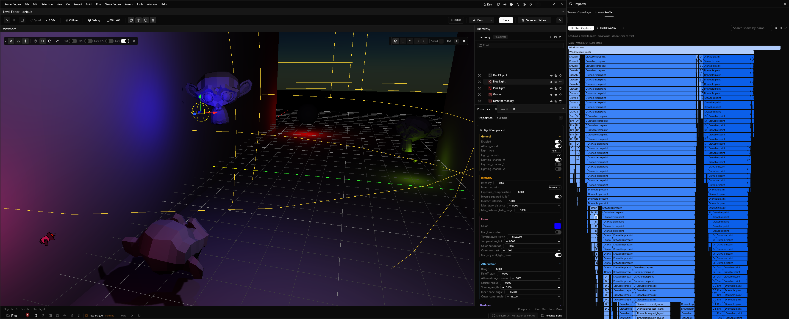
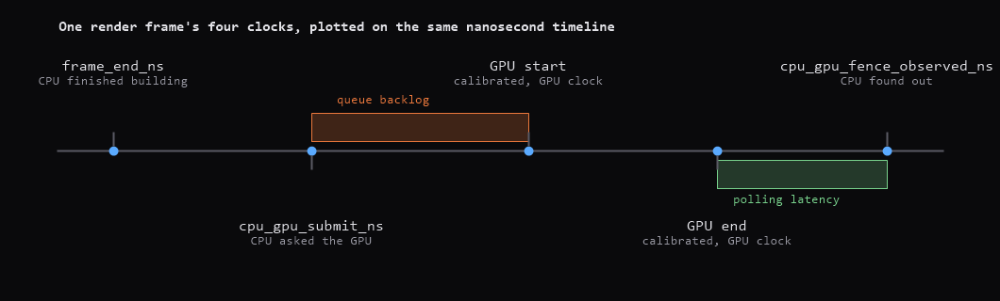
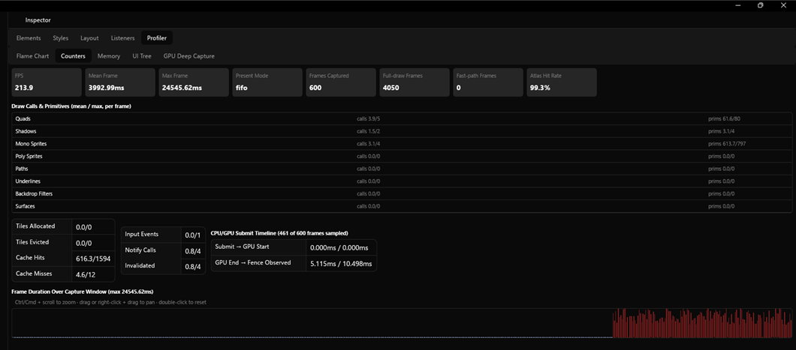
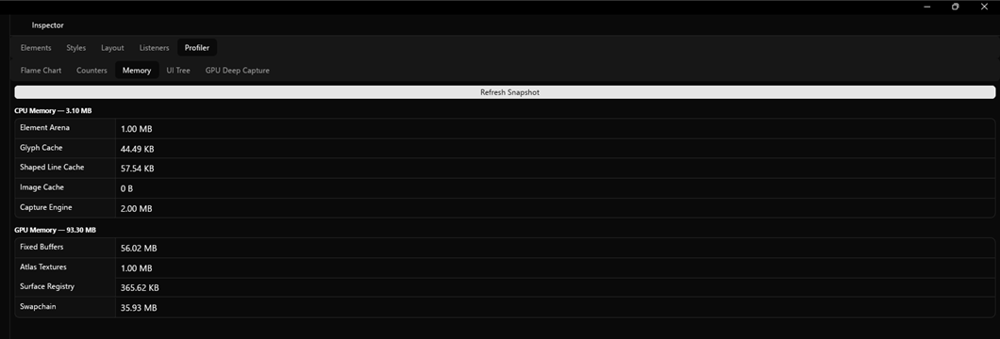
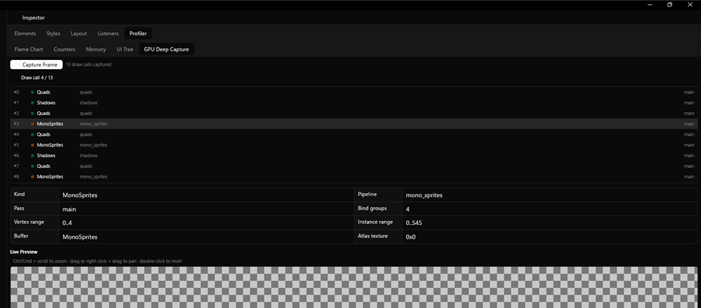
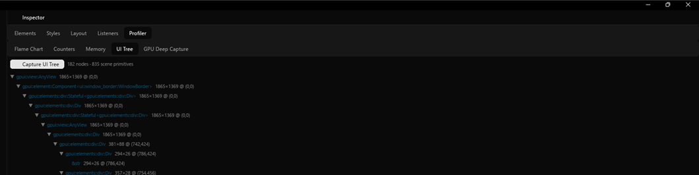
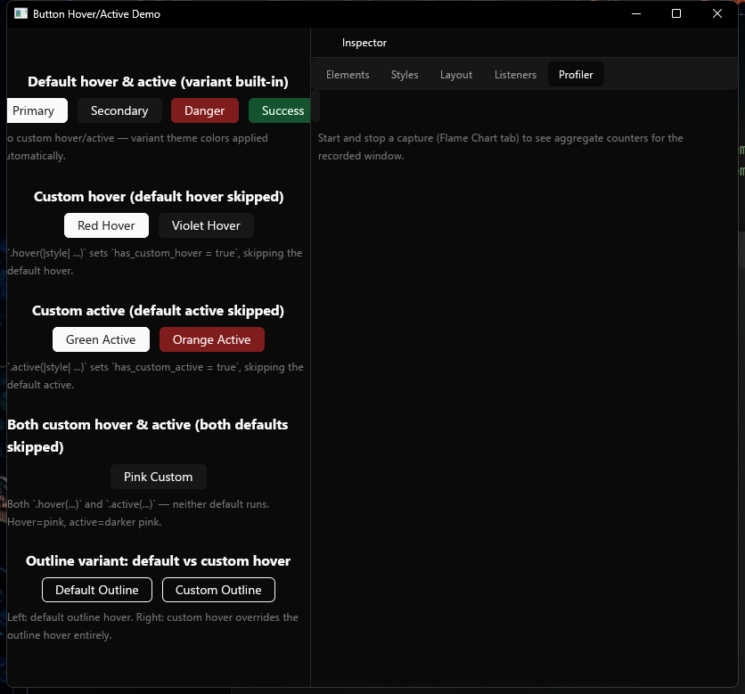
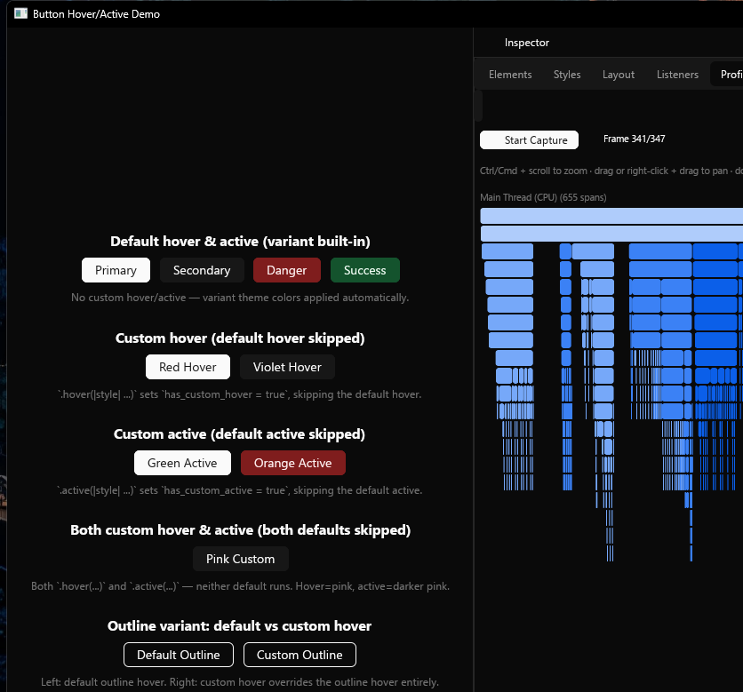

## A Different Kind of Profiler

Helio has a GPU profiler already: per-pass timestamp queries, a live telemetry portal, an on-screen HUD. It answers "which render pass is expensive" very well. It has nothing to say about why a button's hover state took 40ms to apply, what the element tree looked like the frame a panel flickered, or whether the GPU actually started a frame before the CPU moved on to the next one. Those are UI-framework questions, not renderer questions, and GPUI, the UI framework we maintain as our own fork WGPUI for the Pulsar editor, had no way to answer any of them.

This post walks through what we built instead: a capture engine living inside GPUI itself, feature-gated to compile to nothing when unused, a counters and memory system riding alongside it, an on-demand GPU deep capture with a full replay engine, a UI-tree snapshot that reconstructs the element tree after the fact, and a Profiler tab in the Inspector panel that ties all of it together, including a flame chart rendered through a custom instanced GPU shader rather than GPUI's own element tree.



---

## Recording Spans for Free

The instrumentation had one hard constraint from the start: with the `flamegraph` cargo feature off, none of it should exist in the compiled binary. Every capture call site is gated:

```rust
#[cfg(feature = "flamegraph")]
pub fn enter_span(name: SpanName, category: SpanCategory) -> Option<SpanGuard> {
    if !CAPTURE_ENABLED.load(Ordering::Relaxed) {
        return None;
    }
    // record start instant, push onto the per-thread pending stack
}
```

Even with the feature compiled in, an instrumentation site costs one relaxed atomic load and a branch when nothing is recording. `CAPTURE_ENABLED` only flips true for the seconds someone is actually capturing, and that's the only window where the rest of the machinery runs.

A `CpuSpan` is a name, a category, an optional `ElementAttribution` (the `type_name::<E>()` of whatever GPUI element the span belongs to, plus a hash of its `GlobalElementId`), a depth, and a start/end pair. `GpuSpan` mirrors it on the GPU side, tagged with a `GpuPassKind` (`main`, `main_resumed`, `filter_group`, `filter_group_resumed`) and calibrated from the GPU's own clock into the same nanosecond timeline the CPU spans use. `FrameCapture` bundles a frame's CPU spans, background-thread spans, and GPU spans together, and `Capture` holds a ring buffer of those, bounded by `max_frames` so a long recording session doesn't grow without limit.

The two fields that mattered most to get right sit on `FrameCapture` itself, because a render frame doesn't have one clock, it has four:

```rust
/// CPU wall-clock instant `queue.submit()` returned for this frame's GPU
/// work, anchor-relative. This is a **CPU-side observation of when the
/// CPU asked the GPU to run something** -- not when the GPU actually
/// started running it (that's `gpu_spans`' calibrated `start_ns`, a value
/// *inferred* from a GPU-clock timestamp via the session's one-time
/// calibration, not directly observed on the CPU timeline) and not when
/// drawing finished on the CPU (`frame_end_ns`, which happens before
/// submission is even asked for).
pub cpu_gpu_submit_ns: Option<u64>,

/// CPU wall-clock instant the render thread's non-blocking poll first
/// observed this frame's GPU readback as complete, anchor-relative. This
/// is when the **CPU found out** the GPU had fenced/finished -- not when
/// the GPU actually finished (that's the end of `gpu_spans`' calibrated
/// timeline) and not a blocking wait's completion (readback is polled
/// non-blockingly, so this always lags true GPU completion by however
/// long it took the render thread to next call `poll_readback`).
pub cpu_gpu_fence_observed_ns: Option<u64>,
```

Four instants on one timeline: `frame_end_ns` when the CPU finishes building the command buffer, `cpu_gpu_submit_ns` when it hands that buffer off, the calibrated GPU span start and end from the GPU's own clock, and `cpu_gpu_fence_observed_ns` when the CPU's non-blocking poll finally notices completion. The gap between submit and the calibrated GPU start is queue backlog. The gap between the calibrated GPU end and the fence-observed time is pure polling latency with no GPU work in it at all. Plot all four on the same timeline and the two gaps become visually distinct instead of collapsing into one "frame time" number.



---

## Counting and Remembering

Alongside span timing, `FrameCounters` tracks the things you'd want when timing alone doesn't explain a slow frame: `DrawCallCounters` broken down by `DrawCallKind` (quads, shadows, underlines, mono and poly sprites, backdrop filters, paths, surfaces), `AtlasCounters` for tile-allocator activity, and `EventCounters` for input and notification volume. `CounterSummary` aggregates a whole capture's worth of these into means, maxes, and a computed FPS (from the actual span between the first and last frame in the window, not the reciprocal of mean frame duration, which hides idle time between draws).



Memory gets the same treatment. `MemorySnapshot` covers the CPU side: the per-frame element arena's reserved capacity, text system cache sizes, loaded image bytes across every registered image cache, and the capture engine's own live footprint, its per-thread span ring buffers and whatever a running capture is currently holding. `GpuMemorySnapshot` covers the GPU side: the fixed-size quad/shadow/sprite/path/underline/backdrop-filter buffers, atlas texture memory across monochrome and polychrome pages, the surface registry's triple-buffered offscreen textures, and a best-effort estimate of the swapchain's own backing textures (wgpu doesn't expose the presentation engine's actual image count, so this uses `desired_maximum_frame_latency` as a stand-in). Both snapshot types get correlated back to the frame they were taken alongside, so a memory spike and a timing spike in the same frame show up as the same frame in the viewer.



---

## Freezing a Frame's Entire GPU State

The always-on capture engine tells you *when* things happened. It doesn't tell you *what the GPU actually drew*. That's what the on-demand deep capture is for: trigger it once, and it records the complete command stream for exactly one `WgpuRenderer::draw()` call, not a summary of it.

Each entry in that stream is a `DeepCaptureDrawCall`: its sequence number, which `DrawCallKind` it issued, the `wgpu::RenderPipeline` label bound for it (which doubles as shader identity, since each draw call kind maps to exactly one pipeline), which render pass it went into, its vertex and instance ranges, and, depending on kind, either an atlas texture id, a surface id, or a reference to one of the renderer's seven fixed resource buffers:

```rust
pub enum DeepCaptureBufferKind {
    Quads,
    Shadows,
    Underlines,
    MonoSprites,
    PolySprites,
    BackdropFilters,
    Paths,
}
```

Alongside the draw-call stream, the capture reads back the full contents of every fixed buffer touched by at least one of those calls, once per buffer rather than once per call, since a buffer is typically referenced by many draw calls in a single frame and reading it back seven times instead of hundreds is the entire difference between a capture that's cheap and one that stalls the frame it's trying to record. Phase 4b extended the same once-per-resource idea to texture content: atlas pages and composited surfaces both get their actual pixel bytes read back, tightly packed with wgpu's row-alignment padding already stripped out, identified by an id that encodes whether it's an atlas page or a surface and which one.

The replay side, `DeepCaptureReplay`, steps through that recorded stream and reports, per draw call, whether it has everything it needs to redraw faithfully: real captured bytes for both the geometry buffer and (for sprite calls) the atlas texture it samples from, or a status explaining what's missing. `Surfaces` draw calls are a permanent partial case here. Texture content readback gives you the pixel bytes a composited surface displayed, but the draw call itself carries no per-call geometry (bounds, content mask) to position a replayed quad with, so a `Surfaces` call always reports `TextureContentUnavailable` regardless of whether its bytes were actually captured. Knowing that up front, from the replay engine itself, matters more than it sounds: a viewer that silently rendered nothing for missing resources would look identical to one that was replaying correctly and just happened to produce a blank frame.



---

## The Element Tree, After the Fact

A `DeepCapture` tells you what the GPU drew. It says nothing about the element tree that produced it. `UiTreeCapture` fills that gap: every element GPUI's layout pass touched during the captured frame, in the same depth-first order they were visited, each one carrying its concrete type name, a hash of its `GlobalElementId` (using the identical hash function `ElementAttribution` already uses, so the two are directly comparable), its resolved layout bounds, and, for `div`-backed elements with a stable id, a snapshot of its resolved style.

Storing the tree as a flat, depth-annotated list instead of an actual tree keeps the capture itself simple: appending a node during traversal is just a push, no parent pointers to wire up mid-walk. Reconstructing the real shape happens later, in `UiTreeReplay`, with a single pass and a stack:

```rust
for (index, node) in capture.nodes.iter().enumerate() {
    while let Some(&top) = stack.last() {
        if capture.nodes[top].depth < node.depth {
            break;
        }
        stack.pop();
    }
    match stack.last() {
        Some(&parent_index) => {
            parents[index] = Some(parent_index);
            children[parent_index].push(index);
        }
        None => roots.push(index),
    }
    stack.push(index);
}
```

Pop the stack while its top is at the same depth or deeper than the current node, and whatever's left on top is the parent. It's the standard trick for rebuilding a tree from a preorder depth list, one linear pass, no recursion. `UiTreeReplay` also carries the frame's `SceneSnapshot`, a full copy of every paint primitive the frame produced (quads, shadows, underlines, paths, sprites, backdrop filters, surfaces), deep-copied at the exact point `Window::draw` would otherwise let the next frame overwrite it. Between the reconstructed tree and the scene snapshot, a captured frame can be inspected entirely offline: no live app, no GPU device, just data.



---

## The Flame Chart, Drawn Instead of Built

All of the above needed somewhere to live, so it went into a Profiler tab in GPUI's existing Inspector panel: Start Capture, interact with the app, Stop Capture, and get a frame-by-frame flame chart alongside sub-tabs for counters, memory, the UI tree, and deep capture.



The flame chart is the one piece here that couldn't be built the way everything else in the Inspector is built. A typical capture holds hundreds of spans per frame once background threads are counted, and GPUI's element tree is built for interactive UI, not for redrawing hundreds of rectangles as fast as possible on every pan and hover. So the bars themselves are drawn through `wgpu_surface`, GPUI's mechanism for embedding custom wgpu-rendered content inside an otherwise normal element tree, backed by a small dedicated pipeline:

```rust
struct BarInstance {
    rect_min: [f32; 2],
    rect_max: [f32; 2],
    color: [f32; 4],
    corner_radius: f32,
    highlight: f32,
    _pad: [f32; 2],
}
```

One `BarInstance` per visible bar, uploaded as a single storage buffer, drawn with one instanced call per lane. The vertex shader expands each instance into a quad; the fragment shader is a signed-distance-field rounded box, the same antialiasing approach GPUI's own quad shader uses internally:

```wgsl
fn rounded_box_sdf(p: vec2<f32>, half_size: vec2<f32>, radius: f32) -> f32 {
    let q = abs(p) - half_size + vec2<f32>(radius, radius);
    return length(max(q, vec2<f32>(0.0, 0.0))) + min(max(q.x, q.y), 0.0) - radius;
}

@fragment
fn fs_bar(input: VaryingOutput) -> @location(0) vec4<f32> {
    let radius = min(input.corner_radius, min(input.half_size.x, input.half_size.y));
    let dist = rounded_box_sdf(input.local_pos, input.half_size, radius);
    let coverage = saturate(0.5 - dist);
    if coverage <= 0.0 {
        discard;
    }
    var color = input.color;
    if input.highlight > 0.5 {
        color = vec4<f32>(mix(color.rgb, vec3<f32>(1.0, 1.0, 1.0), 0.4), color.a);
    }
    return vec4<f32>(color.rgb, color.a * coverage);
}
```

A thousand bars become one buffer upload and one draw call. Hit-testing runs separately on the CPU, against a parallel array of bar geometry built from the same culled, visible set the GPU instances come from, so hovering and clicking always agree with what the shader actually drew even though neither side depends on the other to do its job.



---

## What's Left

External-device mode still can't correlate GPU timestamps the way owned-device mode does. When GPUI doesn't own the wgpu device, blocking on `device.poll` to read timestamps back isn't safe, since the owning application polls on its own schedule. A ring buffer of query sets, read a few frames later once the owner's own poll cadence has naturally resolved them, would let external-device captures get real GPU timing instead of skipping it.

The deep-capture replay engine only replays inside the process that captured it. Serializing a capture to disk and loading it into a separate viewer process, the actual RenderDoc model, would separate "capture this before the app does something unrecoverable" from needing the original process to stay alive afterward.

`Surfaces` draw calls in a deep capture have their texture content but no per-call geometry to position a replayed quad with. Capturing `SurfaceParams` (bounds and content mask) alongside the existing draw-call stream would close that gap and let surfaces replay as faithfully as every other primitive kind already does.

And the flame chart only ever shows one frame. A view that diffs the current frame's span tree against the previous one's, by name and depth, and reports which spans grew, would turn a capture full of hundreds of frames into a much shorter list of the ones actually worth looking at.
