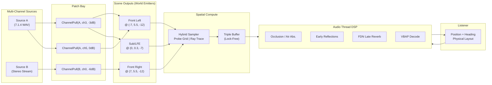
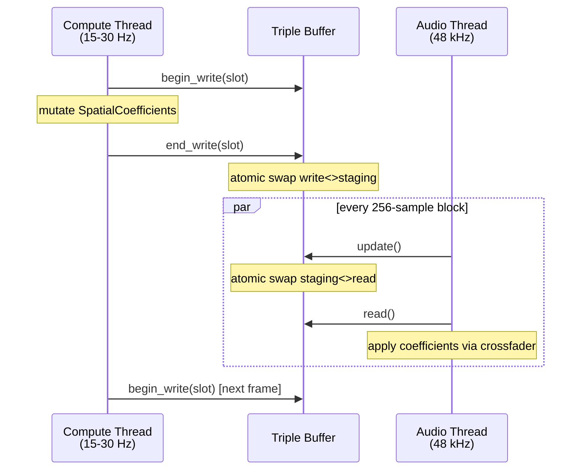
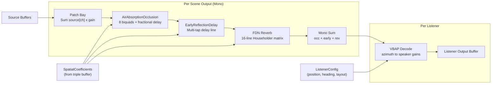

## The Cathedral Problem

A 60-meter Gothic cathedral. Stone floor, vaulted ceiling, eight speakers bolted to the walls. You load an 8-channel audio file. Channel 3 is Back Left in the WAV. The cathedral sends that channel to the Sub/LFE speaker. Channel 6, Side Left in the file, goes to Back Left on the device. No two mappings line up.

The listener walks through the nave. Position changes. Heading changes. The spatialization has to track both in real time. Occlusion from the stone columns. Early reflections off the floor. Reverb from the volume of the space. All of it computed at 48 kHz with a 256-sample buffer.

Five milliseconds and change before the buffer underruns. In that window, no allocations. No mutexes. No file I/O. No ray tracing through a BVH with 10,000 triangles.

Quasar is the engine we built for this. It runs inside the Pulsar game engine. The design separates three concerns. Sources are raw multi-channel audio. Scene outputs are positioned world-space emitters. Listeners have a position, a heading, and a physical speaker layout. The only connection between them is an explicit pull: `ChannelPull(source_id, channel, gain_db)`. You wire them up at startup. You rewire them at runtime. The audio thread never notices.

---

## The Architecture in One Diagram



Three registries. Sources hold multichannel audio data. Scene outputs hold world positions and a list of pulls. Listeners hold a position, a heading, and a physical output layout. The spatial compute phase resolves every pair of scene output and listener. The audio thread renders the result through a zero-alloc DSP pipeline. Every layer is independently hot-swappable. Add a source mid-scene. Remove a scene output. Rewire a pull. No glitch.

---

## The Scene Pipeline

The first version of Quasar took a flat list of `SpatialQuery` pairs. One source position, one listener position, one set of `SpatialCoefficients` back. The audio thread consumed those coefficients through a fixed `AudioNodeGraph`. One input buffer per source. One output buffer. No concept of physical speaker layouts. No listener position. No concept of pulling individual channels from a multi-channel source into a specific world emitter.

The scene pipeline replaced all of that with three phases.

Phase one runs on the API thread. You load sources. You create scene outputs. You add listeners. You connect pulls:

```rust
use quasar::SpatialAudioEngine;
use quasar_core::scene_output::*;

let mut engine = SpatialAudioEngine::new(0, 48000.0, 15.0);

let src = engine.load_source(SourceConfig {
    path: "assets/8_Channel_ID.wav".into(),
    channels: 8,
})?;

let fl = engine.add_scene_output(SceneOutputConfig::new(
    [-7.0, 5.5, -12.0], Movability::Static,
));
let fr = engine.add_scene_output(SceneOutputConfig::new(
    [7.0, 5.5, -12.0], Movability::Static,
));
let sub = engine.add_scene_output(SceneOutputConfig::new(
    [0.0, 0.3, -7.0], Movability::Static,
));

engine.connect_pull(fl, ChannelPull::new(src, 0, 0.0));
engine.connect_pull(fr, ChannelPull::new(src, 1, 0.0));
engine.connect_pull(sub, ChannelPull::new(src, 5, 0.0));

let listener = engine.add_listener(ListenerConfig {
    position: [0.0, 1.6, 0.0],
    heading: [0.0, 0.0, -1.0],
    physical_layout: PhysicalOutputLayout::Surround51,
});
```

Phase two runs on the compute thread at 15-30 Hz. `update_scene_spatial()` iterates every scene output and every listener. For each pair, it builds a `SpatialQuery` and sends it through the hybrid sampler. The sampler returns a `SpatialQueryResult`: direct path parameters, early reflections, late reverb estimate. Those get published into the lock-free triple buffer.

Phase three runs on the audio thread at 48 kHz. `process_audio_scene()` takes one source buffer per loaded source and one output buffer per listener. The patch bay sums channel pulls into mono per scene output. The spatial DSP chain processes each mono buffer: occlusion, early reflections, late reverb. The listener decode stage runs VBAP to map the spatialized mono onto the listener's physical speaker layout.

```rust
let mut src = AudioBuffer::new(8, 256);
let mut out = AudioBuffer::new(6, 256);
engine.process_audio_scene(&[&src], &mut [&mut out]);
```

No allocation. No locking. The buffer sizes are fixed at compile time. The scratch buffers are sized to the maximum number of scene outputs. Everything exists before the first callback fires.

---

## Live Remapping

A scene output is a position and a list of pulls. A pull is three values: a source ID, a channel index, and a gain in dB. Change the position, the compute thread resolves it on the next frame. Change the pull list, the engine rebuilds the patch bay at the next config opportunity. No DSP graph tear-down. No delay line flush. No pop.

```rust
engine.disconnect_pull(outputs[6], src, 6);
engine.connect_pull(outputs[6], ChannelPull::new(src, 7, 0.0));
engine.disconnect_pull(outputs[7], src, 7);
engine.connect_pull(outputs[7], ChannelPull::new(src, 6, 0.0));
```

Two calls to disconnect, two calls to connect. The aux channels swap. The cathedral's speaker layout changes without stopping audio. The patch bay rebuilds, the crossfaders smooth the transition over 15 milliseconds, and the listener hears a seamless rewire.

This extends to everything. Add a listener mid-scene. Remove a scene output. Change a pull's gain. None of it requires the audio thread to stop. None of it produces a click. The triple buffer decouples the config path from the real-time path by design.

---

## The Triple Buffer

Three threads touch Quasar's state. The game thread owns the scene and the listener positions. The compute thread runs spatial queries. The audio thread processes samples. The boundary between the compute thread and the audio thread is the lock-free contract.



`ParameterTripleBuffer` holds three slots of `SpatialCoefficients` behind `UnsafeCell`. Three atomic index pointers track which slot is the write slot, which is the staging slot, and which is the read slot. A monotonically increasing version counter lets the consumer detect new data without a lock.

The producer calls `begin_write()`. This returns a `&mut SpatialCoefficients` pointing at whatever slot `write_index` owns at that moment. The producer mutates the coefficients. It calls `end_write()`. That stamps the version counter into the slot and atomically swaps `write_index` with `staging_index`. After the swap, the slot the producer was just writing to becomes the staging slot. Available for the consumer to claim on its next `update()`.

The consumer path is `update()` then `read()`. `update()` atomically swaps `staging_index` with `read_index`. This claims whatever the producer has published since the last read. `read()` returns a `&SpatialCoefficients` pointing at the now-stable read slot.

Three slots, three indices, always pointing to distinct buffers. The producer and consumer never touch the same slot at the same time. No mutexes. No atomics on the hot path except the two swaps.

The coefficients themselves carry everything the audio thread needs:

```rust
pub struct SpatialCoefficients {
    pub source_id: u32,
    pub direct_gain: Band8,
    pub direct_delay_samples: f32,
    pub direct_azimuth: f32,
    pub direct_elevation: f32,
    pub early_reflections: Vec<EarlyReflectionCoeffs>,
    pub late_t60: Band8,
    pub late_gain_db: f32,
    pub version: u64,
}
```

`Band8` is the universal frequency representation. Eight floats covering the standard octave bands from 62.5 Hz to 8 kHz. Every spatial parameter in the engine is frequency-dependent. Direct attenuation. Reverb time. Material absorption. The audio thread receives these as pre-computed coefficients. It never runs a ray intersection. It never evaluates a material formula. All of that work happens on the compute thread.

Between the triple buffer read and the DSP graph sits an `EqualPowerCrossfader`. The compute thread publishes new coefficients. The crossfader blends from the old values to the new values over a configurable window. Typically 10-20 milliseconds. The blend uses cosine and sine trajectories:

$$
g_0(t) = \\cos\\left(\\frac{\\pi t}{2}\\right),\\qquad g_1(t) = \\sin\\left(\\frac{\\pi t}{2}\\right)
$$

Constant power means $g_0^2 + g_1^2 = 1$. No volume dip. No volume spike. Just a smooth transition.

---

## The Hybrid Sampler

`HybridProbeSampler` sits between the compute backend and the engine. It dispatches each spatial query according to the active strategy. Three strategies exist. Each one trades accuracy for cost in a different way.

`BakedOnly` samples a probe grid at the listener position. It computes inverse-distance attenuation from the source. It returns a `SpatialQueryResult` with no early reflections. Zero ray intersections. Zero material evaluations. The cheapest path. Good for static environments where the acoustics are pre-baked and nothing moves.

`RealTimeOnly` delegates to the `IAcousticComputeBackend` trait. The backend traces rays through the scene. It evaluates material absorption at each hit. It computes specular reflections. It estimates statistical reverb from the room geometry. This path supports dynamic geometry. Moving walls. Collapsing structures. Anything changes the acoustic environment frame to frame.

`HybridBlend` calls the real-time backend for direct path and early reflections. Then it overlays the late reverb T60 from the probe grid. Direct path and early reflections are where dynamic behavior matters most. A door opening changes the direct path instantly. The listener hears the difference. The late reverb tail is less position-sensitive within a room. A baked T60 from a probe grid is nearly indistinguishable from a real-time estimate. Sampling it costs nothing.

```rust
pub fn resolve(&self, query: &SpatialQuery, materials: &dyn MaterialProvider)
    -> Result<SpatialQueryResult, SpatialAudioError>
{
    match self.strategy {
        HybridSamplingStrategy::BakedOnly => {
            let probe = self.probe_grid.as_ref().ok_or(...)?;
            let sample = probe.sample(&listener_pos)?;
            let dist = distance(source_pos, listener_pos);
            let atten = Band8::splat(1.0 / (1.0 + dist));
            Ok(SpatialQueryResult {
                direct_path: DirectPathResult {
                    attenuation: atten,
                    delay_samples: dist / 343.0 * 48000.0,
                    distance: dist,
                    occluded: false,
                    occlusion_factor: 1.0,
                },
                early_reflections: vec![],
                late_reverb: LateReverbEstimate {
                    t60: sample.t60,
                    early_late_split_secs: sample.early_late_split_secs(),
                    late_loudness_db: -10.0,
                },
            })
        }
        HybridSamplingStrategy::RealTimeOnly => {
            let backend = self.realtime_backend.as_ref().ok_or(...)?;
            let results = backend.query_spatial(&[query.clone()], materials);
            results.into_iter().next().ok_or(...)
        }
        HybridSamplingStrategy::HybridBlend => {
            let mut result = self.realtime_backend(...)?;
            if let Some(ref grid) = self.probe_grid {
                if let Ok(sample) = grid.sample(&listener_pos) {
                    result.late_reverb.t60 = sample.t60;
                }
            }
            Ok(result)
        }
    }
}
```

The compute thread calls `resolve()` for each active source at 15-30 Hz. It publishes the result through the triple buffer. The audio thread reads the latest coefficients and renders the next block. No coordination. No waiting.

---

## The Baked Path: Probe Grids

Nebula is the companion baking tool. It takes a static scene, places acoustic probes at regular intervals, and bakes impulse responses at each probe using path tracing. The output is a set of `AcousticProbe` points. Position. Per-band RT60. A time-series of 8-band energy samples.

Quasar consumes this data through `AcousticProbeGrid`. The grid is a 3D axis-aligned structure with `grid_origin`, `grid_spacing`, and `grid_dims`. Probes are stored in a flat `Vec<AcousticProbe>` in row-major order. X varies fastest, then y, then z:

$$\\text{index} = z \\cdot d_y \\cdot d_x + y \\cdot d_x + x$$

Given a listener position inside the grid, `cell_index()` computes the enclosing cell `[cx, cy, cz]` and returns the eight corner probe indices. `trilinear_interpolate()` computes fractional weights `wx, wy, wz` within the cell and blends the eight corner values.

```rust
fn trilinear_interpolate(&self, weights: [f32; 3], corners: [&AcousticProbe; 8]) -> AcousticProbeSample {
    let [wx, wy, wz] = weights;
    let c0 = corners[0].t60.lerp(&corners[1].t60, wx);
    let c1 = corners[2].t60.lerp(&corners[3].t60, wx);
    let c2 = corners[4].t60.lerp(&corners[5].t60, wx);
    let c3 = corners[6].t60.lerp(&corners[7].t60, wx);
    let c01 = c0.lerp(&c1, wy);
    let c23 = c2.lerp(&c3, wy);
    let t60 = c01.lerp(&c23, wz);
    let quality = (1.0 - (wx - 0.5).abs() * 2.0)
                * (1.0 - (wy - 0.5).abs() * 2.0)
                * (1.0 - (wz - 0.5).abs() * 2.0);
    // ...
}
```

The `interpolation_quality` field peaks at 1.0 at the center of a cell and falls to 0.0 at the edges. If the listener is near a cell boundary, the interpolation is less reliable. The engine can boost the blend rate or fall back to a nearest-probe sample.

The nebula import bridge lives behind the `nebula-import` feature flag. It deserializes bincode-format bake files and transposes the 8-band impulse response data into `Vec<Band8>`. For irregularly-spaced probe sets, the grid dimensions are set to `[n, 1, 1]` and the sampler falls back to nearest-probe lookup.

---

## The Compute Backends

`IAcousticComputeBackend` defines the interface any real-time backend must implement:

```rust
pub trait IAcousticComputeBackend: Send + Sync {
    fn query_spatial(&self, queries: &[SpatialQuery],
                     materials: &dyn MaterialProvider) -> Vec<SpatialQueryResult>;
    fn supports_dynamic_geometry(&self) -> bool { false }
    fn update_scene(&mut self, scene: &AcousticScene) -> Result<(), SpatialAudioError>;
    fn trace_ray(&self, ray: &Ray) -> Vec<RayHit>;
}
```

Three implementations exist.

`HardwareAcceleratorStub` returns dummy coefficients. Inverse-distance attenuation, no early reflections, a fixed 0.5-second RT60. The engine compiles and runs without any real backend selected. Useful for testing. Useful for platforms where no compute backend is available yet.

`CpuSimdComputeBackend` is the production CPU path. It builds a BVH from the scene's triangle mesh using the surface area heuristic.

```
For each axis (X, Y, Z):
  Sort triangles by centroid along that axis.
  Build prefix and suffix AABB arrays.
  For each split position:
    compute SAH cost
  Pick the axis and split with the lowest cost.
```

$$
\\text{cost} = 1.0 + \\frac{\\text{left\\_area} \\cdot i + \\text{right\\_area} \\cdot (n - i)}{n}
$$

Leaf nodes hold up to 4 triangles. Internal nodes store an AABB, child pointers, and the split axis. The BVH traversal is standard. Test the AABB. Recurse into children if hit. Return the closest intersection.

Ray-triangle intersection uses Mller-Trumbore. `query_spatial` processes sources in parallel with `rayon::par_iter()`. For each source it casts a shadow ray from the listener to the source for occlusion testing. Then it traces recursive specular reflections up to order 3 for early reflections. The late reverb estimate uses Sabine and Eyring statistical formulas:

$$
\\bar\\alpha[b] = \\frac{\\sum \\alpha[b] \\cdot A_\\triangle}{A_\\text{total}}
$$

$$
T_{60,S}[b] = \\frac{0.161 \\cdot V}{S \\cdot \\bar\\alpha[b]}
$$

$$
T_{60,E}[b] = \\frac{0.161 \\cdot V}{-S \\cdot \\ln(1 - \\bar\\alpha[b])}
$$

$$
T_{60}[b] = \\min(T_{60,S},\\, T_{60,E}),\\;\\text{clamped to }[0.1,\\, 10.0]
$$

Air absorption follows ISO 9613-1. Oxygen and nitrogen relaxation frequencies are computed from temperature and humidity. Per-band attenuation is $e^{-\\alpha[b] \\cdot d}$.

`WgpuComputeBackend` dispatches the same ray tracing work to the GPU through WGSL compute shaders. The dispatch layout is one workgroup per source-listener pair. 64 threads per workgroup. Each thread traces one stochastic ray per iteration. Accumulated reflection energy and per-band absorption go into a shared output buffer.

The WGSL shader contains a full Mller-Trumbore implementation and a PCG random number generator:

```wgsl
fn pcg() -> u32 {
    rng_state = rng_state * 747796405u + 2891336453u;
    let word = ((rng_state >> ((rng_state >> 28u) + 4u)) ^ rng_state) * 277803737u;
    return (word >> 22u) ^ word;
}
```

The output uses double-buffered staging. Two output buffers and two staging buffers. Toggled atomically. The CPU reads the previous frame's results while the GPU processes the current frame. Material evaluation runs on the GPU side through a switch on `model_id`, with identical formulas to the CPU evaluators.

---

## The Material System

Materials in Quasar are not hardcoded structs. They are dynamic physical transfer functions composed from a `MaterialModelId` and a raw byte-aligned `MaterialParameterBuffer`. The same byte buffer can be cast to a typed struct on the CPU via `bytemuck` or blitted directly to a GPU storage buffer.

Three material models are built in.

**Tabular (model ID 1)** is a lookup table with 24 f32 values. Absorption, scattering, and transmission for each of the 8 octave bands. 96 bytes total. No computation. A direct read. Good for artist-authored materials where the acoustic properties are measured or tuned by hand.

**Delany-Bazley (model ID 2)** implements the empirical porous absorber model. Parameters are flow resistivity in Rayls/m and thickness in meters. Flow resistivity typically ranges from 1,000 to 100,000. Thickness ranges from centimeters to tens of centimeters. For each octave band frequency, the model computes complex characteristic impedance and propagation constant. Then it derives surface impedance. Then absorption from the reflection coefficient:

$$
\\begin{aligned}
E &= \\frac{\\rho_0 \\cdot f}{R_s} \\\\
Z_c &= Z_0 \\left(1 + 0.0571 E^{-0.754} - j \\cdot 0.087 \\, E^{-0.732}\\right) \\\\
k  &= \\frac{\\omega}{c_0} \\left(1 + 0.0978 E^{-0.700} - j \\cdot 0.189 \\, E^{-0.595}\\right) \\\\
Z_s &= -j \\, Z_c \\, \\cot(k \\cdot d) \\\\
R   &= \\frac{Z_s - Z_0}{Z_s + Z_0} \\\\
\\alpha &= 1 - |R|^2
\\end{aligned}
$$

The complex cotangent is computed manually. The WGSL shader has the same arithmetic. A 5 cm panel with 20,000 Rayls/m absorbs mostly high frequencies. A 10 cm panel with 10,000 Rayls/m absorbs across the full spectrum.

**Resonant Panel (model ID 3)** models membrane absorbers as mass-spring systems. Parameters are panel mass in kg/m and cavity depth in meters. Panel mass is typically 1-20 kg/m. Cavity depth is typically 0.02-0.5 meters.

$$
f_0 = \\frac{c_0}{2\\pi} \\sqrt{\\frac{\\rho_0}{m \\cdot d}},\\qquad
\\alpha(f) = \\frac{0.95}{1 + Q^2 \\left(\\frac{f}{f_0} - \\frac{f_0}{f}\\right)^2}
$$

Thin plywood with an air gap. Narrow-band absorption centered at the resonant frequency.

`AcousticMaterialRegistry` manages instances at runtime. Each instance is a `(model_id, parameter_buffer)` pair stored in a `Vec` behind an `RwLock`. Instances are referenced by a u32 handle, the index into the vector. The registry supports hot-swapping. Updating an instance's parameter buffer takes effect immediately without rebuilding any acceleration structure.

```rust
reg.update_instance(handle, new_params);
```

The next `query_spatial()` call uses the new parameter values. The BVH does not need to be rebuilt.

---

## The DSP Graph

The audio thread runs the DSP pipeline for every 256-sample block. Every node pre-allocates its state at construction time. The hot path, the `process()` method called for every block, never calls `alloc`. It never takes a lock. It never touches the heap.



`AudioBuffer` is a fixed-size inline array:

```rust
pub struct AudioBuffer {
    data: [[f32; DEFAULT_BLOCK_SIZE]; MAX_AUDIO_CHANNELS],
    num_channels: u16,
    num_samples: u16,
}
```

32 channels at 256 samples each. 32 KiB total. On the stack. No allocation at construction. No allocation at copy. No allocation at clear. The graph owns scratch buffers sized to the maximum number of scene outputs, allocated once at graph construction.

The pipeline per block works in five stages.

Stage one publishes the latest triple-buffer coefficients. An atomic swap, zero copy.

Stage two smooths per-pair coefficients through equal-power crossfaders. The compute thread may have published new data since the last block. The crossfader blends from the old coefficients to the new ones over the configured fade window.

Stage three runs the patch bay. Each scene output has a list of pulls. The patch bay iterates those pulls. For each pull it multiplies the source channel samples by the linear gain and accumulates into the scene output's mono buffer. Out-of-range source indices and channel indices are silently skipped. Defensive. No panic.

Stage four is the spatial render. Run once per scene output. Reference listener is listener zero. The occlusion node applies per-band attenuation and fractional delay. Eight biquad filters per channel, one per octave band. A Hermite-interpolating delay line for the direct path delay. The per-band attenuation is converted to lowpass cutoff:

$$
f_c[b] = f_{\\text{centre}}[b] \\cdot \\sqrt{\\text{attenuation}[b]} + 20\\,\\text{Hz}
$$

Lower attenuation means more occlusion. The cutoff shifts lower. High frequencies roll off.

The early reflection node implements a multi-tap delay. Input audio is downmixed to mono and pushed through a shared delay line. Each early reflection from the spatial query becomes a tap with a fractional delay and a stereo pan:

$$
\\text{pan} = \\frac{\\text{azimuth}}{\\pi},\\qquad
\\theta = \\frac{\\pi}{2}(\\text{pan} + 1) \\cdot 0.5
$$

$$
g_L = \\cos(\\theta),\\qquad g_R = \\sin(\\theta)
$$

The late reverb node is the FDN. 16 delay lines with pairwise coprime lengths spanning 2 ms to 73 ms at 48 kHz:

```rust
const FDN_DELAY_LENGTHS: [usize; 16] = [
    719, 857, 1103, 1321, 1613, 1871, 2213, 2657,
    3079, 3491, 109, 151, 197, 251, 313, 401,
];
```

Each delay line has a 0.5 Hz sinusoidal LFO adding +/- 2 samples of delay modulation. This smooths out metallic resonances. Each line also has a one-pole lowpass damping filter:

$$\\text{damping} = \\exp\\left(-\\frac{3.0}{\\overline{T}_{60} \\cdot f_s}\\right)$$

The feedback matrix is a Householder reflection:

```rust
pub fn feedback_matrix(input: &[f32; 16]) -> [f32; 16] {
    let sum: f32 = input.iter().sum();
    let scale = 2.0 / 16.0;
    let mut out = [0.0_f32; 16];
    for i in 0..16 {
        out[i] = -input[i] + scale * sum;
    }
    out
}
```

This matrix is orthogonal. $HH^T = I$. Energy is preserved in the feedback loop. Combined with a loop gain of 0.85, below unity, the FDN produces a dense reverb tail that decays smoothly without ringing.

```rust
fn process_fdn_channel(&mut self, input_sample: f32) -> f32 {
    let signal = self.pre_delay.tap(self.pre_delay_samples);
    self.pre_delay.push(input_sample);

    let mut vec_in = [0.0_f32; 16];
    for i in 0..16 {
        let mod_offset = (self.modulation_phase[i] * std::f32::consts::TAU).sin() * 2.0;
        self.modulation_phase[i] += 0.5 / self.sample_rate;
        let tap_pos = (FDN_DELAY_LENGTHS[i] as f32 + mod_offset)
            .clamp(0.0, self.max_samples as f32 - 3.0);
        let delayed = self.delay_lines[i].tap(tap_pos as f32);
        vec_in[i] = self.damping_filters[i].process(delayed);
    }

    let vec_out = Self::feedback_matrix(&vec_in);
    for i in 0..16 {
        let feedback = vec_out[i] * 0.85;
        self.delay_lines[i].push(signal / 16.0 + feedback);
    }

    vec_out.iter().sum::<f32>() * (1.0 / 16.0_f32.sqrt())
}
```

Stage five is the listener decode. VBAP maps the spatialized mono onto the listener's physical speaker layout. The listener's heading rotates the world-space azimuth so a source the listener faces comes from the front speakers regardless of world rotation.

```rust
let heading_yaw = listener.heading[0].atan2(-listener.heading[2]);
let listener_azimuth = coeff.direct_azimuth - heading_yaw;
let n = vbap_gains(layout, listener_azimuth, coeff.direct_elevation, &mut gains);
```

Each scene output's mono is decoded onto every connected speaker. The VBAP gains are computed fresh per block. The speaker positions come from the listener's `physical_layout` field. Stereo. 5.1. 7.1.4. Quad. Custom. HRTF falls back to stereo for now.

---

## What It Costs

On a Ryzen 9 7950X, the CPU SIMD backend resolves one source against a 10,000-triangle scene in about 0.2 ms. Three bounces of specular reflections. At 30 Hz with 64 sources, the compute budget is roughly 12.8 ms per frame. Headroom remains for BVH updates when geometry changes.

The GPU backend dispatches 256 rays per source-listener pair in a single workgroup. 64 threads per workgroup. Each thread traces 4 rays. The dispatch for 32 sources produces 32 workgroups. Negligible utilization on any modern GPU. At 256 sources with 16 rays each, a single dispatch of 64 workgroups completes in about 0.1-0.3 ms on an RTX 4090.

The audio thread processes the full DSP chain for one scene output in approximately 0.015 ms per 256-sample block. Directivity, occlusion, early reflections, FDN reverb, stereo decode. At 8 outputs per listener, the total DSP cost per block is about 0.12 ms. Headroom of about 5.2 ms in the 5.33 ms budget.

The FDN reverb uses 16 delay lines of up to 3491 samples each. About 218 KB of state per channel. With pre-delay and the Hermite-interpolating delay lines for early reflections, the total DSP memory per output is roughly 256 KB. All pre-allocated.

---

## The Pattern

Sources hold multichannel audio data. Scene outputs hold world positions and a list of pulls. Listeners hold a position, a heading, and a physical speaker layout. The only connection between them is an explicit pull. Not a bus assignment. Not a send level. Not an audio graph connection. A pull.

The cathedral demo has 8 speakers and the WAV file has 8 channels. Channel 3 in the WAV goes to physical output 5 on the device. One `ChannelPull` per output. When the G key is pressed, two `disconnect_pull` calls and two `connect_pull` calls swap the aux channels. No clicks. No pops. No DSP graph rebuild.

This extends beyond simple remapping. Add a second listener with a different physical layout. The same scene outputs are decoded twice. Once for the stereo headphones. Once for the 5.1 speakers. The compute thread resolves each pair independently. The audio thread writes each listener's output buffer separately. The pull list is shared. The spatialization is per-listener.

Load a second source mid-scene. A stereo dialog track alongside the 8-channel ambient bed. Create a new scene output for the dialog source. Pull both channels into it. Position it near the altar. The compute thread starts resolving it on the next frame. The patch bay includes it in the next mix. No interruption.

The decoupling matters in practice. The demo cathedral has 60 meters of nave, 12 columns, 8 speakers, and one listener walking through it. The engine renders spatial audio for every speaker on every frame. It never allocates. It never locks. It never drops a sample.

Everything is at [github.com/Far-Beyond-Pulsar/Quasar](https://github.com/Far-Beyond-Pulsar/Quasar).
