A million sprites costs you the same CPU work as ten. A single `draw_indexed_indirect` reading a GPU-computed count. No loop. No per-frame iteration over the pool. The CPU touches zero sprites after startup. The GPU does every bit of culling, sorting, simulating, and drawing.

Helio's 2D pipeline is four independent pass crates under `crates/passes/2d/`. No Cargo dependency links them. They talk through raw `Arc<wgpu::Buffer>` handles and a shared byte layout. `helio-pass-sprite-batch` holds the persistent instance pool and renders it. `helio-pass-sprite-cull` culls against the view rect and radix-sorts the survivors, every frame, on the GPU. `helio-pass-sprite-simulate` bounces every sprite around a world box without the CPU ever seeing a position. `helio-pass-radiance-cascades-2d` computes real-time global illumination for the 2D scene through a jump-flood distance field and hierarchical probe raymarch.

The pattern across all of them: the CPU is a bus driver, not a traffic controller. It sets uniform values and dispatches workgroups. It never loops over individual sprites per frame.

---

## Architecture in One Diagram

```mermaid
flowchart LR
    subgraph Pool["Persistent Pool (CPU side)"]
        P1["Vec&lt;SpriteInstance&gt;"]
        P2["free_list / alive flags"]
        P3["dirty range tracking"]
    end

    subgraph GPU["GPU Storage"]
        G1["instances: array&lt;SpriteInstance&gt;"]
        G2["slot_alive: array&lt;u32&gt;"]
        G3["velocities: array&lt;vec2&gt;"]
    end

    subgraph Sim["SpriteSimulatePass (compute)"]
        S1["cs_simulate<br/>Position += vel * dt"]
        S2["Bounce off world box"]
        S3["Write position + depth"]
    end

    subgraph Cull["SpriteCullPass (compute)"]
        C1["cs_cull<br/>Circle-vs-AABB + compact"]
        C2["cs_prepare<br/>Dispatch sizing from visible"]
        C3["cs_histogram / scan / scatter<br/>32× 1-bit LSD radix sort"]
    end

    subgraph Batch["SpriteBatchPass (render)"]
        B1["draw_indexed_indirect<br/>1 draw, GPU-computed count"]
        B2["Vertex-pulling from instances[]"]
        B3["Atlas texture array sample"]
    end

    subgraph RC_2D["RadianceCascades2DPass (compute)"]
        R1["Build scene texture<br/>(emissive + occluder)"]
        R2["Jump-flood distance field"]
        R3["Cascade raymarch + merge"]
    end

    Pool -->|reserve / insert / update| GPU
    GPU --> Sim --> Cull --> Batch
    RC_2D -->|multiply blend| Batch
```



`insert_sprite` at startup is a one-time upload. After that, the CPU sets `set_delta_time` for the simulate pass, `set_view_rect` for the cull pass, and `present`. Nothing else. The dirtiest per-frame CPU work in the 10 million sprite demo is the `WASD` pan handler.

---

## The Persistent Pool

Sprites are not a per-frame push list. They live in a persistent, handle-addressed pool backed by a `Vec<SpriteInstance>` on the CPU side and a matching `wgpu::Buffer` on the GPU side.

```rust
let mut batch = SpriteBatchPass::new(device, config, 640, 360);
batch.reserve(10_000_000);  // same buffer, sized once

let handle = batch.insert_sprite(SpriteInstance::new([100.0, 200.0], [32.0, 32.0])
    .with_depth(150.0)
    .with_color([1.0, 0.5, 0.2, 1.0]));
```

`SpriteHandle` wraps a `u32` slot index. `insert_sprite` pops from a free list or appends. `update_sprite` marks the slot's byte range in a dirty bitmap. `remove_sprite` pushes the slot back onto the free list and clears the alive flag.

The dirty-range tracking is what makes this practical. Touching one sprite out of 10 million re-uploads only the changed bytes. A real scene where 30 sprites move per frame pays for exactly 30 sprites of upload bandwidth. The GPU-side buffer never shrinks, so no reallocation. The pattern matches `helio_core::GrowableBuffer` across the rest of the engine.

The `SpriteInstance` struct is 80 bytes. At 10 million instances the GPU buffer is 800 MiB. On an RTX 4090 that fits. On a laptop with 4 GiB of shared memory you use fewer sprites.

```rust
#[repr(C)]
pub struct SpriteInstance {
    pub position: [f32; 2],     // world-space center
    pub size: [f32; 2],         // before rotation
    pub rotation: f32,          // radians
    pub depth: f32,             // sort key (back-to-front)
    _pad_uv: [f32; 2],
    pub uv_rect: [f32; 4],      // atlas UV rectangle
    pub color: [f32; 4],        // RGBA tint
    pub atlas_layer: u32,       // texture array index
    _pad_tail: [u32; 3],
}
```

Pad fields exist because WGSL's `vec4<f32>` alignment is 16 bytes and Rust's `[f32; 4]` is not. The struct must byte-match the WGSL `SpriteInstance` exactly. `bytemuck::Pod` and `Zeroable` derive on the CPU side. A compile-time `size_of` assert catches drift.

---

## The Batch Pass: Vertex-Pulling

The render pass draws a unit quad `visible_count` times through one `draw_indexed_indirect`. Every vertex invocation looks up its own sprite through `draw_order[instance_index]`.

```rust
pass.set_bind_group(0, &self.bind_group, &[lod * 256]);
pass.draw_indexed_indirect(&self.indirect_buf, 0);
```

The shader pipeline:

```wgsl
@vertex
fn vs_main(v: VertexIn, @builtin(instance_index) instance_index: u32) -> VOut {
    let inst = instances[draw_order[instance_index]];
    let c = cos(inst.rotation);
    let s = sin(inst.rotation);
    let local = v.quad_pos * inst.size;
    let rotated = vec2<f32>(local.x * c - local.y * s, local.x * s + local.y * c);
    let world = rotated + inst.position;
    // ...
}
```

A `VertexStepMode::Instance` buffer always reads instance N from slot N. Reordering draw order would mean physically reordering the data buffer. That is a full-rewrite every frame. Vertex-pulling decouples the stable pool from the per-frame sorted draw order. The pool changes on a per-slot schedule. The draw order changes every frame. They live in separate buffers and neither forces a full rewrite of the other.

The atlas is a `texture_2d_array<f32>`. Layers are added via `add_atlas_layer` which uploads raw `Rgba8` pixels and grows the texture. The batch pass never depends on a 3D scene. It wires into any `RenderGraph` with a dummy `GpuScene`.

---

## The Cull Pass: No CPU, No Allocation

`SpriteCullPass` runs before the batch pass every frame. Three compute stages, all on the GPU.

### Stage 1: cs_cull

One thread per pool slot. Circle-vs-AABB test. Clamp the sprite center into the view rect, compare distance against the bounding radius. Alive + visible slots are atomically compacted into `visible_indices` and `sort_keys`.

```wgsl
let slot = atomicAdd(&indirect_args[1], 1u);
if slot < uniforms.max_visible {
    visible_indices[slot] = i;
    sort_keys[slot] = depth_to_radix_key(inst.depth);
}
```

The `atomicAdd` targets `indirect_args[1]` — the `instance_count` field of `DrawIndexedIndirectArgs`. The CPU never reads this value. The batch pass issues `draw_indexed_indirect` from the same buffer and the GPU reads its own count.

### Stage 2: cs_prepare

A single thread reads the GPU-written visible count, computes `num_blocks`, and writes a `FrameUniform` plus an indirect dispatch args buffer. The sort dispatches that follow are sized by the actual visible count, not the pool's worst-case capacity. Zoom the camera in so only 5,000 sprites are visible. The 32 sort passes dispatch workgroups for 5,000, not 10 million.

### Stage 3: LSD Radix Sort

32 single-bit passes. Each pass runs three kernels: `cs_histogram` counts bits, `cs_scan` does a Hillis-Steele workgroup prefix sum, and `cs_scatter` scatters to the output. One bit per pass instead of eight-bit digits. The earlier 8-bit version had a stability bug caught by `tests/gpu_sort_validation.rs` — the 1-bit rewrite is deterministic.

The sort key is `depth_to_radix_key`. It converts `f32` to a monotonic `u32` by flipping the sign bit for positives and flipping all bits for negatives. Radix sort on `u32` is trivially stable and trivially parallel.

```wgsl
fn depth_to_radix_key(depth: f32) -> u32 {
    let bits = bitcast<u32>(depth);
    if (bits & 0x80000000u) != 0u {
        return ~bits;
    }
    return bits | 0x80000000u;
}
```

The cull pass never imports the batch pass's types. It hardcodes the `SpriteInstance` byte layout in WGSL. The two crates are linked by whoever builds the graph, passing `Arc<wgpu::Buffer>` handles. The same decoupling pattern `helio-pass-shadow-cull` uses with `helio-pass-shadow`.

---

## The Simulate Pass: Physics Without the CPU

`SpriteSimulatePass` adds one more stage before culling. One thread per pool slot. Euler integration. Bounce off a fixed world-space box.

```wgsl
pos += vel * su.dt;
if pos.x < su.bounds_min.x || pos.x > su.bounds_max.x {
    vel.x = -vel.x;
    pos.x = clamp(pos.x, su.bounds_min.x, su.bounds_max.x);
}
if pos.y < su.bounds_min.y || pos.y > su.bounds_max.y {
    vel.y = -vel.y;
    pos.y = clamp(pos.y, su.bounds_min.y, su.bounds_max.y);
}
instances[i].position = pos;
instances[i].depth = pos.y;
```

Depth equals world Y. The radix sort in the cull pass sorts by depth, so sprites higher on screen (lower Y) draw earlier and sprites lower (higher Y) draw on top. The sort does real work every frame as sprites cross each other vertically.

The CPU inserts every sprite once at startup. After that, `SpriteBatchPass::prepare()` sees a clean dirty range. The CPU never issues `update_sprite` on a GPU-simulated slot. Doing so would clobber the GPU's simulated position with stale CPU data on the next upload. The contract is explicit in the module doc comment and enforced by convention.

---

## The 10 Million Sprite Demo

`examples/sprite_10m_demo.rs` wires the three passes in sequence: Simulate → Cull → Batch. Pan with WASD. Zoom with scroll. The world is 20,000 x 20,000 units. The default camera starts at 2,560 x 1,440 half-extent, showing about 369,000 sprites at once. Zoom out to see all 10 million.

```
HELIO_SPRITE_10M_COUNT=5000000 cargo run --example sprite_10m_demo
```

Startup takes a few seconds to build the initial `Vec<SpriteInstance>` and upload it. After that, per frame: one `write_buffer` for each pass's uniforms, three compute dispatches (simulate, cull, 32 sort passes), and one `draw_indexed_indirect`. No CPU loop. No per-frame upload.

The 800 MiB instance buffer means the demo requests the adapter's actual limits rather than the WebGPU spec minimum. On a machine with enough memory it runs smooth. On a machine without, the driver OOMs at buffer creation and you get a clear error instead of a mysterious crash mid-frame.

---

## 2D Radiance Cascades

The `helio-pass-radiance-cascades-2d` crate ports the reference WebGL2 implementation from radiance-cascades.com to a full GPU-compute pipeline. Two pass structs.

`RadianceCascades2DPass` runs first. Each frame builds a small scene texture at 320x180 from a caller-owned occupancy bitset and emitter list. RGB stores emissive light sources. Alpha stores an occluder mask. The pass runs a jump-flood acceleration to convert occluder seeds into a distance field, then computes cascade levels of radiance from coarsest to finest. Each level merges in the next-coarser level's result, approximating multi-bounce indirect light.

`RadianceCascadesCompositePass` runs after the sprite batch. A fullscreen triangle samples the cascade-0 radiance texture and composites via multiply blend. No framebuffer read.

```rust
pub struct RadianceCascadesConfig {
    pub scene_width: u32,           // default 320
    pub scene_height: u32,          // default 180
    pub base_ray_count: f32,        // default 4.0
    pub base_pixels_between_probes: f32,  // default 1.0
    pub max_emitters: u32,          // default 64
    pub interval_overlap: f32,      // default 0.1
}
```

The resolution is deliberately low. Global illumination is soft, low-frequency light. Running it at 320x180 costs a handful of compute dispatches and produces a result that composites over the game's native resolution without visible pixelation.

The cascade count is computed from the scene size and base ray count:

```rust
fn cascade_count_for(w: u32, h: u32, base_ray_count: f32) -> u32 {
    let angular_size = ((w * w + h * h) as f32).sqrt();
    (angular_size.ln() / base_ray_count.ln()).ceil() as u32 + 1
}
```

The jump-flood pass count is `ceil(log2(max(w,h))) + 1`. The distance field raymarch sphere-traces: at each step it jumps by the distance to the nearest occluder instead of a fixed increment. Empty space crosses in a few iterations.

The `sprite_dig_demo` (`examples/sprite_dig_demo.rs`, 1706 lines) is the proof of concept. A complete 2D side-scrolling sandbox mining platformer. About 5,500 terrain tiles. An animated hero with idle, run, jump, and fall sprite sheets. Critters with different behaviours. Mining by click-hold that breaks objects in three stages with crack overlays. Right-click places from the hotbar. Terrain collision through a heightmap that opens real holes when you mine. The cabin windows emit warm amber light through the radiance cascades system. Mining a hole clears the occupancy bitset and light pours into the hole in real time.

70+ sprite sheets are automatically sliced and shelf-packed into a single texture array atlas. One `add_atlas_layer` call per sheet. The atlas layer index goes into `SpriteInstance::atlas_layer`, and the shader samples from `texture_2d_array` without branching.

---

## The Stress Test

`examples/sprite_stress_test.rs` is the bunnymark equivalent. 20,000 sprites bouncing around with CPU-driven positions via `update_sprite` each frame. Rolling FPS counter. Override with `HELIO_SPRITE_STRESS_COUNT`.

This one is useful for profiling the CPU-side upload path. Each frame touches every sprite through `update_sprite`, which marks every slot's byte range in the dirty bitmap. `prepare()` then uploads the full buffer. The stress test proves the dirty-range tracking works correctly at the boundary case where everything changes every frame. The actual cost is one GPU copy of the full instance buffer, which at 20,000 sprites is 1.6 MiB. At 60 fps that is 96 MiB/s of upload bandwidth. Negligible on any PCIe Gen 3 or newer bus.

---

## Platform Constraints

| Constraint | Answer |
|---|---|
| No `MULTI_DRAW_INDIRECT_COUNT` on WebGPU | Exactly 1 `draw_indexed_indirect` call |
| `MAX_STORAGE_BUFFER_BINDINGS` on wasm/Metal | Separate bind groups for instances, draw_order, uniforms |
| 800 MiB instance buffer on integrated GPUs | `reserve()` with a smaller count; the demo uses `adapter.limits()` so it fails early if the allocation can't fit |
| Fixed capacity for cull + simulate passes | `reserve()` before wiring; reallocation not handled |
| Alpha blending requires correct depth order | Depth sort via GPU radix sort, not hardware depth test |
| 32 `MAX_COLOR_ATTACHMENTS` | Alpha blending only; no MRT |
| `max_visible` sized to full pool | Panning or zooming out can never silently drop sprites |

The fixed-capacity constraint on `SpriteCullPass` and `SpriteSimulatePass` is a deliberate trade. Both are wired to specific buffer handles at construction and cannot handle them being reallocated afterward. Call `SpriteBatchPass::reserve()` before wiring GPU culling. This is enforced by documentation, not by the type system. A future version could use `GrowableBuffer`'s reallocation signalling across passes, but the current use case — allocate once at scene load, never change — has not yet justified the complexity.

---

## The Pattern

Helio 2D runs on a single principle: the GPU computes its own draw count, its own sort order, its own physics, its own lighting. The CPU sets a view rect, a delta time, and an emitter list. Then it gets out of the way.

The four passes are independent crates because they are independent concerns. No pass imports another pass's types. They share a byte layout, a few buffer handles, and a graph ordering convention. You can swap the simulate pass for a CPU-driven update. You can skip the cull pass and draw the whole pool unsorted (wasteful but correct). You can omit the radiance cascades entirely and the sprite batch renders just fine.

The dig demo is the fullest expression. 5,500 terrain tiles, 70 atlas layers, a mining system, real collision, animated characters, real-time 2D global illumination — all of it running through four GPU passes and a handful of `draw_indexed_indirect` calls. The CPU spends its frames on input polling and UI, not on iterating sprites.

*Helio is open at [github.com/Far-Beyond-Pulsar/Helio](https://github.com/Far-Beyond-Pulsar/Helio). The 2D passes live in `crates/passes/2d/`. The demos are in `crates/examples/`.*
