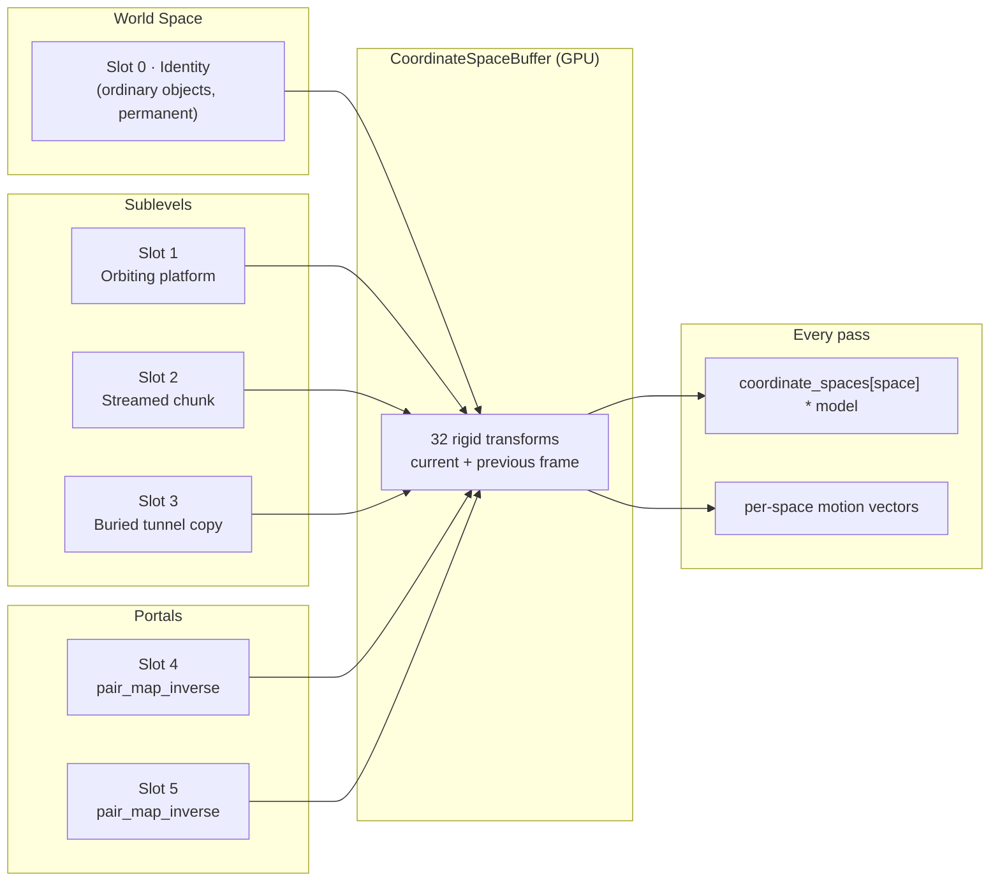
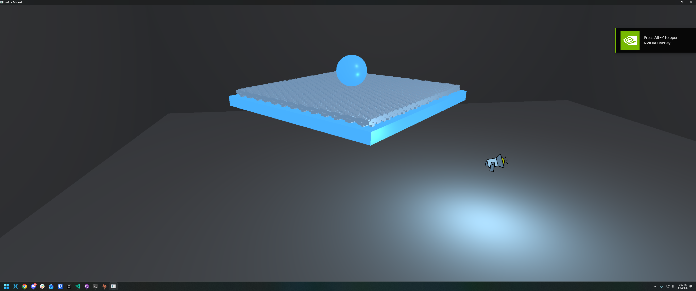
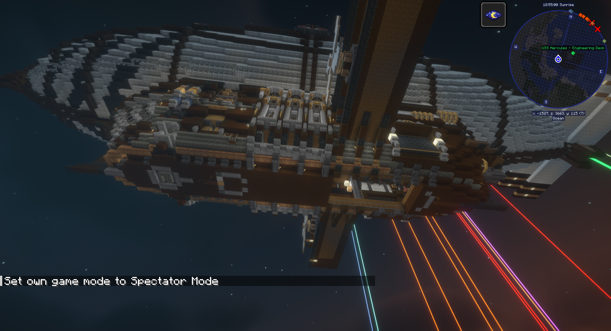
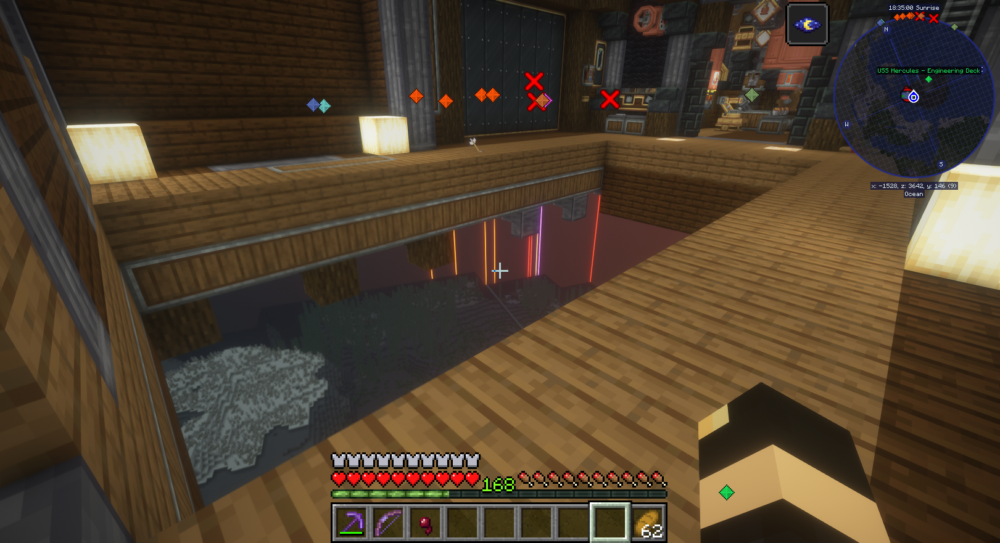
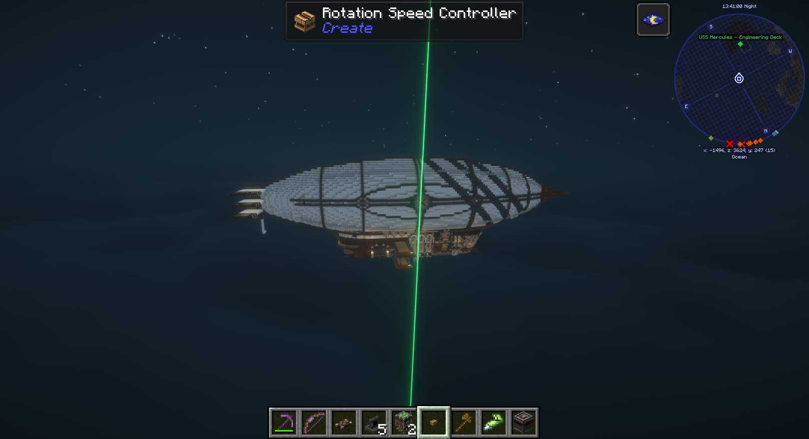
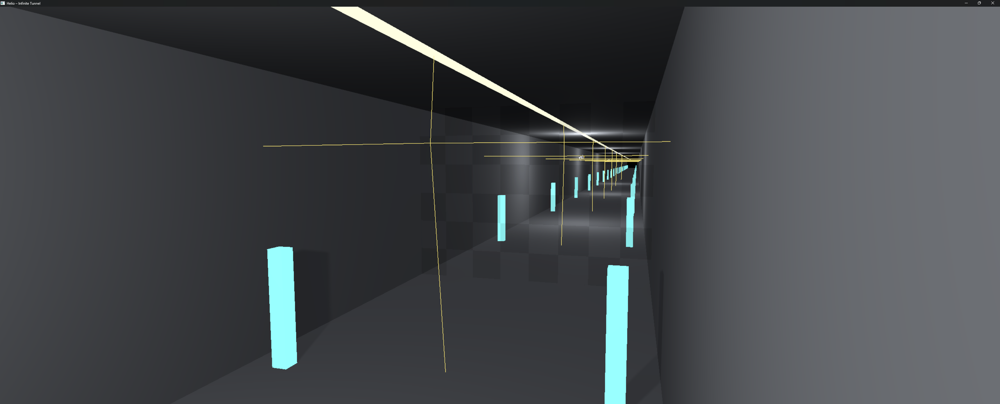
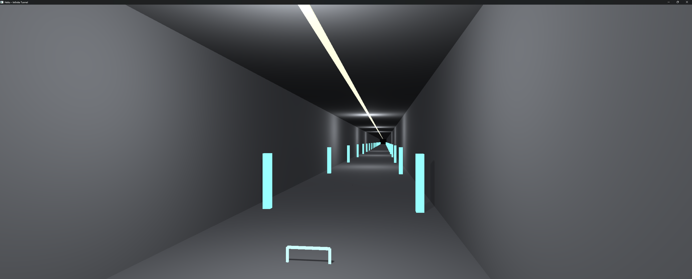
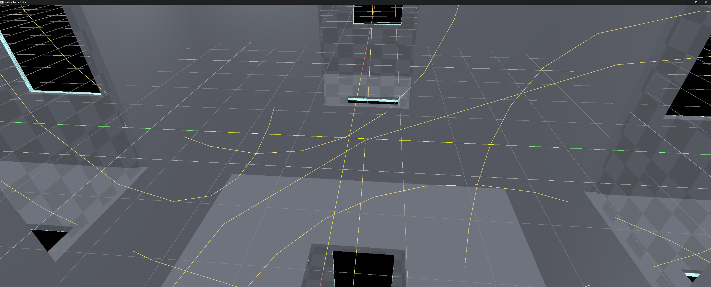

A floating platform orbits a room. A deck, a pillar marker, a point light, and a grid of studs ride it, over 65K objects on one moving slab. Every one of them casts a real shadow as it travels. The frame time does not move. The whole orbit costs one matrix write.

A corridor repeats forever. Twelve copies of a 16-metre segment sit buried 500 metres below the floor, culled by the far plane, invisible from every angle except through a frame at either end. Look through the frame and the buried copies pull up into the continuation and stitch onto the real geometry. The tunnel reads as endless. The copies are sublevels. The frames are portals.

A chunk of the world loads when the player gets near and unloads when they leave. The transition costs a tag and a matrix. That is streaming, and it rides the same rail.

The rail is a small GPU table of rigid transforms. Every instance in Helio renders through an index into it. Slot zero is the permanent identity, world space. A sublevel claims a slot and tags its members with it. A portal claims a slot and writes the inverse pair map of two surfaces into it. Streaming claims a slot, tags a group, and frees the slot later. Moving any of them is one matrix write. Portals, streaming, and moving whole groups are one feature.

---

## Why Not a Camera Per Portal

Rendering a portal the obvious way is to hand it a camera. The far surface becomes a viewpoint. The scene renders into a texture from there, and the portal polygon samples that texture and stamps it onto the wall. It works. It is the wrong shape for the job. A portal camera is a second render of the world. The cost lands on memory, compute, latency, and configuration at once.

A camera is not a viewport. It is a render pipeline. It owns a color target, a depth target, and a velocity target for TAA. At 1080p that is roughly 30 MB of GPU memory per portal. The portal cube puts six on screen, around 180 MB of targets holding a picture the player sees through a narrow slit of the screen. The allocation sits there for the whole session, on or off screen.

The pipeline re-runs for every camera. Shadow passes, the depth prepass, culling, the GBuffer, lighting, transparents. The whole graph re-instantiates with a different camera matrix, and it does so in the worst shape. A frustum opens from a point. The portal camera renders a broad wedge of the world at full resolution. Nearly all of it is thrown away when the result is downsampled to the portal's footprint. A feature an inch wide on screen asks the GPU to fill a full frame. Most of that work ends up cropped off.

Latency is where it gets structural. To keep recursion from exploding, portal views come from the previous frame. One level of portals costs one frame of staleness. Nested portals stack that cost. A portal visible through a portal samples a view already a frame old. The layer below is older still. Moving rigid bodies ghost under TAA. The portal's contents carry motion from a frame no longer matching the camera looking at them. The lag is the first thing you notice. It multiplies exactly where the feature matters most.

None of it is free to set up. Each portal is an engine-level camera with engine-level knobs. Resolution scale. Recursion depth. Which passes it runs. Whether it updates its own shadows. Whether the far side must be hidden from every other camera so it is not drawn twice. What it does to motion vectors. The configuration surface is where a system like this actually lives, and it is large.

Helio does none of it. A portal is not a camera, not a pipeline. It is one slot in a GPU table of rigid transforms, the same rail sublevels and streaming ride. The far side of the portal is geometry already there. A matrix remaps it, and the portal surface clips it in the same pass drawing everything else. One camera. One cull. One set of render targets. No recursion. No stale texture. No per-portal configuration. A portal costs what a moving platform costs.

---

## The Architecture in One Diagram



One registry of transforms, shared by everything. The vertex and cull shaders read `coordinate_spaces[space]` and apply it on top of the instance's ordinary local model matrix. Every coordinate space is a rigid transform, which gives it a fixed 2D shape. The 3x3 rotation block $R_s$ carries the orientation, and the column $\\mathbf{t}_s$ carries the placement:

$$
C_s = \\begin{bmatrix}
    r_{00} & r_{01} & r_{02} & t_x \\\\
    r_{10} & r_{11} & r_{12} & t_y \\\\
    r_{20} & r_{21} & r_{22} & t_z \\\\
    0 & 0 & 0 & 1
\\end{bmatrix}
$$

Applying it is ordinary matrix multiplication. Let $\\mathbf{q} = M_i \\cdot \\mathbf{p}_{\\text{local}}$ be the vertex at its authored position. The space acts on $\\mathbf{q}$, and the top rows expand to three dot products:

$$
\\mathbf{p}_{\\text{world}} = C_s \\cdot \\mathbf{q},
\\qquad
\\begin{bmatrix} p_x \\\\ p_y \\\\ p_z \\end{bmatrix}
= \\begin{bmatrix}
    r_{00}\\,q_x + r_{01}\\,q_y + r_{02}\\,q_z + t_x \\\\
    r_{10}\\,q_x + r_{11}\\,q_y + r_{12}\\,q_z + t_y \\\\
    r_{20}\\,q_x + r_{21}\\,q_y + r_{22}\\,q_z + t_z
\\end{bmatrix}
$$

Rotation multiplies into the position, translation adds after. Nothing else is allowed to happen. Rigid means no shear and no non-uniform scale, which is why the portal clip test later can treat a mapped point as a real place in space.

An object that never claims a slot renders exactly as before, because slot zero is the identity:

$$
C_0 = \\begin{bmatrix}
    1 & 0 & 0 & 0 \\\\
    0 & 1 & 0 & 0 \\\\
    0 & 0 & 1 & 0 \\\\
    0 & 0 & 0 & 1
\\end{bmatrix},
\\qquad
C_0 \\cdot M_i = M_i
$$

Slot zero guarantees that, permanently.

Two GPU buffers back the table, `buffer()` and `prev_buffer()`. `flush()` uploads whatever changed this frame. `cycle_prev()` copies current into previous once per frame after the flush, so the next frame uploads correct previous-frame values before anything reads them. A moving sublevel and a reposed portal write correct per-space motion vectors. TAA reprojects them instead of smearing them into the world around.

---

## The Coordinate Space

`MAX_COORDINATE_SPACES` is 32. That is the entire budget for the whole mechanism, sublevels and portals together. Slot 0 is reserved. Every real slot costs one 64-byte matrix in each buffer, 32 × 64 × 2 bytes of GPU memory in total. The whole system costs 4 KiB.

The space id travels in the instance flags field. Bits 8-15, a byte that was already there:

```rust
pub const INSTANCE_COORDINATE_SPACE_SHIFT: u32 = 8;
pub const INSTANCE_COORDINATE_SPACE_MASK: u32 = 0xFF << INSTANCE_COORDINATE_SPACE_SHIFT;

pub const fn set_coordinate_space(flags: u32, space: u32) -> u32 {
    (flags & !INSTANCE_COORDINATE_SPACE_MASK)
        | ((space << INSTANCE_COORDINATE_SPACE_SHIFT) & INSTANCE_COORDINATE_SPACE_MASK)
}

pub const fn coordinate_space(flags: u32) -> u32 {
    (flags & INSTANCE_COORDINATE_SPACE_MASK) >> INSTANCE_COORDINATE_SPACE_SHIFT
}
```

No new instance fields. No new draw calls. No new per-instance GPU storage. Tagging a member is a bitfield write to an instance that already exists, at a field that already exists. That decision is the reason everything below is cheap.

Overwriting a slot is the hot path, and it is one call:

```rust
pub fn update_slot(&mut self, slot: u32, matrix: [f32; 16]) {
    let idx = slot as usize;
    self.current[idx] = matrix;
    self.dirty = true;
}
```

One matrix write into a CPU mirror, one upload at the next flush. Nothing walks. Nothing rebuilds. Nothing waits on a mesh, a material, or a draw call.

---

## Sublevels

A sublevel is a group of objects rendered through one shared, cheaply movable transform. Members keep their ordinary local model matrices, exactly as an ungrouped object would. Nothing about how an object is authored changes. What differs is the index the GPU reads.

```rust
let sublevel = scene.add_sublevel(SublevelDescriptor {
    group: PLATFORM_GROUP,
    placement: start_placement,
})?;

// per frame, no matter how many members:
scene.update_sublevel(sublevel, placement)?;
```

Membership is captured once, at `add_sublevel`. The walk over the dense object array happens exactly once, at creation. Remove and refresh walk it again when you call them, and none of those calls ever run per frame. Objects added to the group afterward stay out until `refresh_sublevel_membership` re-captures them. Remove the sublevel and every member falls back to slot zero, world space, while the slot frees for reuse. Add more objects to the same group later, call `refresh_sublevel_membership`, and they join the platform too.

The demo platform carries a deck, a pillar marker, a light, and a grid of studs. The studs share one mesh and one material, so they batch into a single instanced draw regardless. The sublevel makes the whole platform, studs included, one `update_sublevel` call per frame. Watch it orbit, cast real shadows the entire way, and leave the frame time flat.

Unlike a portal, a sublevel needs no clipping. It draws no duplicate of anything. It is the same geometry rendered in another place, so the only extra cost is one transform application on the GPU. There is no separate pass to gate and no fixed allocation to pay for when a scene has no sublevels. A sublevel-tagged instance just flows through the existing G-buffer and shadow pipeline.




---

## Two Features Fall Out of It

The table was built to move groups cheaply. Two features followed from that without any new mechanism. Both are the same shape as the platform demo, pointed at different problems.

**Sublevel streaming** is the load and unload of whole chunks of a world around the player. A chunk's entire runtime footprint is a slot and a tag. Load it: allocate a slot, write the placement, tag the group. Unload it: untag, free the slot. The draw path never notices the difference between a chunk that has been there for an hour and a chunk that streamed in this frame.

**Portals** are a second camera's worth of seeing without a second camera. A portal is a pair of surfaces, and the inverse map between them is one more coordinate space. The portal claims a slot like any sublevel, content near the far surface gets mapped through it and drawn again through the same camera, and the fragment shader clips it to the opening.

The rest of this post takes them in turn.

---

## Sublevel Streaming

A sublevel's whole cost is a slot and a tag. That makes streaming a bookkeeping problem, not a rendering problem. The renderer has no streaming concept of its own; it only ever sees a coordinate space appear and disappear.

Be clear about where this stands. The streaming layer is not in the engine yet. What ships today is the mechanism under it: sublevels already tag in one walk, move at O(1), and free their slot on removal. The part that decides which sublevels are resident is the next feature. It is not built. It is designed, and the design sits on ground that is already in place. This section describes the plan in full, so what follows is a specification, not a report.

### What Streaming Looks Like

A level is authored as a set of sublevels, not one flat scene. Each sublevel carries its authored placement plus a streaming bounds, a radius or box that says how much of the world it claims. The player moves through a set of these containers, and the question every frame is which ones belong in the world right now.

A streaming manager holds the answer. Resident is the only new state in the whole design: a list of `SublevelId`s with a distance class each. Nothing about the scene changes shape to accommodate it.

The loop is simple. Every frame the manager tests each known sublevel against the camera position. Inside the load radius, it loads. Outside the unload radius, it unloads. The two radii overlap on purpose. The unload radius sits well beyond the load radius, so a sublevel on the seam does not flip every time the player breathes across the boundary. No thrash.

Load and unload are the calls the scene already exposes. Load is `add_sublevel`: allocate a coordinate-space slot, write the placement, walk the group once and tag the members. Unload is `remove_sublevel`: untag, free the slot. Streaming adds no new scene operation. It only supplies a policy for when to call the ones that exist.

A budget caps the policy. Per frame, the manager loads at most a fixed number of sublevels and unloads at most another, nearest first. A teleport does not stall on a full rebuild. It degrades to a few frames of progressive fill, the same shape as the tile ring in Helio's foliage system repopulating after a jump.

The draw path never learns any of this. A resident sublevel is a group of instances with a transform, indistinguishable from one that has been in the scene all session. Frustum and Hi-Z cull it exactly like anything else. A non-resident sublevel is absent. Nothing transforms it, nothing culls it, nothing draws it, and its slot returns to the pool. Content stops existing past the unload radius, which is the point.

The editor is where it gets authored. Sublevels appear in the outliner as containers. Each one exposes a streaming radius, drawn as a gizmo in the viewport and editable as a number in the inspector. Play mode hands the resident set to the runtime manager, so you can walk the level and see the exact radius where content loads and unloads, tune it live, and ship the same values into the game.

### The Minecraft Mod That Inspired This Approach

Create and Create Aeronautics take the technique to its extreme. Create moves whole machines as single structures. Create Aeronautics flies them: ships with tens of thousands of blocks, real lift, whole fleets in the sky. Underneath sits Sable, the library mod that carries them, and Sable is the closest thing to the Sublevels system this post describes that ships in production today.

Sable calls its moving structures sub-levels. A sub-level holds normal Minecraft chunks, entities, and block-entities, but it exists at a separate dynamic position and orientation inside the level. You walk up the gangplank and the ship is not scenery. It is a world that moves.







Sable pays for that scale honestly. The project describes itself as incredibly intrusive. Sub-levels ride on extensive mixins into the level's guts, and the compatibility warning sits in the first paragraphs of the README. Every sub-level is a second world instance under the first, with its own chunks, its own ticking, its own physics. That is how a hull the size of a neighbourhood flies. It is also the ceiling the approach bumps against.

The Sublevels system is the same idea with the world part removed. There is no second instance of anything. A sublevel is a group of instances that already exist, tagged with one index into a 4 KiB table of transforms. The ship you board is the same geometry, same draw calls, same materials, one extra matrix on the GPU. Stream it in: allocate a slot, write the placement, tag the group. Stream it out: untag, free the slot. A ship, a city block, a dungeon, they are all the same width of bookkeeping.

Sublevels takes its name and its direction from Sable. Sable's term for its moving structures, sub-levels, is where the name here comes from, and the design owes RyanHCode's project a real debt. Thank you to RyanHCode and everyone working on Sable, for building the thing this post is chasing after. And thank the Create mod devs and their community, for giving Sable such an awesome use case. Sable lives at [github.com/ryanhcode/sable](https://github.com/ryanhcode/sable).

---

## Portals

Two portal surfaces A and B live in the same world. The rigid transform that carries A's frame to B's frame is the pair map:

$$
M_{AB} = T_B \\cdot T_A^{-1}
$$

and its inverse, carrying B's frame back to A's frame, is:

$$
M_{BA} = T_A \\cdot T_B^{-1}
$$

`pair_map_inverse` is that second matrix. It is exactly a coordinate space. `add_portal` claims a slot and writes it:

```rust
scene.add_portal(PortalDescriptor {
    a: pose_near,
    b: pose_near_b,
    half_extent: Vec2::new(2.0, 1.5),
})?;
```

A portal's runtime cost is the same shape as a sublevel's. `update_portal_pose` is one `update_slot` call, and nothing in the scene walks. The extra work lives in three passes, and they run every frame because what a portal shows is a live question. Content is selected fresh, mapped fresh, and clipped fresh, with nothing captured at add time. Portal counts are meant to stay small, and the GPU view list is republished wholesale on any edit, since a handful of entries costs nothing.

### The Cull Pass

`helio-pass-portal-cull` decides what gets drawn twice. It runs one workgroup per (draw group, chain) pair. Each workgroup maps that group's instances through the chain's composed transform, built on the GPU from the same `coordinate_spaces` table, and tests the mapped bounds against the main camera's frustum. Content that is not actually near a portal's other side maps nowhere near the camera and fails the same sphere test the ordinary cull applies to world space. Survivors compact into a shared buffer, tagged with the chain that selected them, and a tiny `finalize` dispatch turns each group's settled count into a `DrawIndexedIndirect`. Frustum-only, no occlusion test: portal content is already bounded by the frustum, and occlusion is a fill-rate optimization this first version skips.

Two details keep the cull honest. An instance already living in one of the chain's own portal spaces is skipped, so content cannot duplicate onto itself through a mirror. And a conservative per-stage test rejects any mapped sphere that clearly misses a stage's own opening, padded by the sphere's radius. Without that, the cull overselects: every wall panel would pass through every chain, because a composed position can sit broadly inside the frustum without being anywhere near any portal's window.

### The Duplicate Draw

Survivors draw a second time through the same camera. `helio-pass-portal-instances` is fused into the same physical G-buffer pass, `LoadOp::Load` on all eight attachments, so it shares the real depth buffer and composes with everything already drawn. One `multi_draw_indexed_indirect` call, the same shape as the ordinary pass: one draw per mesh and material group, not one per chain. Each instance looks up its chain from the buffer the cull wrote and composes its own coordinate space through the whole sequence, deepest portal first. For a chain $P_0, \\ldots, P_{d-1}$ with $P_0$ outermost, the composed transform is:

$$
\\mathbf{p}_{\\text{world}} = M_{P_0} \\cdot M_{P_1} \\cdots M_{P_{d-1}} \\cdot C_s \\cdot M_i \\cdot \\mathbf{p}_{\\text{local}}
$$

Every stage is a coordinate-space lookup in the same table. Nothing about the chain changes the shape of the work. The chain applies to both the current and the previous frame transform, so a moving portal, or content moving in its own space, writes correct per-space motion vectors end to end.

### The Clip

The fragment shader keeps only content that was legitimately visible through every surface in the chain. Each stage gets its own world-space test in its own local frame. For a point $\\mathbf{p}$ carried back into that portal's frame by the surface's inverse, the fragment survives the stage only when:

$$
|p_x| \\le h_x, \\qquad |p_y| \\le h_y, \\qquad p_z \\le 0
$$

in front of the surface and inside the half-extent. Inner stages are virtual, so that box is their only bound. The outermost stage is deliberately different. It checks only behind-the-surface, and the window is enforced elsewhere, because content behind a portal is allowed to be wider than the opening itself. A window legitimately shows a whole room beyond it, and applying the box there would shrink every portal's visible depth into a tube.

The opening's true silhouette comes from `helio-pass-portal-mask`, which runs just before. It stamps each portal's real opening quad into a per-pixel mask, depth-tested read-only against the real scene so an occluded portal stays unmasked, with a depth bias so the stamp wins its coin-flip against the geometry it sits flush with. A duplicate fragment survives only where the mask at its own pixel names its chain's outermost portal. Then the mask pass resets the depth buffer to the far plane wherever it stamped, so the duplicated copies self-occlude correctly among themselves instead of fighting unrelated nearby geometry.

### Portals Reflect Each Other

The chain list is what makes recursion automatic, and the scene generates it in one walk. Every sequence of active portal indices from length 1 up to `MAX_CHAIN_DEPTH`, which is 3, repeats allowed. `[P, P, P]` is exactly a mirror: look through the portal at its own reflection three times over. The list is rebuilt only when a portal is added or removed. Pose updates never touch it, because which chains are valid depends only on how many portals exist, not where they sit. `MAX_PORTAL_CHAINS` caps the list at 300. Six portals at depth three generate 258, so the cap is headroom, and scenes are expected to stay well under it. A depth-1 chain is precisely the old single-portal behavior. The chain mechanism is a strict generalization, not a separate path.

The portal cube demo is the proof of all of it. A sealed room carries a doorway-shaped portal in the center of each of its six walls, and no copies are authored anywhere in the file. Every portal pairs its real doorway with the pose at the opposite wall, facing the same direction, which is real content that is already there. Each doorway shows the room receding for a few bounces, and near a corner you see one doorway through another's reflection. Every bounce comes from the chain list.

The infinite tunnel is the pairing with sublevels, and the two line up because both reduce to the same table. One corridor segment is authored once, then re-inserted twelve times per direction, each copy a sublevel buried 500 metres below the floor and culled by the main pass. Each portal pairs its real surface at the corridor end with a remote pose translated straight down the same 500 metres, which makes its coordinate space a pure vertical shift. The cull maps the buried copies up into the corridor's continuation, selects them exactly when the mapped position is in view, and the clip discards them the moment the mapped position strays off the corridor line. Walk through the opening and a CPU-side crossing test, driven by the same pose pair, teleports you to the other end. The corridor repeats every 16 metres, so the jump reads seamless, and you can keep walking forever.







---

## Improvements

The mechanism is general. Most of what a demo does is authoring, and the demos took shortcuts the engine never required. This section is honest about which edges are real and which are habits.

### No More Hidden Copies

The buried copies are not a requirement of the mechanism. `add_portal` never touches a scene object. It allocates a slot, writes one matrix, and republishes a view list. What appears through a portal is whatever content happens to live near the far surface, and that content can be ordinary world-space geometry that was already there. The portal cube proves the point: six portals, zero authored copies anywhere in the file, every far side a real wall facing its real opposite. Nothing is hidden in that demo because nothing has to be.

The tunnel buried its copies for a reason specific to its premise. An endless corridor needs geometry past the frame, and the demo synthesized it by re-inserting the segment as sublevels below the ground. The burial keeps the main pass from drawing them, the vertical-shift portal pulls them into view, and the effect reads as endless. Remove the copies and the corridor genuinely ends, because the far side is empty by design. That is a content-authoring decision. The mechanism never required the trick.

Production has no reason to hide geometry under the world. A portal connects two places that both exist, and the far place can be real, streamed, or placed as a sublevel at its actual location. The streamed case is the clean one: the loader from the previous section brings the far side in when it matters, and the portal maps whatever is there. Nothing sits 500 metres below anything. The mechanism already handles all of these today. The demos just never exercised the plain case.

### Occlusion for the Portal Cull

The portal cull is frustum-only, and the code says so on purpose: occlusion is a fill-rate optimization the first version skipped. The scene already has a Hi-Z pipeline for the ordinary path, and it already composes coordinate spaces. Wiring the pyramid into the portal cull lets mapped content be rejected against real occluders before any of it draws. Portalled content is usually a sliver of the screen, so the win is out of proportion to the added test.

### Chains That Know When to Stop

`MAX_CHAIN_DEPTH` is a constant, 3, and the docs pick it because a fourth bounce is usually too small to tell apart from falloff. The right depth is a function of the scene, and a constant cannot know it. A chain could keep bouncing while its composed content still projects above a pixel threshold and stop once a bounce is sub-pixel. That ties recursion cost to what the eye can actually resolve, and it lets a scene with huge doorways afford the fourth bounce the constant currently reserves out.

### Headroom in the Table

The instance flags field addresses up to 255 spaces. The table ships capped at 32, and the demo asserts its 22 against the wall. Raising the cap is a constant change and nothing else: 64 bytes per slot in each buffer, and 8 bits of space id still addresses every slot. Streaming is the consumer that will actually want the headroom, since a resident chunk holds a slot for its whole stay.

### Portals Casting Shadows

Portalled content is lit. The duplicate writes a real world-space position into the G-buffer, and the lighting pass runs over the G-buffer, so a mapped object picks up the real lights of the place it appears to be. It does not cast a shadow into the scene, because the shadow passes have no portal concept. They render every instance in its own coordinate space, and the duplicate exists only in the portal pass. The natural extension is a portal-aware shadow pass that draws the chain-composed duplicate into the light's own view. Until then, a portal opens onto a lit room with no shadows of its own.

### VR

None of this has been tested in VR, and in principle it should hold up better than most portal approaches. The reasons are in the architecture above. There is no second camera. The abandoned offscreen-eye design is gone, and the shipped path renders through the real one, which in stereo means each eye is just another camera. The cull takes frustum planes from the scene's camera, the mask stamps each opening from that camera's viewpoint, and the instance pass projects with the same camera slot. Run the passes per eye, the way every other per-view pass already runs, and each eye gets its own honest test.

Parallax is correct by construction. Each eye maps the content through the same coordinate spaces from its own position, so the two eyes disagree exactly the way two real eyes would at that geometry. Stereo convergence through a portal falls out of the existing math. There is no shared-eye approximation to reconcile, no portal camera to place twice, no planar-reflection hack that only works from one vantage point. Motion vectors are per space and shared by both eyes, so reprojection has nothing per-eye to maintain.

The honest caveats are two. A portal surface closer than the distance between the eyes is the degenerate case every portal renderer fights, and the exact clip means the divergence is correct rather than hidden. And none of the demos exercise stereo, so the claim rests on the shape of the code, not on a frame anyone has seen. The duplicate draws also run once per eye, which doubles the portal fill cost, and that makes the occlusion item above pay back twice in VR.
