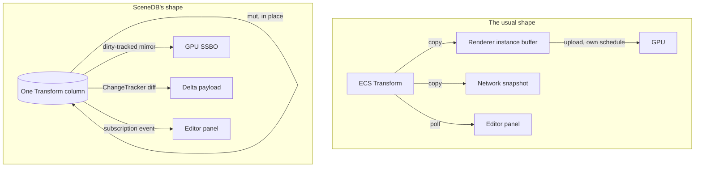

Open the source of almost any engine and the same shape shows up four or five times over. The physics engine keeps a rigid body with a position. The renderer keeps a mesh instance with a transform. The network layer keeps a replicated snapshot with its own position field. The editor keeps a property panel showing position, rotation, scale. Four structs. Four owners. One actual thing, an entity's transform, copied across all of them because nobody wrote it down in exactly one place to begin with.

Every frame something has to reconcile these copies, and the reconciliation is where the bugs live. Physics moves the rigid body. A sync system reads it back out afterward and writes it into the renderer's transform. That transform gets serialized into a packet on whatever schedule the network layer runs. The editor polls the renderer's transform to draw a gizmo, because polling is the only way it has of finding out anything changed at all. Every arrow between those boxes is a place where one system can be a frame ahead of another, where a write lands after a read instead of before it, where a value sits stale in an editor panel because no one told the panel to look again.

None of this is unusual. Most engines work exactly this way, and most of the time it's fine, because most of the time the four copies drift apart for at most a frame or two and nobody notices. SceneDB starts from the position that this is still wrong, even when it's invisible. Its answer is to delete the arrows entirely. There's one struct. Physics writes it directly. Rendering reads it, sometimes through a GPU mirror it never has to think about, because the mirror is the same row living in a second physical memory rather than a second logical copy. The network layer reads that same write through a change tracker armed at the write site. The editor reads it through a subscription that fires exactly once, for exactly that write, and never again until the next one. Nobody copies anything anywhere. Nobody reconciles anything, because there was never a second version to reconcile against.

That single decision is the reason SceneDB's ECS looks strange to anyone coming from Bevy or Flecs. It isn't a gameplay store with graphics and networking clipped onto the side. It's the graphics store, the networking store, and the gameplay store at once, and those were never three different things in the first place. They're three different reasons to look at the same handful of bytes.

---

## The Shape of the Problem, Made Concrete

Take a `Transform` with position, rotation, and scale. In a conventional engine its lifecycle usually runs through five separate hops.

Gameplay or physics writes a new value into the ECS world. A render-sync system reads that world once a frame and copies the changed fields into a renderer-owned instance buffer, with its own dirty flags, on its own schedule. That instance buffer gets uploaded to the GPU, on a third schedule, with a staleness window nobody has fully audited. If the entity replicates, a fourth system reads the ECS world again, diffs it against whatever it last sent, and serializes the difference. If an editor is attached, a fifth system polls the world on every redraw, because it has no other way of knowing whether the value it drew last frame is still the value that's true now.

Five systems. Five copies. Five schedules. And the correctness of the whole pipeline rests on all five staying in lockstep with a sixth thing, the actual simulation state, that none of the five actually owns. This is precisely the problem a database exists to solve, and most engines solve it the way you'd solve it before databases existed: four spreadsheets kept in sync by hand, hope standing in for a guarantee. You don't run a business that way. You keep one table and let every consumer query it directly. SceneDB takes that idea and applies it literally to entity storage. A component isn't a value copied to wherever it's needed. It's a column, and every consumer is a different way of reading or writing that same column, never a private copy of it.



Nothing on the right is a copy in the sense that matters. The GPU mirror is bytes from the same row, held in a second location only because VRAM and system RAM are physically separate, a constraint no software decision removes. We'll get to how that stays honest further down. The delta payload and the subscription event aren't copies of the value either. They're records of which row changed, produced as a side effect of the one real write. The write happened exactly once, in exactly one place. Everything downstream is a fact derived from that write, not a second belief about what the value probably is by now.

---

## Design Decisions

### A component doesn't get to decide who reads it

The first thing that feels off using SceneDB is that a `Transform` struct has no opinion on whether it's rendered, replicated, both, or neither. Those questions live in annotations, not in architecture, and the annotations don't talk to each other.

```rust
#[derive(SceneStore, Replicate, Default)]
#[repr(C)]
pub struct MeshInstance {
    /// GPU-mirrored every frame it changes, and network-replicated as an
    /// 8-byte handle. Not the vertex data. Just which mesh this row points to.
    #[gpu]
    #[replicate(encoding = GpuHandle, condition = Always)]
    pub mesh: Handle<Mesh>,

    /// GPU-mirrored once at spawn. Network-replicated once at spawn.
    #[gpu(mirror = Once)]
    #[replicate(encoding = Pod, condition = InitialOnly)]
    pub base_transform: [f32; 16],

    /// CPU only. Never touches VRAM. Replicated only to simulated proxies.
    #[replicate(encoding = DeltaCompressed, condition = SimulatedOnly)]
    pub health: f32,
}
```

`#[derive(SceneStore)]` only ever looks at `#[gpu(...)]` attributes. `#[derive(Replicate)]` only ever looks at `#[replicate(...)]` attributes. Neither macro knows the other exists, and that indifference is the entire point. Where a field's bytes live, CPU column only or CPU column plus a GPU mirror, is one question. How a field behaves over the network, never sent, sent once, sent every frame, delta compressed, event only, is a second and unrelated question. The struct is where both get answered at once, without either answer leaking into the other. In a conventional engine, "does the renderer see this" and "does the network see this" are usually decided by two pieces of code in two files owned by two people, each capable of drifting out of truth with what the struct actually contains and each other. Here both answers compile straight out of the same field. Drift becomes a type error the compiler catches before you ship, not a bug someone finds three months later chasing a desync report.

Combine both attributes and the truth table looks like this:

| Storage (`#[gpu]`) | Replication (`#[replicate]`) | Result |
|---|---|---|
| none | none | CPU only, never replicated |
| none | `GpuHandle` | CPU only on the server, handle sent over the wire, remote side resolves it locally |
| `#[gpu]` | none | GPU mirror, never replicated |
| `#[gpu]` | `Always` | GPU mirror plus network replication every frame |
| `#[gpu(mirror = Once)]` | `InitialOnly` | GPU mirror once, network replication once at spawn |

Five rows, five honest combinations, and every field in the engine lands in exactly one of them, chosen once at the struct definition and never revisited by a system that has to guess.

### Storage is one thing. Where else the bytes live is an annotation on top of it.

Under both macros sits the actual mechanism, and this is where the weirdness stops being cosmetic. There's no separate GPU-side entity and CPU-side entity. There's a paged, structure-of-arrays column store, 256-row pages by default, up to 1024, 64-byte aligned columns, a 128-byte per-element stride ceiling, and a field either has a GPU mirror riding on its column or it doesn't. `insert`, `get`, `get_mut`, and query iteration behave identically either way. You do not write different code depending on whether a field happens to be GPU-visible.

```rust
world.insert(e, Transform { position, rotation, scale });
// If Transform's fields carry #[gpu], that insert also marks the GPU
// mirror dirty. If they don't, it doesn't. The call site never changes.
```

Every row also gets a `Handle`, a packed u64 built from a slot index, a generation counter, and a type tag. Storage compacts by swap-and-pop at frame boundaries, physical rows move around freely underneath, and a `Handle` held anywhere else in the engine never invalidates, because the generation counter catches a stale reference before it can touch the wrong row. This detail matters more than it sounds like it should. A system that keeps a `Handle` across frames, a script, an editor selection, a network authority table, doesn't need to know or care that storage got compacted out from under it between the write and the next read.

Layered on top of that page storage is the archetype `World`, which groups entities by component set into contiguous columns and caches the archetype graph as an edge list. A repeated `insert`/`remove` transition on an already-seen `(archetype, component)` pair costs two `Vec` index reads, not a key rebuild and rehash, the same trick Bevy and Flecs lean on for the same reason. Query dispatch splits column resolution from the per-row hot path: `WorldQuery::init_fetch` resolves which column matches once per archetype, and the inner loop after that is pointer arithmetic with nothing left to look up. `world.query_items::<Q>()` skips fetching the `Entity` handle entirely when a query never needs it, and `Bundle` resolves a multi-component spawn's destination archetype once instead of migrating an entity once per component inserted. Compare against `bevy_ecs` on matched scenarios and archetype migration lands about 1.8x faster, four-component queries at 10k entities come out ahead, spawn sits at parity, and two-component queries trail by six to eleven percent. None of that is a special-cased fast path bolted on around the sync problem, because there's no sync problem left to route around.

None of this is free to design, and the honesty matters more here than anywhere else in the post. This only works because "where else does this field's bytes need to live" has a small, enumerable set of true answers, and each answer carries a genuinely different cost profile. A field written every frame and a field set once at spawn are not the same kind of GPU citizen, and treating them identically wastes either bandwidth or freshness depending on which way you got it wrong. So instead of a single `#[gpu]` switch there are seven distinct modes, and picking the wrong one is a real design mistake, not a style preference.

| Mode | What it's for |
|---|---|
| CPU-only (no `#[gpu]`) | Bookkeeping a shader never touches, AI state, editor-only fields |
| `DirtyTracked` (bare `#[gpu]`) | Changes on an unpredictable schedule; every write reaches the GPU, unchanged rows skip the upload |
| `Once` | Set at spawn, effectively constant afterward, an asset index or a baked ID |
| Packed record (`#[gpu(layout = packed)]`) | Every annotated field a struct owns is read together, by one shader, as one interleaved record |
| Var-len pool (`#[gpu]` on a `Vec<T>`) | A component owns its own variable-length payload, a mesh's own vertex array |
| Handle/heavy split (`#[gpu(mirror = Once, heavy)]`) | A handle to something large and derived, baked lighting, precomputed mesh metadata |
| Shared buffer key (`#[gpu(buffer = "key")]`) | Two unrelated component types whose same-shaped fields a shader wants read as one array |

Seven modes reads like overkill until you notice what each one is actually doing: an honest, exhaustive list of ways bytes living in two places can stay coherent without a caller ever having to think about it. A `Once` field routinely re-inserted, because some other field on the same component changed, does not re-upload. Re-uploading it would be churn for a value that never actually moved. But an explicit `get_mut` on that same field always re-uploads, every time, because `get_mut` means the caller deliberately changed the value on purpose, and `Once`'s "never again" promise was only ever about incidental noise from an unrelated write, never about suppressing a change someone asked for by hand. Getting that distinction wrong is exactly the kind of mistake a bolted-on render-sync system makes routinely, because it doesn't have access to which kind of write just happened one layer down. It's a structural fact SceneDB's storage layer already has on hand, because there's only one write path feeding it.

Packed records tighten this further. Group every `#[gpu]` field of a struct into one buffer with `#[gpu(layout = packed)]`, and the compiler enforces that every field in the group shares one mirror mode. Mixing `Once` and `DirtyTracked` inside the same packed record fails to compile, and the failure is correct. "Half of this write is deferred" has no coherent meaning once the record uploads as a single interleaved unit. A `Vec<T>`-typed field routed through `#[gpu]` gets detected by its Rust type alone and sent to a shared, growable pool with a freelist, no extra syntax required, because a variable-length payload and a fixed-size scalar were never going to share a buffer shape to begin with.

### The frame doesn't need locks. It needs a compiler willing to say no.

If storage, the GPU mirror, and replication are one thing, an obvious question follows. What stops a render pass from reading a row physics is halfway through writing? The usual answer is locks, or careful double buffering, or an ordering promise living only in a comment. SceneDB turns the ordering into a type instead.

```rust
fn simulate(world: &mut World, _w: &SimulateWitness) { /* &mut writes */ }
fn harvest(world: &World, _h: &HarvestPhase) { /* read-only */ }
fn boundary(world: &mut World, _r: &RetiredPhase) { /* compact, retire */ }
```

`SimulateWitness`, `HarvestPhase`, and `RetiredPhase` are zero-sized types, and there is no path to calling `write_transform` without holding a `SimulateWitness`, no path to `snapshot_liveness` without a `HarvestPhase`, no path to `compact` or `execute_transitions` without a `RetiredPhase`. Nothing checks this at runtime, because there's nothing left to check once the compiler has already refused to build the wrong call. The driver produces and consumes these tokens in a fixed order, acquire, simulate, harvest, boundary, repeat, and within Simulate itself, systems run in parallel across independent handles, because the archetype `World` supports split borrowing and `SceneGpuStore::write_transform` stays safe under concurrent writers through interior atomics rather than a mutex. `LivenessMask` stores each 64-row word as an `AtomicU64` under `Relaxed` ordering, set during Simulate by a single writer and read during Harvest by concurrent readers holding a lease, with no CAS loop and no `SeqCst` anywhere in the path. The GPU store's generation shadow uses `AtomicU32` per slot, updated during `write_transform` through an atomic store and bulk-synced to VRAM later. Dirty masks in the GPU layer use the same `AtomicU64` shape for the same reason: set under `&mut`, read under `&self` during delta sync. Component IDs get `AtomicU32` for global ID generation. Everything else in the library is plain `&mut`, no atomics, because most of it never needs to be anything else.

The one place that genuinely demands single-threaded discipline, retiring dead rows, compacting pages, executing streaming transitions, is exactly the phase whose witness only exists during the boundary step. You cannot accidentally compact storage from two threads at once, because you cannot hold two `RetiredPhase`s at the same time. There's exactly one, minted once per frame, consumed once, gone. Harvest scans stay read-only against `SpatialCell` and are explicitly documented safe to run on separate threads per view. wgpu submission is implicitly threaded on the driver side regardless. There's no internal thread pool or async runtime anywhere in SceneDB itself, and that's deliberate. Threading policy belongs to whatever job system the engine integration layer already runs, and SceneDB's job is only to make sure nothing it hands that job system can be misused across a phase boundary.

This detail matters more than it looks like it should for a design built around one shared copy of everything. A design where physics, rendering, and replication all reach into the same store only stays safe if none of them can reach in at an arbitrary point mid-frame. Loosen that and the single-copy idea collapses right back into the torn-read problems a four-copy design already had, just now with better cache locality and worse debugging, since there's no longer an obvious second copy to blame. The phase machine is what lets "everything reads and writes the same state" be a claim instead of a liability.

### Replication isn't a system watching the data. It's a receipt for a write that already happened.

The clearest proof this is one store and not four sits in how multiplayer replication and multi-user editing get built, because both run on the exact mechanism already feeding the GPU mirror. A `ChangeTracker` fills up during Simulate and drains at the Simulate-to-Harvest boundary, the identical fence that guarantees the liveness mask is coherent for that frame. The tracker never polls anything. It never asks whether something changed. It gets appended to at the write site, by the same `insert`/`get_mut` calls that were going to happen regardless of whether anyone downstream cared.

```rust
world.insert_tracked(e, Transform { position, rotation, scale });
// One call. The GPU mirror, if annotated, the ChangeTracker, if
// replicated, and any live subscribers all learn about this write
// from the same call. No separate poll step anywhere.
```

`tracker.drain()` produces a `Delta`, which flows through interest management via `RelevanceSet`, an ownership and condition filter via `AuthorityTable`, and out as an encoded payload, Pod, delta-compressed, serialized, or a bare GPU handle, depending on how the field was annotated back at the struct definition. Nothing in that pipeline asks storage what's different compared to last time, the way a naive network-sync system would have to. It already knows, because it was present the moment the difference was made.

The wire format for the schema handshake is small and boring on purpose, which is a feature: little-endian throughout, a `schema_count` u32, then per schema a `component_type` u32 and a `field_count` u32, then per field a `field_index` u32, an `encoding` u8, a `condition` u8, an `event_channel` u8. Encoding maps zero through five across Pod, Serialized, GpuHandle, DeltaCompressed, Event, and Opaque. Condition maps zero through ten across the eleven `ReplicationCondition` variants. Event channel is None, ReliableOrdered, or Unreliable. None of this touches actual network transport. SceneDB produces `Delta` and `EventBatch` byte payloads and specifies an encoding per field. It does not open a socket, encrypt anything, authenticate anyone, or handle NAT punch-through or relay. That part is the engine's job, same as it would be for any other payload crossing the wire.

The same primitive runs a multi-user editor with no extra machinery layered underneath. `Ownership::Shared` lets multiple peers write optimistically, and conflicts resolve deterministically at the frame boundary by comparing `ClientId`, higher wins, no locks, no operational transform, no CRDT anywhere near the store. SceneDB has no idea whether the peer on the other end of a `Delta` is a game client three hundred milliseconds away over a bad connection or a second artist's cursor two desks over on the same LAN. It's the same write, the same tracker, the same fence either way. Undo history, real OT semantics if an editor wants them, a lock server UI, all of that is the application's problem, built on top of one deterministic conflict-resolution primitive the store already hands it for free.

### A second, quieter path for anything that just wants to know

Replication answers one question: what changed, for a specific remote target, batched up into a coherent diff. There's a separate mechanism for a completely different question an editor panel or any other live consumer actually asks, which is simpler and more personal: did this one value I already have change since I last looked. `subscribe`/`take_component_change_events` answers that directly. Arm a subscription once per `(Entity, ComponentId)` pair a panel displays, cache the value locally, and only re-pull it when an event naming that exact key shows up.

```rust
let sub = world.subscribe::<Health>(e).unwrap();
world.get_mut::<Health>(e).unwrap().0 = 42; // a real write through DerefMut, one event
for event in world.take_component_change_events() {
    if event.subscription == sub {
        // invalidate the cached value for (e, Health) and re-pull
    }
}
```

Delivery is batched, never a callback. Mutations append into a bounded pending queue, and if that queue overflows, the oldest events get dropped and counted through `dropped_component_change_events()`, rather than silently vanishing. A listener can never re-enter the store mid-drop of a `Mut` guard, because nothing calls back into user code synchronously from inside a write. Event kinds are `Inserted`, `Mutated`, only fired when a write actually went through `DerefMut`, and `Removed`, which also auto-unsubscribes anything tied to a despawned entity. With no subscribers attached anywhere, the cost of all this collapses to one `Option::is_none()` check per mutating call, the same shape as the attached-mirror and attached-tracker short circuits elsewhere in the store. This sits next to `ChangeTracker`, not instead of it. Replication is a batched diff aimed at one target. A subscription is a push notice to whoever happens to be listening, about one specific key, with nothing else attached.

### The spatial layer and the streaming grid are the same idea again, one level up

It would be easy to assume all of this only applies at the component level, and that spatial queries or asset streaming live in some separate subsystem off to the side. They don't. `SpatialCell` wraps a page with six dedicated `f32` columns, AABB min and max across three axes, and a query scans those column arrays directly with no per-entity iteration and no hot-path allocation, accelerated by AVX2 on x86 and NEON on ARM, both required to match a scalar reference implementation bit for bit. There's no separate spatial index maintained off to the side and kept in sync with the entity store after the fact. The bounds live in the same paged storage everything else does.

The streaming grid runs on the same principle applied to residency instead of geometry. Cells classify into Outer, Margin, or Inner domains from a distance model with hysteresis bands that damp boundary jitter, evaluated against a slice of every observer's AABB at once, so multiple players with overlapping load areas behave correctly: a cell promotes if any one of them gets close enough, and demotes only once every one of them has left. Cells can also get pinned to a domain directly, bypassing distance rules entirely, and pinned cells coexist on the same grid as distance-classified ones without special-casing. Outer sits off the GPU entirely, tracked only as a coordinate and a bounding volume, nothing registered against `SceneGpuStore`. Crossing from Outer into Margin is the actual upload, a call to `register_cell`. Margin and Inner both stay GPU-resident afterward and differ only by detail tier, proxy geometry against full geometry, governed by the streaming budget's separate VRAM allotments for each. There's no system-RAM tier sitting between fully unloaded and GPU-resident yet, an open gap tracked honestly rather than papered over.

Underneath all of it sits `SceneGpuStore`, holding region-partitioned SSBOs shared across every registered cell, delta-synced so only rows that actually changed get uploaded again. A generation buffer and a slot mirror live in VRAM for GPU-side handle validation, with a bulk rebuild path after device loss, because a lost device is exactly the moment every assumption about what's already uploaded stops being safe to trust. The harvest pipeline runs one spatial query per view, one staging array per view with no shared state between them, and routes hits into mesh-class buckets feeding indirect draw dispatch. Every GPU resource in the whole system, row buffers, texture arrays, asset registries, resolves through one keyed `GpuBufferRegistry`, which is the same instinct as everything above it applied one more level down: one place to look something up, not four registries each holding a partial, possibly stale view of the same set of buffers.

### Even "who's allowed to touch this" runs through the store instead of around it

Physics engines, script VMs, and editor tooling conventionally keep their own private registry of things they know how to act on, a body list, a script binding table, a blueprint node graph, each maintained separately from the entity store they're supposedly operating on. SceneDB folds this in too. A `Subsystem` implements a handful of optional hooks, all default no-op, and registers once with a `SceneDb`, which owns a `World`, a `SubsystemRegistry`, and a `FrameDriver`, and drives all three together. `db.step()` alone is enough for a host with no GPU-mirrored store attached at all, running every registered subsystem's `simulate_a`/`simulate_b` hooks and flushing any attached mirror's dirty fields automatically at the end of the call. Reaching a subsystem by static Rust type is a zero-cost typed borrow, `db.subsystem_mut::<PhysicsSubsystem>()`, no reflection involved anywhere in that path.

For anything that needs to call a subsystem method by name instead, a script, a blueprint graph, editor tooling built to work against arbitrary component types at runtime, a method tagged `#[subsystem_method]` inside a `#[scenedb_subsystem(name = "...")]` block gets an `inventory::submit!` registration into Pulsar's central reflection database at link time, the exact same mechanism `EngineClassRegistry` uses for `#[derive(EngineClass)]` components, just keyed against a plain `&mut dyn Any` receiver instead of the fuller `EngineClass` interface, since a subsystem singleton doesn't carry the spawn and property-panel obligations a spawnable component does. `SceneDb::dispatch` looks a subsystem up by its registered name, gets a `&mut dyn Any` onto it, and hands off to the registry's invoke path. A name that doesn't resolve, or a method that doesn't exist on the subsystem it found, comes back as a typed `Err`, never a panic, because reflection-driven dispatch reached from a script is exactly the boundary where a panic would be the wrong failure mode.

A blueprint node calling "apply force" and a Rust system calling `subsystem_mut::<PhysicsSubsystem>()` walk through two different doors into the same object. Neither one owns a private copy of what physics currently is.

---

## What This Actually Costs

None of the above is free, and the honest version of this post says so plainly rather than glossing past it. Routing every field through an explicit CPU, GPU, and replication annotation means the component gets designed up front, not discovered empirically as the engine grows around it. Forget a `#[gpu]` attribute on a field that needed one, and nothing slows down to warn you. The field just never reaches the shader, and the first sign of the mistake is something on screen that refuses to move, with no error anywhere pointing at why. Packed GPU records go further and force every field in the group to share one mirror mode by construction. Mixing `Once` and `DirtyTracked` inside a packed struct is a compile error, not a judgment call left for later, because half a record deferring while the other half updates every frame has no meaning once the whole thing writes as one interleaved unit.

The phase machine removes runtime locking, but it adds a real constraint in exchange. Nothing gets to read a value slightly out of step with the current frame just because it would be convenient. An editor panel wanting a live value goes through a subscription or waits for harvest like everything else. There's no back door for reading right now, from whatever thread happens to be asking, just this once. That restriction is deliberate, and the alternative, letting anything read from anywhere at any time, is precisely the discipline gap that let four-copy architectures drift apart in the first place.

Even the benchmark numbers come with caveats worth stating rather than hiding. The archetype query table counts only the matching entities toward throughput, though the scan also walks a tenth as many non-matching entities in an adjacent archetype to exercise the skip path honestly. The spatial scan numbers capture a fresh liveness-words buffer per cell call, shared by both the scalar and AVX2 arms, so the absolute nanoseconds-per-row figure at large row counts includes that fixed per-cell cost baked in. The scalar-to-AVX2 ratio is the number worth trusting; the raw absolute figure at the largest sizes is honest but not the cleanest possible measurement.

| Rows | AABB scalar | AABB AVX2 | Frustum scalar | Frustum AVX2 |
|---|---:|---:|---:|---:|
| 1,024 | 1.04 µs | 510 ns | 3.38 µs | 1.05 µs |
| 16,384 | 16.9 µs | 8.55 µs | 54.0 µs | 17.1 µs |
| 256,000 | 270 µs | 154 µs | 864 µs | 279 µs |
| 1,000,448 | 1.18 ms | 956 µs | 3.79 ms | 1.42 ms |

Normalized per row, the AVX2 path holds close to a flat 0.5 to 1.0 nanoseconds across four orders of magnitude of row count, and that flatness is the actual claim being made, not the raw millisecond figure at the top end.

The archetype query side of the ledger tells a similar story. An early baseline sat 18 to 27 times behind on query iteration and roughly 2.9 times behind on spawn, before three specific changes closed the gap: the archetype-graph edge cache, the split between column resolution and the per-row hot path, and bundle-based spawning that resolves a destination archetype once instead of migrating an entity once per inserted component.

| Entities | Query time | Per entity | Throughput |
|---|---:|---:|---:|
| 100 | 81.9 ns | 0.82 ns | 1.22 Gelem/s |
| 1,000 | 664 ns | 0.66 ns | 1.51 Gelem/s |
| 10,000 | 6.42 µs | 0.64 ns | 1.56 Gelem/s |
| 50,000 | 31.9 µs | 0.64 ns | 1.57 Gelem/s |
| 100,000 | 63.6 µs | 0.64 ns | 1.57 Gelem/s |

Those numbers describe raw storage and query performance on their own, with nothing added for a render-sync system, a network-diff system, or an editor poll loop running on top, because none of those exist here as separate systems paying their own separate cost. Whatever work they'd normally do got amortized straight into the same `insert` and `get_mut` calls every component needed to make anyway, whether anyone downstream was watching or not.

---

## Why the Weirdness Is the Point

Coming from Bevy, Flecs, or Unity's DOTS, SceneDB's `World` looks familiar at first glance. Archetypes, bundles, typed queries, an edge-cached migration graph, the same shapes anyone who's used those engines already knows how to reason about. Then a `#[gpu]` attribute turns up on a component field with nothing to do with entities at all, and a `#[replicate]` attribute sits right next to it with nothing to do with rendering, and a `ChangeTracker` turns out to read from the identical write path the GPU mirror already uses, and a compile-time witness type stands in for what every other engine implements as a runtime mutex. None of these are separate systems dressed up in ECS clothing. They're one column, looked at from four directions, because the alternative, four columns each pretending to describe the same thing independently, was the exact bug this whole design set out to remove.

That's the actual claim sitting behind the name. It isn't called SceneDB because "database" sounds impressive on a slide. It's called that because the rest of the engine is meant to treat it exactly the way an application treats a real database: the one place state lives, queried and written directly, with physics, the renderer, the network layer, the editor, and a script VM all built as clients against it, none of them keeping a private copy anywhere. A gameplay-only ECS is doing a quarter of that job. SceneDB does the whole thing on purpose, and most of what looks strange about it is work a bolted-on sync layer would otherwise be doing badly, somewhere else, a frame late.

---

*SceneDB is open at github.com/Far-Beyond-Pulsar/SceneDB.*